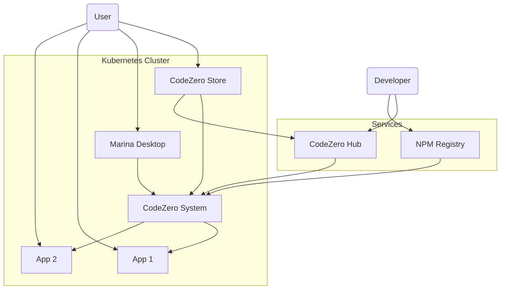

# CodeZero

CodeZero is a new kind of operating system. Like Windows, Mac OSX, Linux or Unix, it acts as an interface between your hardware and you. But, unlike those other operating systems, it acts as an interface between you and any cloud.

CodeZero is a Cloud application management system built on Kubernetes. It consists of many components, most of which are installed and fully operate within a customer's own cloud.

## CodeZero Cloud

A CodeZero Cloud is a Kubernetes (k8s) cluster enhanced with the CodeZero platform. This is done by deploying several components into your Kubernetes cluster.

### Kubernetes

[Kubernetes](https://kubernetes.io/docs/concepts/overview/what-is-kubernetes/) is an open-source cloud orchestration platform that allows users to build and maintain their own private clouds without getting locked-in to any specific cloud vendor. A CodeZero cloud can run on the Kubernetes provider of your choice: Digital Ocean, Amazon EKS, Google's GKE, Azure Kubernetes Service, or even bare metal.

### Components

Components that are installed and operate in a customers cluster:

| **Application**              | **Description**                                                           | **Linux Analogy** |
| ---------------------------- | ------------------------------------------------------------------------- | ----------------- |
| CodeZero System              | This is the operating system of a CodeZero Cloud                          | Ubuntu            |
| Marina                       | A web UI that provides a desktop like experience to CodeZero              | GNOME             |
| Store                        | Responsible for finding and installing applications from the CodeZero hub | APT               |
| Harbour Master (coming soon) | User/access control                                                       |
| Coast Guard (coming soon)    | Network security management                                               | UFW               |

## CodeZero Hub

The other major component of CodeZero is the CodeZero Hub. This is the backend system that powers the https://codezero.io and https://developer.codezero.io/ web applications. This portion of the CodeZero system is controlled and operated by CodeZero and provides APIs for creating a new cluster, sharing and finding CodeZero applications, managing pricing and billing, and by default provides the initial authentication mechanism for a CodeZero cluster.

> [!NOTE]
> Except when a user first installs a cloud using the web interface (via https://codezero.io/), CodeZero never stores or maintains access to a customers cluster.

## Architecture

This diagram illustrates the relationship between the CodeZero Hub Application Registry, and your Kubernetes cluster running the CodeZero Store, the CodeZero Marina Desktop and System and installed apps.

Developers publish their applications by publishing application manifests to the CodeZero Hub, and the associated provisioner module to the NPM registry.

CodeZero Cloud users install applications by using the CodeZero Store. The store accesses Hub to find available applications for installation. When the application is installed, the application manifest is added to the cluster. The system then downloads needed provisioner modules to install the Kubernetes resources. Kubernetes then downloads needed application container images from container repositories such as Docker.
