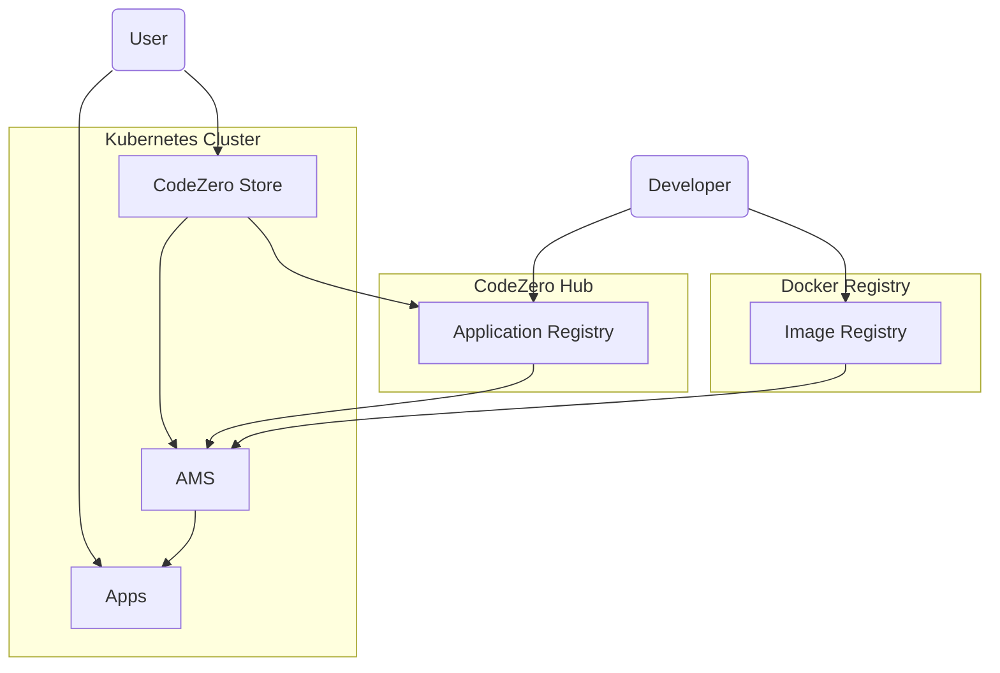

# CodeZero Applications

CodeZero's goal is to empower developers to give non-technical users a great
user experience running applications in their Private Cloud.

The CodeZero Platform includes the CodeZero System and tools for CodeZero Cloud
OS (OS) developers to publish apps. It allows non-technical users to bootstrap
the OS, install, configure and run CodeZero Applications (Apps) in a Kubernetes
cluster.

The c6o System manages application manifests that describe the application to
the system. A manifest consists of information about the application, including:

- packaging information including icon, application type, name, description,
  authors, and other data needed for provisioners, the hub UI.
- images for the provisioner to install
- dependencies required (other apps such as a database)
- system services required (volumes, pub/sub)
  - related configuration needed by the system services such as pub/sub schemas
- configuration required (can be filled in using a UI or CLI).
- provisioner to use (if not the default application provisioner)

The AMS runs inside a standard Kubernetes cluster in the `codezero-system`
namespace and provides an interface to install and manage applications called
the CodeZero Store. Developers can also interact with the service using a CLI.

The AMS is quite different from other package managers like Helm. Helm does not
support an application lifecycle. Helm applications are either running in the
Kubernetes cluster or not. Using AMS, applications can be in an `installed`,
`configured`, or `running` state. (The Kubernetes cluster will only manage
running applications.)

The configuration and logic needed to deploy and run an application in the
cluster is done using _provisioners_. You can think of provisioners as
installers on Windows and MacOS. Several provisioners may be required to
properly install an application depending on the complexity of the application
stack. Simple applications may not require provisioners.

## Architecture

This diagram illustrates relationship between the Hub Application Registry and
customer's Kubernetes clusters running AMS, the CodeZero Store and CodeZero
Apps.



Users interact with the _CodeZero Store_ on their cluster to install Apps and
manage instances of these apps.

The AMS manages the user experience and Apps throught the application lifecycle
from installation, configuration, running to removal in the cluster. The
orchestration of Apps once running, however, is managed by Kubernetes. Users
will need to bootstrap new clusters and install the CodeZero Cloud OS. Once OS
is installed, Users access the CodeZero Store directly via a web UI or using the
CLI.

AMS manages two resources:

- **Applications** - apps that are installed in the cluster. These are
  essentially templates that can be configured and run by the AMS
- **Instances** - apps that are configured and/or running. When an application
  is configured or launched, a new instance is created.

### Security Considerations

Where necessary, role based access control supported by Kubernetes will be used
to secure internal services used by CodeZero components and installed
applications.

The AMS and CodeZero Store UI will support authentication and access control.
The assumption is that a single CodeZero customer organization will own the
cluster, but the customer will want to provide access to different capabilities
and access to applications and instances to different users in their
organization based on roles such as owner/admin, user, guest for example.

Some users will have the ability to install new applications and create new
instances (administrators, owners) while others will only have the ability to
view what has already been installed in the store.

User management and authentication for CodeZero Store and the AMS will be
independent of the CodeZero Hub so that the cluster will work without
connectivity to the Hub.

Roles:

- **owner** - initial installer and admin who can also create, manage cluster
- **admin** - can manage users, install apps, create instances for users
- **user (with permissions)** - can view and access app instances that are
  running for them, manage these instances.
- **guest** - can only access instances.

Open issues for discussion:

- This implies that the CodeZero Store and AMS may also need a way to manage
  users (CRUD) and perhaps API keys. Do we want a separate service for this? Can
  we leverage external authentication systems for this, or point to an org's
  LDAP server?
- Are we just controlling the capabilities of the CodeZero Store and AMS or
  visibilty and access control of the apps themselves?
- Related to above, applications installed with the system will often have their
  own access control. Will we layer CodeZero User access control on top somehow?
  Perhaps using a proxy (we did this for Node-RED)? How then would we map our
  users/roles to the applications? Would they need to log in twice?
- For an MVP suggest all authenticated users will be admins, and we'll assume
  installed applications (e.g. mongodb, dashboards) will manage their own access
  control separately.

## Example Use Cases

### 1. Bootstrapping CodeZero

The user will bootstrap the CodeZero system using either the CLI or using the
CodeZero Hub.

The customer will provision their k8s cluster on any cloud such as Digital
Ocean, AWS, Azure or Google Cloud. Once provisioned, they will retrieve their
Kubernetes configuration file.

#### CLI bootstrap

Using the traxitt CLI, they can set the `KUBECONFIG` environment variable to
point to the Kubernetes configuration file then issue the following command to
bootstrap the system:

```bash
traxitt bootstrap
```

This will install necessary components into the cluster needed to bootstrap the
system, the AMS, which will then install additional system components and apps
including the traxitt store, pub/sub system and others.

#### Web Bootstrap

For developers that are more comfortable with a web UI, the traxitt Hub will
also bootstrap a cluster.

To do so, the user will upload their k8s configuration into the web browser, and
click on the bootstrap button. This will install the bootstrap components as the
CLI does, triggering installation of other traxitt system components.

### 2. Install, configure and run Node-RED as a traxitt application using CLI

Node-RED is a Node.js application that depends on a persistent volume. The
developer defines an app manifest for Node-RED (node-red.yaml) to install it
using the CLI. Developers use the CLI tool to test their application
installation and management flow.

Developer installs the app using the CLI:

```bash
traxitt install node-red.yaml
```

Once the node-red application is `installed`, developers can launch the app from
the CLI:

```bash
traxitt launch node-red red-1
```

On launch (or configure), the Traxitt System will check to see if all
configuration requirements set out in the App manifest are met. If not,
developers and users are presented with configuration requests prior to launch.

For example, the Traxitt CLI responds with configuration needed:

```bash
> Flow storage volume to mount at /data: [volume-name]
```

User fills in the volume name, or cancels if one does not exist and installs it
separately, and tries again to launch.

Once Node-RED is configured, an application instance called `red-1` is launched
and in a `running` state.

### 3. Install Dashboard Web App using Traxitt Hub

In this case, OS is running in the cluster and the user is interacting with the
web based Traxitt Store UI. The App they want to install, called _Dashboard_,
depends on a Mongodb service and a Time Series database service.

The user opens the Traxitt Store UI, and searches for the Dashboard App. The
Traxitt Store experience is one we already familiar with. The user clicks on
`install`.

Behind the scenes, the manifest is retrieved by the AMS and the system installs
the Dashboard App. Note that this does not create an instance of the application
in the cluster, it just allows the user to create an _instance_ of the app in
the cluster by configuring it and running it (launch).

Once installed, she clicks on the Dashboard App icon and clicks on `launch`. The
user can then type in the name of the instance such as `dashboard1`. The Traxitt
OS sees that the manifest requires a mongodb and time series database.

Because dependencies are not yet available, the dashboard is not deployed to the
cluster. The user is presented with a configuration screen as these Apps have
not been installed yet. She is then prompted to install the Mongodb service and
time series database from the Traxitt Store using the same flow, that is, first
installing, then launching them.

> Note: initially we can just let the user what dependencies they need, and
> cancel the application launch. Once dependencies are installed, they can
> attempt to launch the app again, filling in configuration for their
> dependencies.

Once all the dependencies are installed, and all the configuration requirements
of the Dashboard App are met, the system creates an instance `dashboard1`. The
Dashboard App is in a `running` state and the new dashboard UI is presented to
her.

> Note: There are potentially mulitple instances of the Dashboard App running
> with different configurations. The UX for managing this is WIP.

## Configuring Application Dependencies

The dashboard to mongodb and time series database use case highlights the need
for a way to associate clients to the services they depend on, such as web
applications to databases, or other services like traxitt pub/sub, filling in
configuration parameters like connection strings, dns names, and credentials.

Initially we'll do this manually, then we'll create k8s resources to be able to
do this automatically based on configMap/secret schemas.

### Manual Application Dependency Configuration

Intially, the association of the dashboard instances to mongodb and time series
database (configuring mongodb connection strings etc) is done during via a
simple UI.

After launching mongodb, we can allow the user to request the current
configuration containing connection strings and references to secrets in the UI.

The user can then jot these down or copy/paste these to the application
configuration on launch.

### Automatic Configuration

To make dependency configuration automatic, we can define configMap/secret
_schemas_ for dependencies based on the dependency type and version. For
example, we can define a `mongodb/v1` schema that defines how the connection
string, and root password needed by applications will be exposed in k8s
configMaps and secrets to connect to it.

When an application like dashboard is launched, it can look for its dependencies
(mongodb), and if found, can retrieve the associated configMap and secret by its
schema `mongodb/v1` and the instance name. It can then point its configuration
to the connection string and secrets needed in the configMap and secret defined
by the schema.

This will require defining different config/secret schemas for dependencies like
databases and other services, including the traxitt pub/sub systems.
Applications must be aware of these schemas to configure themselves as
described.

Like data schema used by the pub/sub system application configuration schemas
will be described using a standard like JSON schema, and referenced in the
application manifest.

## Using TAS CLI

The traxitt CLI is a client to the AMS system shown in the architecture diagram.
Other than the bootstrap provisioning code, it is essentially a REST client to
the AMS.

There are two ways to provide a manifest for an application.

- specify by package name/version for download from the Hub repository
- supply a manifest file directly (e.g. during development)

One an application is installed, an instance of it is created on configuration
or launch (config and run) allowing the user to manage more than one instance of
an application in their cluster by name.

### Bootstrap Traxitt

```bash
traxitt bootstrap
```

Bootstrap the Traxitt OS into a Kubernetes cluster. This installs the minimum
required components required to bootstrap the rest of the system (the AMS). Once
these components are loaded, they will pull in other Traxitt OS components
including the pub/sub system, monitoring tools and other traxitt cloud OS
facilities needed by traxitt applications. Just export the `KUBECONFIG`
environment variable and execute this command to get up and running.

No authentication is required.

### Install Application

```bash
traxitt install {manifest.yaml|app-package-name}
```

This command installs an application using the specified `manifest.yaml` file or
specified package name in the application repository (hub). This does not
configure or run the application, simply moves it to the `installed` state so
that it can be used to launch an instance.

### Configurure Application and Create Instance

```bash
traxitt configure {app-package-name} {values.yml} {instance-name}
```

The user can configure and create an application _instance_ with the supplied
values (file), or get input from the CLI to fill in configuration parameters.
Once configured the instance is in the `configured` state.

### Run Instance

```bash
traxitt run {instance-name}
```

Run the application instance by name. It is assumed that is ready to run
(configured).

### Launch Instance

```bash
traxitt launch {app-package-name} {values.yaml} {instance-name}
```

Configure and run (launch) an application instance in one step.

### Upgrade Instance

```bash
traxitt upgrade {instance-name} --manifest {manifest.yaml}
```

Upgrade an application by name. If no manifest is supplied directly, the new
manifest will be downloaded from the Application Repository and the new version
deployed.

> TODO: not sure how we will manage app versions for different instances?

### Stop Instance

```bash
traxitt stop {instance-name}
```

This stops an instance moving it back to the `configured` state

> Note: This may involve deleting it from Kubernetes.

### Delete Instance

```bash
traxitt delete {instance-name}
```

This deletes an instance in the `configured/stopped` state.

### Uninstall Application

```bash
traxitt remove {app-package-name}
```

Remove the application specified by the spec file. To use it it must be
reinstalled.

### List installed applications

```bash
traxitt get apps
```

Lists the applications and their current instances state (installed, configured,
running).

### List application instances

```bash
traxitt get instances
```

Lists the instances of applications and their current state (configured,
running).

## Application Manifest

App manifests contain the information needed deploy an application. An
application typically corresponds to a Kubernetes _deployment_.

- packaging information including icon, application type, name, description,
  authors, and other data needed for provisioners, the hub UI.
- docker images for the provisioner to install
- dependencies required (other apps such as a database)
- system services required (volumes, pub/sub)
  - related configuration needed by the system services such as pub/sub schemas
- configuration required (to be filled in using a web UI or CLI).
- provisioner to use (if not uses the default application provisioner)

The simplest app manifest will consist of the following:

- unique package name
- localized package name for the UI
- icon
- description
- container image

With this information, the application can be displayed in the traxitt store,
and installed using the AMS. When a simple app manifest like this is used, the
AMS will deploy a single pod running the specified container image sin traxitt.

## AMS UI

The Traxitt Store serves as the UI for the AMS. It displays applications
avaiable for installation from the traxitt repository (Hub), as well as
applications currently installed and managed by the AMS.

Using the UI, the user can search for apps in the registry, install and
uninstall apps, configure, run, stop, delete instances.

## AMS REST Interface

REST interface.

> TODO: this will follow the CLI - basically resources for applications and
> instances.

## FAQ

### Q. How does TAS compare to helm?

A. Unlike helm charts that are templates describing the end state of the
cluster, TAS provisioners are imperative programs that contain any logic
necessary to ensure applications are installed including checking the status of
dependencies.

TAS is a service that can be used as a CLI tool or used by a service such as
traxitt hub to provision and manage applications in a Kubernetes cluster.

TAS does not require _hooks_ and associated job pods running in the cluster.
Provisioners can wait for resources to be successfully deployed, or check the
status of services using external probes and any other means.

TAS can interact with the user to request configuration information during
installation.

Helm does not maintain the state of an application as installed or configured,
it simply generates specs and deploys applications.
