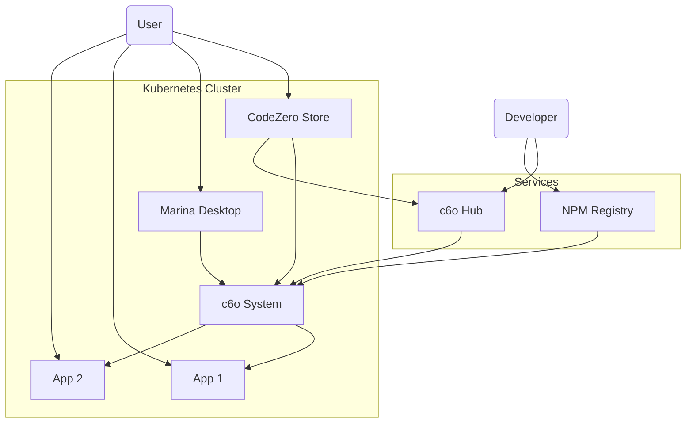

# Architecture

CodeZero is a cloud application management system built on Kubernetes. This diagram illustrates the relationship between the CodeZero Hub Application Registry, and your Kubernetes cluster running the CodeZero Store, the CodeZero Marina Desktop and System and installed apps.

Developers publish their applications by publishing application manifests to the c6o Hub, and the associated provisioner module to the npm registry.

c6o Cloud users install applications by using the c6o Store. The store accesses Hub to find available applications for installation. When the application is installed, the application manifest is added to the cluster. The system then downloads needed provisioner modules to install the Kubernetes resources. Kubernetes then downloads needed application container images from container repositories such as Docker.
