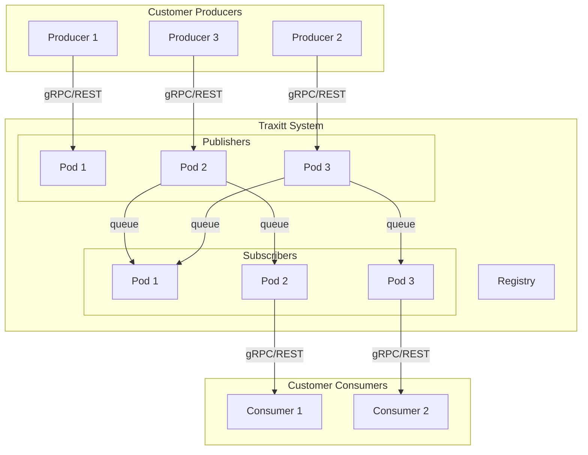

<!-- markdownlint-disable MD010 MD034 MD028 MD037 MD024 MD007 MD042 MD001 -->

# Inter-App Communication

## Overview

When developing modular systems using Service Oriented Architectures, there are
a number of ways in which two services can communicate with each other. In
general, services can be _tightly coupled_ or _loosely coupled_.

### Tightly Coupled Services

Tightly coupled services can be anything from statically linked libraries to
services communicating over a REST API. In this case, developers are fully aware
of the application interface provided by the other service. Clients are hard
coded to the contract defined by the service interface.

Tightly coupled services are very common because they are very easy to build.
There are, however, some down sides to tightly coupled services:

1. They can be fragile. Changes made to one service can break the other service
1. The are less resilient. A service outage can cause the entire service
   pipeline to experience an outage
1. By definition, it is not easy to swap out one service for another unless the
   interface strictly matches the current contract

### Loosely Coupled Services

Alternatively, developers can build loosely coupled services. Loosely coupled
services use a transport mechanism that acts as a data broker between services.
Services read and write to an intermediary message broker that:

1. Acts as a "shock absorber" in case the system experiences increased load
1. Is responsible for transporting messages between services
1. Can provide additional services like keeping messages in order or fanning out
   the messages to multiple recipients

While there is additional development complexity in building loosely coupled
services, they are essential to building resilient systems that scale. Traxitt
provides out of the box functionality to eliminate this development complexity.

### Direct Communication

With Kubernetes you can expose services internally and externally using
constructs such as _Services_ and _Pods_. Typically these services are tightly
coupled, communicating directly, with interfaces that are specific to the
communicating services. Traxitt's Publisher/Subscriber Subsystem builds on top
of existing Kubernetes services and pods, providing means of inter-service
communications to support loosely coupled services described here.

### The Publisher/Subscriber Subsystem

Clients of the Traxitt Publisher and Subscriber (Pub/Sub) system are called
_Producers_ and _Consumers_. Producers publish data, Consumers subscribe to data
using the subsystem's _Publisher_ and _Subscriber_ services. An internal system
called the _Registry_ coordinates Publishers and Subscribers and is backed by
etcd.

> [!NOTE] You will never have to directly interact with the Registry however, it
> is the source of truth for all active Subscriptions.

The Pub/Sub system provides an abstraction over Queueing providers like
RabbitMQ, Kafka, Azure Event Hubs and others. By doing so, the Pub/Sub system
provides a data centric view on streams of data more akin to databases than
queues. End users can link services through the Traxitt UI to create
Subscriptions much like the "File Open" dialog in present day desktop Operating
Systems. Developers can create Subscriptions programmatically.

The Pub/Sub system provides service developers and users a means to:

1. Produce data without concern of who the downstream Consumers are
1. Support both stateless and stateful Consumers for Subscriptions
1. Manage authorization on which Users can access what data based on the
   Subscriptions they can create
1. Handle bursts of data in the data pipeline without it affecting other parts
   through persistent and non persistent data paths with different TTL settings.

This functionality is provided without the need to worry about underlying
queuing constructs like partitioning and topics for scalabiltiy and maintaining
state.

The following diagram illustrates the key components of the Pub/Sub subsystem:



The Pub/Sub engine is a "subscriber interest" system meaning if there are no
Consumers interested in data from a producer, data is dropped by the Publisher
so that system resources are not consumed unnecessarily.

## Messages

Streams of `Messages` are the equivalent of Documents in a traditional operating
system. They make up the backbone of the Traxitt System. Data is transmitted
using `Message` format below. `Messages` comprise of Metadata that describe the
data and the Payload.

```protobuf
message Message {
    string Id = 1;
    string SchemaUri = 2;
    google.protobuf.Timestamp Timestamp = 3;
    map<string, string> Labels = 4;
    repeatable string Tags = 5;
    bytes Payload = 6;
}
```

### Id

The `Message.Id` uniquely identifies the Message and is a ULID. Messages take a
non-deterministic path through the system to Consumers. Consumers can use this
`Id` to de-duplicate or merge parts of a `Message` as it is processed by the
different pathways through the system.

### SchemaUri

The `Message.SchemaUri` is a Schema URI that defines the `Message.Payload`
format, and the messages that Subscribers are interested in on behalf of their
Consumers as described later.

The Schema URL is in
[JSON Schema](https://json-schema.org/understanding-json-schema/structuring.html)
format.

> Note that the Schema URI doesn't have to be local to the Traxitt Hub, e.g.:
> https://hub.traxitt.com/schema/customerdomain/v1/temperature, but does need to
> be accessible on the Internet. You have the ability to manage your schemas in
> Traxitt's hub system.

> Once a schema is used by any Producer or Consumer, it should not be changed;
> instead, when a schema needs to be updated, applications should use an _new_
> schema with a different version, e.g.:
> https://hub.traxitt.com/schema/customerdomain/v2/temperature. Once the an
> older schema version is fully deprecated it can then be removed.

### Timestamp

The `Message.Timestamp` field defines the time the message was generated. This
is different than Gateway Timestamp or Processing Timestamps.

> TBD: Do we store other timestamps? Are they just part of the payload? If so,
> this means we don't have a standard. We likely want a client (device)
> timestamp and a timestamp when the Message was generated.

### Labels

`Message.Labels` are optional key value pairs that make up the key part of the
`Message` Metadata. These are anything that have to do with the processing of
the data as opposed to `Payload` data. `Subscriptions` can filter by `Labels`.

### Tags

`Message.Tags` are a list of optional tags (strings) that make up the key part
of the `Message` Metadata. `Tags` would include things like which `Consumers`
have already processed the `Message`

### Payload

The `Message.Payload` contains the body of the message and is defined by the
`Message.SchemaId`

## Publishing

Publishing is simple. The Producer sends `Messages` to the Publisher service in
a fire-and-forget model without any concern for any downstream Consumer
requirements.

### gRPC API

Producers can use unary and streamed gRPC APIs. A Producer can either make a
separate publish call each time using the `Publish` RPC when there is new
content or it can open a stream and send content as it arrives using
`PublishStream`.

The streamed option is recommended when the Producer generates a lot of data in
short intervals whereas the unary option is recommended when data arrives
infrequently and there is no need to keep connections open for infrequent data
streams.

The following protobuf specification defines these RPC services.

<!-- tabs:start -->

#### ** Streamed **

```protobuf
service Publisher {
  rpc PublishStream(stream Message) returns (google.protobuf.Empty) {}
}
```

#### ** Unary **

```protobuf
service Publisher {
  rpc Publish(Message) returns (google.protobuf.Empty) {}
}
```

<!-- tabs:end -->

### REST API

> TBD - Not yet implemented

## Subscribing

A `Subscription` describes the type of data a Consumer wishes to receive. The
Traxitt System handles everything with respect to delivering data from Producers
to Consumers within the cluster. One can think of a Traxitt `Subscription` as a
live database query. The `Subscription` request is as follows:

```protobuf
message Subscription {
    string SchemaUri = 1;
	Partition Partition = 2;
	repeated Selector Filters = 3;
    repeated Selector Projections = 4;
    bool Persistent = 5;
    string Address = 6;
}

message Partition {
    repeated string MetadataFields = 1;
    repeated string PayloadFields = 2;
    string Namespace = 3;
    string LabelSelector = 4; // to query k8s to get the pods
}

message Selector {
    string Provider = 1;
    string Query = 2;
}
```

### SchemaUri

The `Subscription.SchemaUri` defines the schema Uri of the messages that a
consumer is interested in.

> Traxitt has a reserved schema URI that can be referenced when subscriptions
> need to see every message produced. This is useful when a consumer is writing
> all messages to a time series database or log. In this case, use
> https://hub.traxitt.com/schema/traxitt/all

### Partition Field

When subscribing to data, Traxitt can send data to a Consumer Kubernetes Service
or a Pod using the streaming API or the `Address` specified using an unary gRPC
call. This is fine if your Service is a stateless service and it does not matter
which Pod processes the Message. An example stateless service is an Alerting
service that looks at a single Message to trigger an alert. If, however, you
have a stateful service, requiring multiple messages associated with entities to
be delivered to the same Consumer, you will need to use partitioning to ensure
the system will scale.

To do so, use the `Subscription.PartitionField` to specify how to partition the
data so it gets routed to a specific Pod. The `PartitionField` is a JSON Path
string identifying a field in the `Message.Payload`. For instance, if your
`Message.Payload` has a `DeviceId` field and you identify this field in the
`Subscription.PartitionField`, the system will route the message to a Pods such
that Messages for a given `DeviceId` will always be routed to the same Pod. If
the Pod is no longer responsive, the system will elect a new Pod for the
`Message` for the given `DeviceId`.

> TBD: How do you specify a Deployment? You can't with Address and Namespace

If the specified `PartitionField` is missing in the `Message.Payload`, the
message is dropped.

> TBD How does one subscribe to data in another cluster?

### Filters

The consumer will likely not be interested in all of the messages with the same
schema. For example: an alert/alarm consumer of temperature sensors may only be
interested in data flowing from sensors in a particular warehouse and, of those,
only those that are either below or above certain alert/alarm thresholds.

Use the `Subscription.Filters` to specify one or more filters to select which
messages to receive. If multiple filters are specified then the intersection of
the resulting messages will only be sent, i.e.: an AND logical operator is
applied across multiple filters.

Each filter must specify the `Selector.Provider` and have the `Selector.Query`,
which will be applied against each message to determine whether or not it should
be sent.

> TBD: Initially, only PartiQL will be supported.

### Projections

Often, consumers may not be interested in all fields of the filtered message
content, or may need to reshape the data. It is good practice for consumers to
specify only the content they want from the messages to maintain system
performance and reduce noise.

The consumer can specify one or more projections in the
`Subscription.Projections`. If multiple projections are specified then the union
of the projections will be sent, i.e.: a union/combination of each of the
projections will be sent as the final message.

> TBD: Initially, only PartiQL will be supported. TBD: Determine what to use as
> the projection format, e.g.: JSON Path.

### Persistence

Subscriptions can be either _Persistent_ or _Transient_ as specified by the
`Subscription.Persistent` field. The system will continue to buffer messages for
a persistent subscription even if all of the Consumers stop responding. In
contrast, should all Consumer endpoints fail to acknowledge messages to a
transient subscription, the subscription will be terminated.

> Note that any buffered messages will be retained based on the Traxitt System
> configuration settings.

### Address

The `Subscription.Address` defines where data is delivered. This is only
applicable for unary `Subscriptions` (see below).

### gRPC API

Consumers can also choose between using unary and streamed gRPC APIs. The
streamed option is the simpler of the two. When `SubscribeStream` is used, the
Consumer receives messages as a streamed response. To end the subscription, the
Consumer simply closes the stream; the Subscription will be cleaned up. The
`Subscription.Address` field is ignored for streamed subscriptions.

When using the unary gRPC option, the Consumer sets up a gRPC endpoint where the
Subscriber will send Messages. The Address of the gRPC service is set in the
`Subscription.Address` field. This can be a Kubernetes `Service`, an individual
`Pod` or even an external endpoint. The call to `Subscribe` returns a
`SubscriptionToken`. When the Consumer is done with the Subscription, it has to
call `Unsubscribe` with this token to end the Subscription.

<!-- tabs:start -->

#### ** Streamed **

```protobuf
service Subscriber {
  rpc SubscribeStream(Subscription) returns (stream Message) {}

```

#### ** Unary **

```protobuf
service Subscriber {
  rpc Subscribe(Subscription) returns (SubscriptionToken) {}
  rpc Unsubscribe(SubscriptionToken) returns (google.protobuf.Empty) {}
}

message SubscriptionToken {
    string Token = 1;
}
```

#### Consumer RPC Endpoint

Messages to Consumers that subscribe using the unary API will be sent to the
following Consumer service interface. This has to be implemented at the endpoint
specified at `Subscription.Address`:

```protobuf
service Consumer {
  rpc ProcessMessage(Message) returns (google.protobuf.Empty) {}
}
```

<!-- tabs:end -->

### REST API

> TBD - Not yet implemented

## NOTES = to be organized

#### Data

```json
{
  "sensorid": "s123",
  "active": true,
  "time": "2019-01-01 10:00:00",
  "temperature": [
    {
      "value": "254.9",
      "unit": "Kelvin"
    },
    {
      "value": "-18.1",
      "unit": "C"
    },
    {
      "value": "-0.6",
      "unit": "F"
    }
  ],
  "humidity": {
    "value": "0.21"
  }
}
```

#### Subscription

```json
{
	"Namespace": "" ,
 	"Address": null ,
	"Persistent": false,
	"SchemaURIs" : { "https://schemas.traxitt.com/ibm.com/temperature/20190101#" },
	"Filters" :
		{ "https://schemas.traxitt.com/ibm.com/temperature/20190101#" :
			"$and: { $.active, $.temperature[?(@unit=='C')].Value < 0 }"
		},
	"Projections" :
		{ "https://schemas.traxitt.com/ibm.com/temperature/20190101#" :
			"$.time,$.temperature[?(@unit=='C')]"
		}
}
```

As you can see, the consumer only wants temperature content that is from an
active sensor and has a reading below freezing. And, to only subscribe to the
timestamp and temperature value in Celsius.

Example 2: in this example, there's a warehouse full of humidiity sensors but
the cosnumer only wants to monitor a specific sensor:

#### Data

```json
{
    "sensorid" : "warehouse1sensor1",
	"active": true,
	"time": "2019-01-01 10:00:02",
	"temperature": [{
		"value": "254.9",
		"unit": "Kelvin"
	},{
		"value": "-18.1",
		"unit": "C"
	},{
		"value": "-0.6",
		"unit": "F"
	}],
	"humidity": {
		"value": "0.21"
	}
},{
	"sensorid" : "warehouse1sensor2",
	"active": true,
	"time": "2019-01-01 10:00:01",
	"temperature": [{
		"value": "254.9",
		"unit": "Kelvin"
	},{
		"value": "-18.1",
		"unit": "C"
	},{
		"value": "-0.6",
		"unit": "F"
	}],
	"humidity": {
		"value": "0.21"
	}
},...
```

#### Subscription

```json
{
	"Namespace": "" ,
 	"Address": null ,
	"Persistent": false,
	"SchemaURIs" : { "https://schemas.traxitt.com/ibm.com/temperature/20190101#" },
	"Filters" :
		{ "https://schemas.traxitt.com/ibm.com/temperature/20190101#" :
			"$.sensorid == 'warehouse1sensor2'"
		},
	"Projections" : null
}
```

As you can see, the consumer wants all of the content from 'warehouse1sensor2'.

### Producer content

When a producer registers, the producer must specify the content type as one or
more schemas.

If no consumers are subscribed to a schema (or schemas) at publish time, then
the content is simply dropped by the Traxitt System's publisher component.
Conversely, if there's a consumer subscribed to all schemas (\*) then no content
is dropped.

Of course, there are an incredible variety of producer content sources out
there. Custom software needs to be written for each type (and possibly major
version) of this content source. Traxitt can assist customers to write adapters
for their specific hardware sensors and/or data sources. In addition, Traxitt
has a library of adapters already written either by Traxitt or the developer
community.

We recommend polling your sensors or data sources with a practical predefined
frequency. In other words, choose a frequency that makes sense to capture
expected changes quickly but doesn't introduce too much noise. For example, a
weather-based temperature sensor could be polled every 60 seconds and there's
little value polling it more frequently than this. Of course, take into account
the sensor's accuracy and account for a follow up reading after a wild
fluctuation.

### Subscriber content

When a consumer registers, the consumer can specify the messages or content it's
interested in as follows:

- All content (\*)
- Only content of a particular schema (type)
- If applicable, which content that applies to the schema, by JSON Query
  filtering (selection).
- - Note that JAQL's group, join, sort, top and transform are NOT supported;
    instead, these operations are left to the consumer.
- If applicable, which subsets of the schema (projection), if not all of it. Try
  to be minimal in order to be efficient and this will increase performance. See
  [JSON Path](https://goessner.net/articles/JsonPath/)
- - Alternatives include Pig and Hive.

For example, a consumer may subscribe to everything (\*). This may be desirable
to persist all content to a time series database. See
[Time series database](#Time-series-database)

Another example, a consumer may subscribe to a schema representing Temperature
and Humidity. However, this consumer could specify the projection of just the
humidity subset of possible data, including the sensor's location. In addition,
this consumer could also specify to only subscribe to humidity values over 65%.
This may be desirable for a high humidity alarm and/or to trigger a nearby
dehumidifier to be activated.

### Handling multiple consumers for a particular schema

For now, if there are multiple consumers interested in the same content but with
different projections and/or selections then the Traxitt System will simply send
duplicated of this content even if there are opportunities for possible
efficiency and/or performance improvements.

### Partitioning

Aggregation is out of scope and is a task best handled by a consumer. However,
the Traxitt System allows for partitioning to ensure that a consumer with a
subscription continue to receive content from the same producers so that they
can perform aggregation. For example, let's say that the task of calculating the
average temperature over a 24 hour period for each sensor in a warehouse is a
job handled by 3 or more consumers (for performance and scalability reasons). Of
course, the Traxitt Ssystem cannot arbitrarily send content to any of these 3
consumers but, instead, needs to parition the content by producer and then
consistenly send the content onto the same consumer unless something goes wrong
(more on this later).

So, how is this achieved? If a consumer subscribes with an existing
subscription, i.e.: the messages or content they're after is a complete match,
then the subscriber automatically recognizes this and assigns a partition to the
preexisting consumer and this new consumer. As such, both consumers will now get
roughly half of the content. Interestingly, this does have the side effect of
the original consumer now no longer receiving content from roughly half of the
producers it was receiving.

Similarly, if a third consumer subscribes with the same existing subscription
then, the content is now partitioned into roughly thirds from that point
forward. Conversely, if a consumer crashes or is no longer available then the
content is repartitioned into one less part until, of course, there is no
partition needed and all of the content for that subscription is sent to a
single consumer.

In order to partition content consistently, this is achieved by partitioning
based on a hashing algorithm on the producer ID and the number of partitions at
the time.

### Schema management

Customer schemas are be managed using [Traxitt's hub](#) software. Schemas can
be created, viewed, updated and deleted. Caution should be taken when updating
or deleting a schema to ensure that there are no existing subscribers that
depend on it.

Schema URIs should follow the form:
http://schamas.traxitt.com/customer-namespace/id# E.g.:
https://schemas.traxitt.com/ibm.com/temperature/20190101#

### Security

Security is important to ensure that produces are permitted to publish data and
messages are only sent to legitimate consumers.

#### TLS/SSL

In a production environment, it's recommended to use server-side TLS/SSL
certificates. \*\* See [gRPC authentication](https://grpc.io/docs/guides/auth/)

#### JWT

In addition, the Traxitt System implements JWT tokens as follows:

You can call a to a UnaryInterceptor like so if you want to verify the jwt on
every request

```go
// middleware for each rpc request. This function verifies the client has the correct "jwt".
func authInterceptor(ctx context.Context, req interface{}, usi *grpc.UnaryServerInfo, handler grpc.UnaryHandler) (interface{}, error) {
    meta, ok := metadata.FromIncomingContext(ctx)
    if !ok {
        return nil, status.Error(codes.Unauthenticated, "INTERNAL_SERVER_ERROR")
    }
    if len(meta["jwt"]) != 1 {
        return nil, status.Error(codes.Unauthenticated, "INTERNAL_SERVER_ERROR")
    }

    // perform different authorization logic per method
    if usi.FullMethod != ...

    // if code here to verify jwt is correct. if not return nil and error by accessing meta["jwt"][0]

    return handler(ctx, req) // go to function.
}
```

In your context from the client use the metadata to pass the jwt string and
verify.

In Your main function remember to register it like so

```go
// register server
myService := grpc.NewServer(
    grpc.UnaryInterceptor(authInterceptor), // use auth interceptor middleware
)
pb.RegisterTheServiceServer(myService, &s)
reflection.Register(myService)
```

Your client would need to call your server like this:

```go
// create context with token and timeout
ctx, cancel := context.WithTimeout(metadata.NewOutgoingContext(context.Background(), metadata.New(map[string]string{"jwt": "myjwtstring"})), time.Second*1)
defer cancel()
```

Similarly, see
[gRPC interceptors blog post](https://davidsbond.github.io/2019/06/14/creating-grpc-interceptors-in-go.html)

## Component architecture

The publisher and subscriber software components are written in Go (Golang) in
order to take full advantage of microservice architecture and scalability on
Kubernetes.

### APIs

Producers talk to the publisher component via gRPC or RESTful-based APIs. gRPC
is recommended for performance and efficiency reasons. Both unary and streamed
connections are supported in the gRPC API.

Similarly, consumers talk to the subscriber component via gRPC or RESTful-based
APIs. gRPC is recommended for performance and efficiency reasons. Both unary and
streamed connections are supported in the gRPC API.

### Coupling

The coupling of services can be either tight or loose. A tightly coupled service
or component, theservices or components are dependent on one another and, as a
result, isn't very scalable. Changes to one service or component often requires
changes to a number of other services or components. Conversely, loose coupling
reduces interdependencies between components, more flexible, maintainable,
scalable and stable. For these reasons, the traxitt System is loosely coupled.

Producers and consumers connect to publishers and subscribers using Kubernetes'
DNS-based service discovery. For example:
publisher.traxitt-system.svc.cluster.local instead of 192.168.0.1 or
pod123.digitalocean.com. This way, the service will hand off the request to the
appropriate load balanced publisher component and there is no tight coupling.

### Time series database

Most of the time, all of the content needs to be persisted to a time series
database. This doesn't need to be a high priority but it does need to be
complete (reliable). For this reason, the Traxitt System comes with this ability
out of the box and can be easily configured to set this up.

> Should we may only support 1 or more common SaaS time series DB providers OR
> should we support in Kubernetes. I would think the latter due to Internet
> bandwidth/latency...

This time series database is useful for record keeping as well as running
queries and performing analytics.

After some research, ElasticSearch runs well on Kubernetes and is open source.
TimescaleDB is also open source and

- InfluxDB not recommended for production in k8s
- [ElasticSearch as a time series data store](https://www.elastic.co/blog/elasticsearch-as-a-time-series-data-store)
- [Research on Time Series DBs](https://redmonk.com/rstephens/2018/04/03/the-state-of-the-time-series-database-market/)

### Logging

#### Levels

The Traxitt System components have the ability to output logs at a configurable
threshold level as follows:

- Fatal only
- Errors
- Warnings
- Info
- Debug (all) At any particular level, any higher level logs will also be
  included. For example: Warnings will include errors and fatal issues.

In production, the debug (all) log level should not be used for performance
reasons.

(https://kubernetes.io/docs/tasks/debug-application-cluster/logging-elasticsearch-kibana/)

#### Integration

TBD re: offering out of the box, configurable logging integration with
SaaS/cloud logging services.

\*\*\* TODO - Avro vs Parquet
