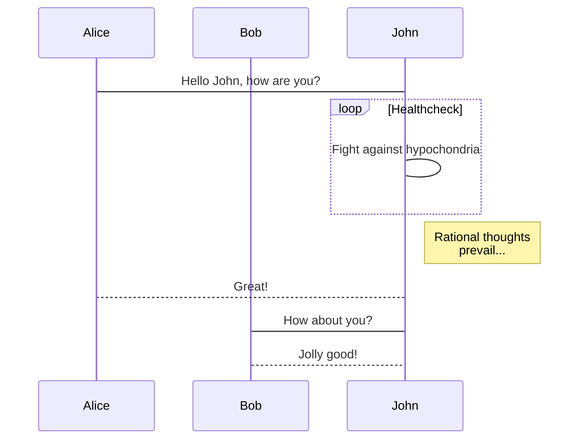

# Samples

> Welcome to Traxitt.

<!-- tabs:start -->

## ** English **

Hello!

## ** French **

Bonjour!

## ** Italian **

Ciao!

<!-- tabs:end -->



:octocat: Hello

```json
{
    "foo: {
        "bar": "car"
    }
}
```

Something

> [!NOTE]
> An alert of type 'note' using global style 'callout'.

Something

> [!WARNING]
> An alert of type 'note' using global style 'callout'.

Tip

> [!TIP]
> An alert of type 'note' using global style 'callout'.

Danger

> [!DANGER]
> An alert of type 'note' using global style 'callout'.
