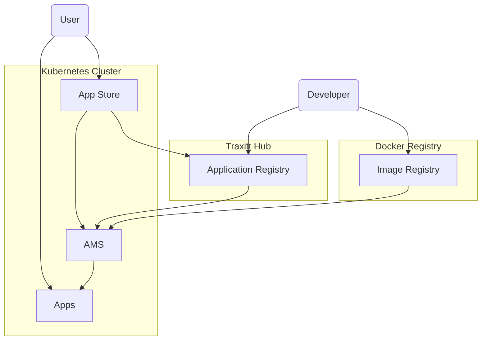

# Traxitt Applications

The Traxitt System includes Application Management Services (AMS) and tools for Traxitt Cloud OS (OS) developers. It allows non-technical users to install, configure and run Traxitt Applications (Apps) in the Traxitt Cloud OS running in a Kubernetes cluster.

> Traxitts goal is to empower developers to give non-technical users a great user experience running applications in their Private Cloud.

The AMS consists of application manifests that describe the application to the system. A manifest consists of information about the application including:

- packaging information including icon, application type, name, description, authors, and other data needed for provisioners, the hub UI.
- images for the provisioner to install
- dependencies required (other apps such as a database)
- system services required (volumes, pub/sub)
  - related configuration needed by the system services such as pub/sub schemas
- configuration required (can be filled in using a UI or CLI).
- provisioner to use (if not the default application provisioner)

The AMS runs inside a standard Kubernetes cluster in the `traxitt-system` namespace and provides interfaces to install and manage applications. Developers can interact with the service using a CLI. Unlike Helm, it can also run as a service with a UI and associated REST API.

Helm does not support an application lifecycle. Helm applications are either running in the Kubernetes cluster or not. Using TAS, applications can be in an `installed`, `configured`, or `running` state. (The Kubernetes cluster will only manage running applications.)

The configuration and logic needed to deploy and run an application in the cluster is done using *provisioners*. You can think of provisioners as installers on Windows and MacOS. Several provisioners may be required to properly install an application depending on the complexity of the application stack. Simple applications, may not require provisioners.

## Architecture

This diagram illustrates relationship between the Hub and customer's Kubernetes clusters running TAS other traxitt system services and apps.



Users interacts with the Traxitt App Store on their cluster to install Apps.

The AMS manages the user experience and Apps throught the lifecycle from installation, configuration, running to removal in the cluster. The orchestration of Apps, however, is managed by Kubernetes.

> NOTE: Users will need to bootstrap new clusters and install the Traxitt Cloud OS. Once OS is installed, Users access it directly via a web UI.

## Example Use Cases

### 1. Install, configure and run Node-RED as a traxitt application using CLI

Node-RED is a Node.js application that depends on a persistent volume. The developer defines an app manifest for Node-RED (node-red.yaml) to install it using the CLI. Developers use the CLI tool to test their application installation and management flow.

Developer installs the app using the CLI:

``` bash
traxitt install node-red.yaml
```

Once the node-red application is `installed`, developers can launch the app from the CLI:

``` bash
traxitt launch node-red
```

On launch, the Traxitt System will check to see if all configuation requirements set out in the App manifest are met. If not, developers and users are presented with configuration screens prior to launch.

For example, the Traxitt CLI responds with configuration needed:

``` bash
flow storage volume to mount at /data:
```

User fills in the volume name, or cancels if one does not exist. Once the App is configured, the App is in a `running` state.

### 2. Install Dashboard Web App using Traxitt Hub

In this case, OS is running in the cluster and the user is interacting with the web based UI. They App they want to install called *Dashboard* depends on a Mongodb service and a time series database.

The user opens the Traxitt OS UI, launches the App Store and searches for the Dashboard App. The App Store experience is one we already familair with. The user clicks on `install`.

Behind the scenes, the manifest is retrieved by the AMS and the system installs the Dashboard App.

Once installed, she clicks on the Dashboard App icon. The Traxitt OS sees that the manifest requires a mongodb and time series database. The user is presented with a configuration screen as these Apps have not been installed yet. She is then prompted to install the Mongodb service and time series database from the App Store.

Once all the dependencies are installed, all the requirements of the Dashboard App are now met and the Dashboard App is in a `running` state and the UI is presented to her.

The linking of Mongodb and time series database (connection strings etc) is done during the configuration flow via a simple UI.

> Note that there could be multiple instance of the Dashboard App running with different configurations. The UX for this is WIP.

## Using TAS CLI

> NOTE: We should ensure the command format feels familiar to kubectl/helm/docker users. WIP

### Boostrap Traxitt Cluster

    traxitt bootstrap

Install or bootstrap the Traxitt OS into a Kubernetes cluster. This includes the TAS service itself, the pub/sub system, monitoring tools and other traxitt cloud OS facilities needed by traxitt applications. Just point the `KUBECONFIG` environment and execute this command to get up and running.

> [!NOTE]
> In this case TAS is run as a CLI *outside* a cluster.

### Install Traxitt Application

    traxitt install {manifest.yaml}

This command installs an application using the specified `manifest.yaml` file. This does not run the application, simply moves it to the installed state so that it can be configured. Returns the name of the unconfigured application as in the manifest.

> Do we specify the name of the instance of the app here so we can configure and install multiple?

### Configure Application

    traxitt configure {application} {values.yml}

The user can configure the application with the supplied values file, or get input from the CLI to fill in configuration parameters.

### Run Application

    traxitt run {application}

This runs a configured application with a specified name. If no name is supplied one is generated and returned.

### Stop Application

    traxitt stop {application}

This stops an application moving it to the configured state. This may involve deleting it from Kubernetes.

### Uninstall Application

    traxitt remove {application}

Remove the application specified by the spec file. To use it it must be reinstalled.

### List applications

    traxitt get

Lists the applications and their current state (installed, configured, running).

### Application Information

    traxitt get {application}

Gets information about the specified application including its manifest, state.

## Application Manifest

App manifests contain the information needed deploy an application.

- packaging information including icon, application type, name, description, authors, and other data needed for provisioners, the hub UI.
- images for the provisioner to install
- dependencies required (other apps such as a database)
- system services required (volumes, pub/sub)
    - related configuration needed by the system services such as pub/sub schemas
- configuration required (can be filled in using a UI or CLI).
- provisioner to use (if not the default application provisioner)

TODO: examples of yaml

## TAS UI

## REST Interface

REST interface.

TODO: This will correpond to the CLI.

## FAQ

### Q. How does TAS compare to helm?

A. Unlike helm charts that are templates describing the end state of the cluster, TAS provisioners are imperative programs that contain any logic necessary to ensure applications are installed including checking the status of dependencies.

TAS is a service that can be used as a CLI tool or used by a service such as traxitt hub to provision and manage applications in a Kubernetes cluster.

TAS does not require *hooks* and associated job pods running in the cluster. Provisioners can wait for resources to be successfully deployed, or check the status of services using external probes and any other means.

TAS can interact with the user to request configuration information during installation.

Helm does not maintain the state of an application as installed or configured, it simply generates specs and deploys applications.

