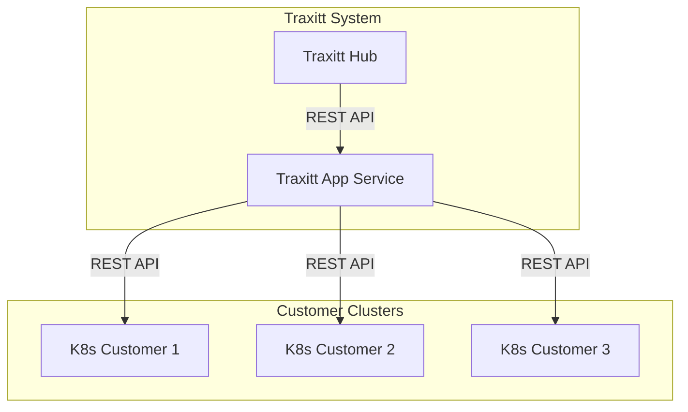

# Traxitt App Service

The Traxitt App Service (TAS) is an application management service and CLI tool for the traxitt system.  It handles the logic of an application lifecycle consisting of installing, configuring and then running traxitt applications in the Traxitt Cloud OS hosted on a kubernetes cluster.

The TAS manages application manifests that describe the application to the system.  A manifest consists of information about the application including:

- packaging information including icon, application type, name, description, authors, and other data needed for provisioners, the hub UI.
- images for the provisioner to install
- dependencies required (other apps such as a database)
- system services required (volumes, pub/sub)
    - related configuration needed by the system services such as pub/sub schemas
- configuration required (can be filled in using a UI or CLI).
- provisioner to use (if not the default application provisioner)

Like Helm, the service runs outside a standard kubernetes cluster and is used to install applications and services using a CLI.  Unlike Helm, it can also run as a service with a REST API.

Helm does not support an application lifecycle.  Helm applications are either running in the k8s cluster or not.  Using TAS, applications can be in an `installed`, `configured`, or `running` state.  (The k8s cluster will only manage running applications.)

The configuration and logic needed to deploy and run an application in the cluster is in a *provisioner* component of TAS.  We expect there may be a few different provisioners needed for applications and specialized system components, but they will be fairly simple.

## High Level Architecture

Diagram illustrates relationship between the Hub, Application Service, Provisioner repository and customer's k8s clusters.  The TAS is a service within the traxitt system.

Note that the TAS maintains state for the applications that are installed, configured or running in clusters.  The customer k8s clusters only maintain state about running applications.

## Example Use Cases

### 1. Install, configure and run Node-RED as a traxitt application using CLI.**

Node-RED is a node.js application that depends on a volume.  User finds app manifest for Node-RED (node-red.yaml).

User types:

    traxitt install node-red.yaml

Traxitt tool indicates that the application is installed:

    > node-red installed

The node-red application is in an `installed` state in the service.  User configures node-red:

    traxitt configure node-red

Traxitt CLI responds with configuration needed:

    > flow storage volume to mount at /data:

User fills in the volume name, or cancels if one doesn't exist. Once the application is configured, the application is in a `configured` state.  Only applications in the configured state can be run.

    traxitt run node-red

This causes the provisioner to take the manifest, configuration and create kubernetes specs needed to deploy and run the application.

### 2. Install Dashboard Web application using Traxitt Hub

In this case, Hub is a client of TAS.  A web application called *dashboard* depends on a mongodb instance and a time series database instance.

The user opens Hub to find a UI for the dashboard manifest in the app store.  Hub displays a nice icon, description, and other information from the manifest its storage.  Note that hub only manages manifests, i.e. the app store, not the state of applications.

The user clicks on `install`.

The manifest is sent to TAS and moved to the `installed` state by making a REST call to install the application.

In the Hub UI, the user views list of installed applications that are not yet configured or running on Hub.  This infomration is retrieved from the TAS service.

She clicks on the installed dashboard application, and then clicks on `configure`.

A configuration dialog appears with the parawemeters that need to be configured including the connection string to the mongodb and time series databases.  The configuration needed is in the manifest.

She realizes the required dependencies haven't been installed and configured yet, so she cancels, and then goes to the app store to find a mongodb, and time series database.  She installs and configures those, and then runs them.  She notes down the connection strings needed for her application during the configuration.

She then goes to the dashboard app again, clicks on `configure`, and fills in the dependency connection strings.  Once done, Hub makes a call to TAS to configure the app.  The dashboard is now configured.

> Perhaps we can auto detect the config strings for dependencies?

She then clicks on 'run' in the dashboard app.  Hub calls TAS to deploy the resources for the application into kubernetes using the provisioner code.

Note that there could be multiple dashboards running.  This would require providing a different name during the configuration phase.

> Do we give a name to the app when we run it so we can run multiple?

## Using TAS CLI

> NOTE: We should ensure the command format feels familiar to kubectl/helm/docker users.  Work in progress!

### Boostrap Traxitt Cluster

    traxitt bootstrap

Install or bootstrap the Traxitt OS into a k8s cluster.  This includes the pub/sub system, monitoring tools and other traxitt cloud OS facilities needed by traxitt applications.  Just point the `KUBECONFIG` environment and execute this command to get up and running.

### Install Traxitt Application

    traxitt install {manifest.yaml}

This command installs an application using the specified `manifest.yaml` file.  This does not run the application, simply moves it to the installed state so that it can be configured.  Returns the name of the unconfigured application as in the manifest.

> Do we specify the name of the instance of the app here so we can configure and install multiple?

### Configure Application

    traxitt configure {application} {values.yml}

The user can configure the application with the supplied values file, or get input from the CLI to fill in configuration parameters.

### Run Application

    traxitt run {application}

This runs a configured application with a specified name.  If no name is supplied one is generated and returned.

### Stop Application

    traxitt stop {application}

This stops an application moving it to the configured state.  This may involve deleting it from k8s.

### Uninstall Application

    traxitt remove {application}

Remove the application specified by the spec file.  To use it it must be reinstalled.

### List applications

    traxitt get

Lists the applications and their current state (installed, configured, running).

### Application Information

    traxitt get {application}

Gets information about the specified application including its manifest, state.

## Application Manfiest

App manifests contain the information needed deploy an application.

- packaging information including icon, application type, name, description, authors, and other data needed for provisioners, the hub UI.
- images for the provisioner to install
- dependencies required (other apps such as a database)
- system services required (volumes, pub/sub)
    - related configuration needed by the system services such as pub/sub schemas
- configuration required (can be filled in using a UI or CLI).
- provisioner to use (if not the default application provisioner)

TODO: examples of yaml

## Running TAS as a service

How to run TAS as a service.

### REST Interface

REST interface.

TODOL This will correpond to the CLI.

## FAQ

### Q. How does TAS compare to helm?

A. Unlike helm charts that are templates describing the end state of the cluster, TAS provisioners are imperative programs that contain any logic necessary to ensure applications are installed including checking the status of dependencies.

TAS is a service that can be used as a CLI tool or used by a service such as traxitt hub to provision and manage applications in a k8s cluster.

TAS does not require *hooks* and associated job pods running in the cluster.  Provisioners can wait for resources to be successfully deployed, or check the status of services using external probes and any other means.

TAS can interact with the user to request configuration information during installation.

Helm does not maintain the state of an application as installed or configured, it simply generates specs and deploys applications.

