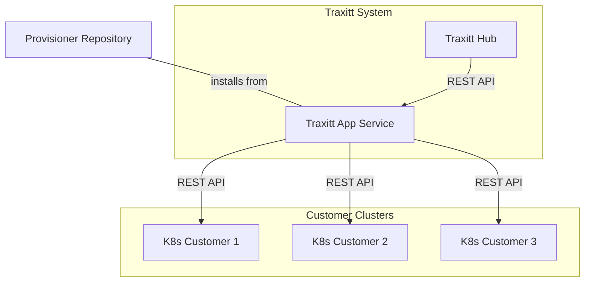

# Traxitt App Service

The Traxitt App Service (TAS) is an application management service and CLI tool for the traxitt system.  With *app-specs* and referenced *provisioners* you define, configure, install and update applications running on the Traxitt Cloud OS.

Like Helm, the service runs outside a standard kubernetes cluster and is used to install applications and services using a CLI.  Unlike Helm, it can also be included as a dependency in another Node.js application or run as a service with a REST API.

Most of the configuration and logic needed to provision an application are defined in a *provisioner* written by an application supplier.  Once a provisioner is available, a  traxitt user need only configure the provisioner and ensure dependencies are satisfied to provision an application.

TAS is written in Typescript.  Provisioners are NPM packages that act as plug ins for the service.  App specs are the configuration parameters used by provisioners.  They are provisioner specific and written using yaml/json, or supplied interactively.

## Using TAS CLI

> NOTE: We should ensure the command format feels familiar to kubectl/helm/docker users.  Work in progress!

### Boostrap Traxitt Cluster

    traxitt bootstrap

Install or bootstrap the Traxitt OS into a k8s cluster.  This includes the pub/sub system, monitoring tools and other traxitt cloud OS facilities needed by traxitt applications.  Just point the `KUBECONFIG` environment and execute this command to get up and running.

### Provision Traxitt Application

    traxitt install {app-spec.yaml}

This command provisions an application using the specified `app-spec.yaml` file.  If the provisioner referenced in this file is available in the repository (see below) it will be installed if needed and called to install application in the cluster.

If there are required parameters missing in the application spec, or the tool determines that there are missing dependencies, the tool will request feedback from the user.  This may involve provisioning other applications it depends on, supplying additional parameters or referencing additional `app-spec.yaml` files.

### Remove Application

    traxitt remove {app-spec.yaml}

Remove the application specified by the spec file.

### List applications

    traxitt get

Lists the applications installed in the cluster.

### Application Information

    traxitt get {application}

Gets information about the specified application in the cluster, including its `app-spec`.

## Provisioner Repositories

A provisioner repository is an NPM repository containing provisioners that can be used by TAS.

    traxitt search {query}

This command will search for a provisioner in the currently configured provisioner NPM repository.

## Application Specs

App specifications contain the configuration parameters used by a provisioner to deploy an application.

They include the provisioner name, namespace, and other settings used by the provisioner similar to `values.yaml` files used in helm charts.

>TODO: examples

## Writing Provisioners

Provisioners are Node.js modules that use the `@traxitt/kubeclient` and others packages to install resources into the traxitt cluster.

Provisioners contain code needed to install applications, as well as the parameters that need to be provided, or associated defaults for app-specs.

>TODO: examples

## Package interface

How to use the library from Javascript.

```javascript
const traxitt = require('@traxitt/traxitt');

traxitt.bootstrap()
```

TODO: examples

## Running TAS as a service

How to run TAS as a service.

### REST Interface

REST interface.

## High Level Architecture

Diagram illustrates relationship between the Hub, Application Service, Provisioner repository and customer's k8s clusters.  The TAS is a service within the traxitt system.




## FAQ

### Q. How does TAS compare to helm?

A. Unlike helm charts that are templates describing the end state of the cluster, TAS provisioners are imperative programs that contain any logic necessary to ensure applications are installed including checking the status of dependencies.

TAS is a service that can be used as a CLI tool or used by a service such as traxitt hub to provision and manage applications in a k8s cluster.

TAS does not require *hooks* and associated job pods running in the cluster.  Provisioners can wait for resources to be successfully deployed, or check the status of services using external probes and any other means.

TAS can interact with the user to request configuration information during installation.
