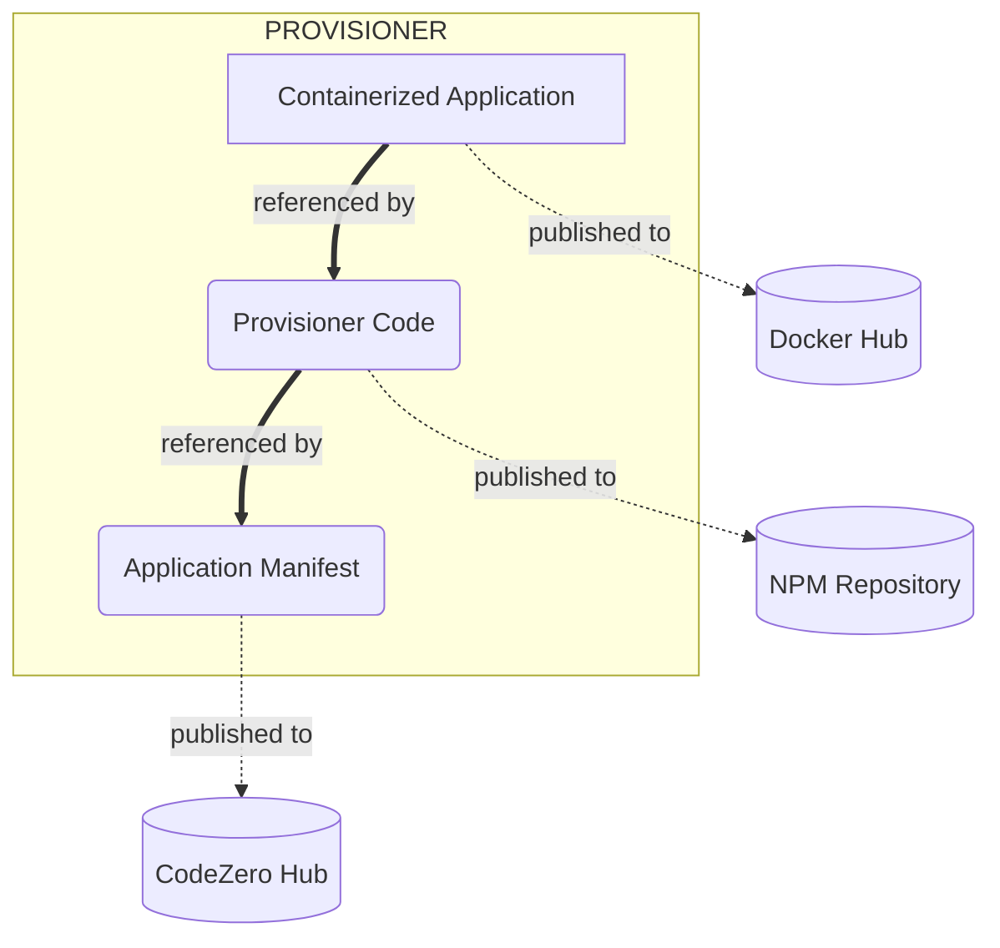

# A CodeZero Application

An Application in the CodeZero ecosystem consists of 3 main components.  First off, there is the core application itself, which can be developed in any number of ways, so long as it is executable in a container environment.  Then there is the CodeZero Provisioner, which is responsible for orchestrating the installation and management of your application in a end-users cluster.  And lastly, there is an Application Manifest that describes the application in the CodeZero ecosystem.

## Components

| Component | Destination | Description | Example
| --------- | ----------- | ----------- | -------
| Containerized Image(s) | Docker Hub | Docker image that encapsulates your application's process(es), which run in the customers clusters. | [nodered/node-red](https://hub.docker.com/r/nodered/node-red)
| Application Provisioner   | NPM | Code responsible for installing, updating, and managing the application in a CodeZero customer's cluster. | [@provisioner/node-red](https://www.npmjs.com/package/@provisioner/node-red)
| Application Manifest | CodeZero Hub | Detailed manifest (YAML) that describes an application in the CodeZero ecosystem. | [Node Red](https://hub.codezero.io/marketplace/01EFBMKNH606HDGHZTJK7714JZ)

### Components Diagram

## Getting Started Guides

1. [Hello World Example](../guides/hello-world)
1. [Publishing a Basic Application using App Engine](../guides/appengine)
1. [Creating a Custom Provisioner](../guides/custom-provisioner)
