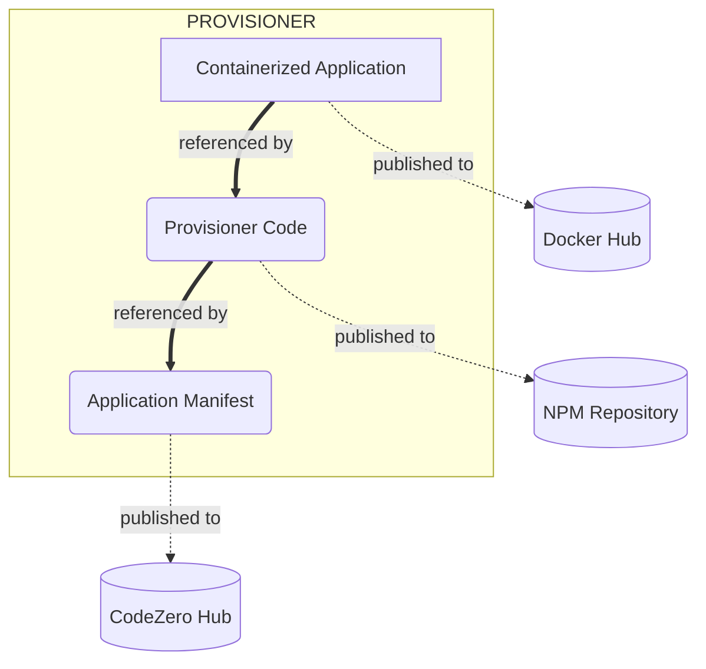

# Building an Application

Introducing an Application into the CodeZero ecosystem consists of 3 main components. A manifest that describe the application, a provisioner to install and manage the applicaiton, and a containerized application that will actually run and perform the applications function(s).

## Components

| Component | Destination | Description | Example
| --------- | ----------- | ----------- | -------
| Containerized Image(s) | Docker Hub | Docker image that encapsulates your application's process(es), which run in the customers clusters. | [nodered/node-red](https://hub.docker.com/r/nodered/node-red)
| Application Provisioner   | NPM | Code responsible for installing, updating, and managing the application in a CodeZero customer's cluster. | [@provisioner/node-red](https://www.npmjs.com/package/@provisioner/node-red)
| Application Manifest | CodeZero Hub | Detailed manifest (YAML) that describes an application in the CodeZero ecosystem. | [Node Red](https://hub.codezero.io/marketplace/01EFBMKNH606HDGHZTJK7714JZ)

### Components Diagram

## Getting Started Guides

1. [Creating a Containerized Application](./guide/0.5-docker)
1. [Publishing a Basic Application using App Engine](./guide/1-basic)
1. [Creating a Custom Provisioner](./guide/3-codegen.md)
