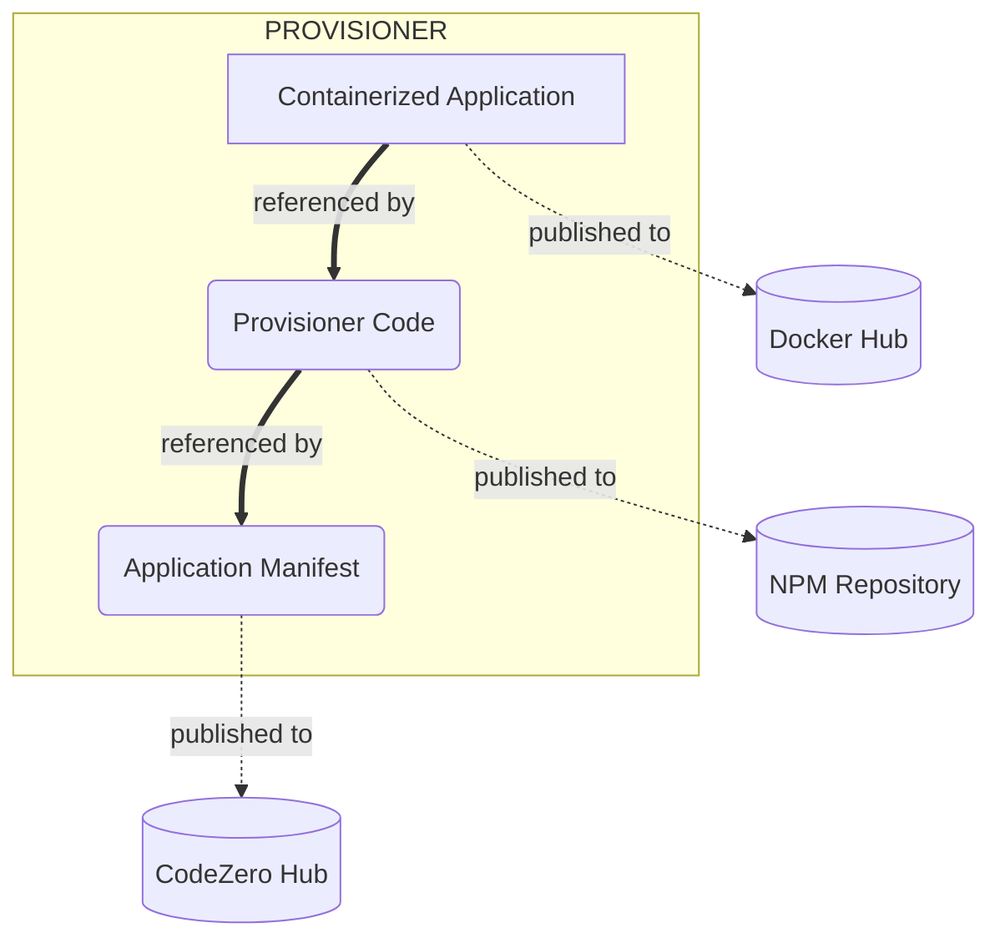

# A CodeZero Application

An Application in the CodeZero ecosystem consists of 3 main components.  First off, there is the core application itself, which can be developed in any number of ways, so long as it is executable in a container environment.  Then there is the CodeZero Provisioner, which is responsible for orchestrating the installation and management of your application in an end-users cluster.  And lastly, there is an Application Manifest that describes the application in the CodeZero ecosystem.

## Components

| Component                 | Destination   | Description | Example
| ---------                 | -----------   | ----------- | -------
| Containerized Image(s)    | Docker Hub    | Docker image(s) encapsulates your application's process(es), which will run in end-users' clusters. | [nodered/node-red](https://hub.docker.com/r/nodered/node-red)
| Application Provisioner   | NPM           | Code responsible for installing, updating, and managing the application in a CodeZero customer's cluster. | [@provisioner/node-red](https://www.npmjs.com/package/@provisioner/node-red)
| Application Manifest      | CodeZero Hub  | Detailed manifest (YAML) that describes an application in the CodeZero ecosystem. | [Node Red](https://hub.codezero.io/marketplace/01EFBMKNH606HDGHZTJK7714JZ)

### Containerized Image

A container image represents binary data that encapsulates your application and all its software dependencies.  CodeZero supports any containerized technology that Kubernetes supports (for example: Docker, containerd, CRI-O).  However, for simplicity, we will focus our documentation and support on applications using Docker and published to Docker Hub.

> [!NOTE]
> Checkout the [Hello World Guide](../guides/hello-world) for an example of creating an application from scratch and publishing through Docker Hub.

<!-- ### Multiple Images

A CodeZero Application may consist of one or multiple container images.  However, if an application has external dependencies (ex: database), it's highly recommended to use application linking rather than bundling applications together.  
For example, if building a Wordpress provisioner, it may be tempting to directly include a MySQL container. However, a much better design should define the MySQL service as a dependency, so it can leverage the power of existing MySQL instances.

How to develop the actual application logic that will run in a customers cluster is a very broad topic, and is not new or specific to CodeZero.

Therefore, instead of trying to explain all of this ourselves, we will just cover the basics, and provide  some helpful links to learn more. -->

### Provisioner

A Provisioner is an NPM package used by the CodeZero platform to install, remove, and reconfigure applications.  In this regard, it is similar Helm.  However, CodeZero provides several important features that improve on existing tools:

1. User-friendly UI: allow both technical and non-technical audiences to install and manage your applications with ease
1. Not just a template: take control the provisioning processes using JavaScript/NodeJS.
1. Powerful API: the CodeZero provisioner API for powerful and flexible application management.

Once a provisioner is created, it can be accessed by the CLI or from within the CodeZero desktop UI in order to create and manage the application.

#### App Engine

App Engine is a highly configurable provisioner created by CodeZero that provides developers with a fast and easy way to onboard their applications without needing to create a customer provisioner of their own.

> [!NOTE]
> Check out the [Creating a Basic Application Guide](../guide/appengine) to see App Engine in action.

> [!EXPERT]
> Check out the [App Engine reference](../references/appengine) for a full list of App Engine features and configuration.

#### Provisioner API

If your application requires more advanced customization, you can create your own provisioner package, and leverage the full power of our Provisioner API.

> [!NOTE]
> Check out the [Creating a Custom Provisioner](../guide/custom-provisioner) to see App Engine in action.

> [!EXPERT]
> Check out the [Provisioner API documentation](../references/provisioner) for more advanced features.

### Application Manifest

The Application Manifest describes how an Application behaves in the CodeZero ecosystem.  It includes all the metadata needed to display an application in the Marketplace (ex: the applications name, description, icon, category, tags, etc).  It also defines the provisioner responsible for installing and managing the application, how the user interacts with the application (ex: what happens when the user clicks on the icon on their desktop), and how/what to expose to the outside world.

> [!NOTE]
> Check out the [Creating a Basic Application Guide](../guide/appengine) to see what a basic Application Manifest looks like.

> [!EXPERT]
> See [here](../references/application-manifest) for a full description of the Application Manifest and all its properties.

## Developing an Application

### Guides

We have created a few walkthrough guides to help get you started with publishing an application on CodeZero:

1. [Hello World Example](../guides/hello-world)
1. [Publishing a Standard Application](../guides/appengine)
1. [Creating a Custom Provisioner](../guides/custom-provisioner) 

### Monetize your Application

CodeZero makes it possible for developers to monetize their applications using simple pricing and billing options.  See more about this feature [here](../concepts/monetization).
