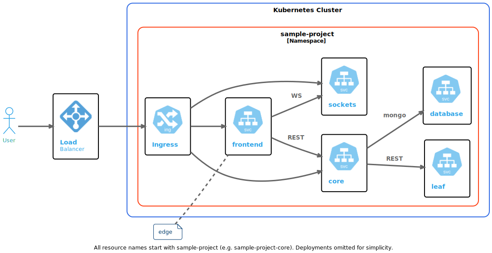

# Environments

It is common practice in Modern Development to have a Production environment and pre-production environments like Staging and Development. Advanced DevOps teams would take advantage of Infrastructure as Code and Ephemeral Environments in order to improve team velocity.

## Ephemeral Environments

Ephemeral Environments are Environments meant to last for a short amount of time. Unlike long-running Environments, mature DevOps organizations have on-demand environments that can be brought up on demand. Some organizations create these environments per feature branch and dispose of them once the branch is merged.

Some benefits of Ephemeral Environments are

[//]: <> (https://www.bunnyshell.com/blog/what-are-ephemeral-environment)

- Remove development bottlenecks. When sharing long-running environments, development teams have to batch features together before they are deployed and tested.
- Improve feedback loop. These environments allow QA, designers, product managers and even customers to provide feedback during the development process.
- Avoid the issues that come up with configuration drift. Each long-running environment takes the development team farther away from Production. As these environments stick around, small configuration changes cause it to drift farther away from Production. Some of us may have experience the "It works on my machine but not in Production" problem

## Logical Ephemeral Environments

### Microservices Graph

Services running in Kubernetes form a graph. The following simplified graph represents the Sample Kubernetes Project from the Tutorials section of these documents.

Typically, each pre-Production environment has an exact replica or a subset of the application Microservices Graph. However, we would like you to consider alterations to this graph within a physical environment as a new Logical Ephemeral Environment.

CodeZero provides you a set of primitives: Teleport, Intercept and Mount which can be configured and composed to re-shape the Microservices Graph in order to work on a feature or an issue.

Alterations to the graph are recorded in [Sessions](/sessions) which, when closed, restore the physical graph to its original state.
