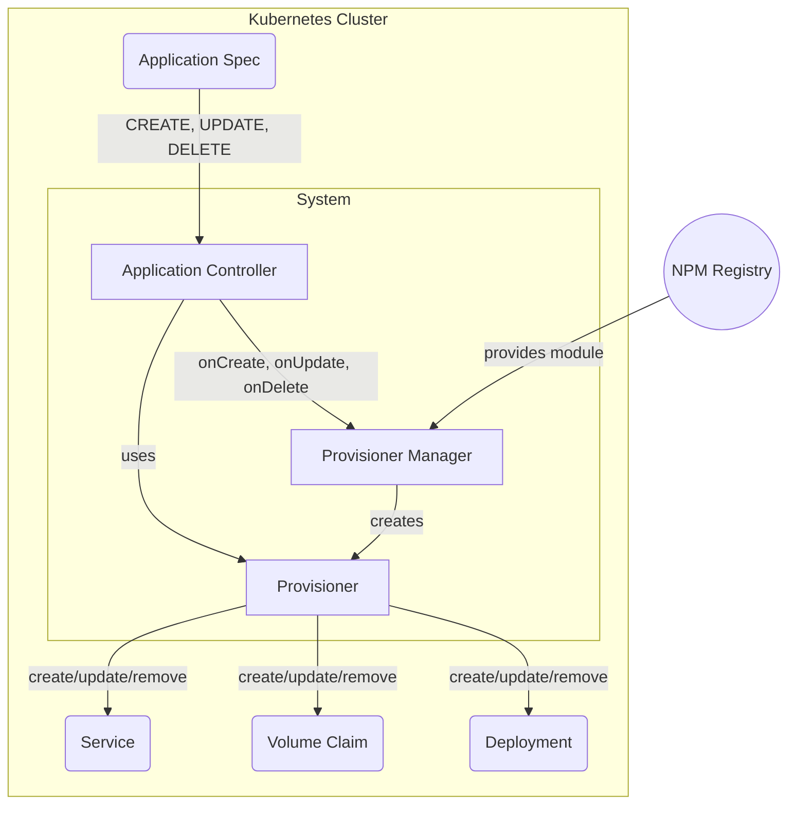

# How Provisioners Work

The c6o *application manifest* is a kubernetes custom resource definition (CRD) that provides the necessary configuration and metadata needed for c6o to manage applications. The manifest contains sections used by a *provisioner* for installing, removing, and updating applications, sections for configuring internal and external access to the application, what interfaces are supported, and status. More information on the manifest can be found [here](/reference/appspec.md).

A provisioner is a npm package used by the c6o platform to install, remove, and update or configure your application. The provisioner is accessed both by the  CLI and the c6o system via the web-based Marina, Store and Navstation applications.

To install an application, the manifest is retrieved by the c6o system (or the CLI) and added to the cluster. The system then detects that the application has been added and calls the provisioner to perform the installation. Similarly, when an application is updated or removed, the system detects the change, and uses the application provisioner to perform the change.

## Architecture

The provisioning system is illustrated below.  The c6o Application controller watches application CRDs.  When an application resources changes the App Controller uses the Provisioner Manager to download an NPM module, and instantiate the provisioner implementation, and call the appropriate action methods needed to handle the event.  

For example, the application controller would detect a CREATE event when a new application is added.  The event handler uses the Provision Manager to download and instantiate the provisioner for that application.  In a separate process, it calls the provisioner to perform the action.  The Provisioner generates the needed k8s resources such as a deployment, service, and pvc as shown to install the application.

> Note that it is possible for the c6o CLI to call the Provisioner Manager directly to perform application install, update and removal without involving the System Applicaton Controller.  This is useful for testing and debugging.

## Provisioner Services

A provisioner is an object implemented by an NPM package that exposes methods to implement the *create*, *update* and *remove* *actions* of c6o applications in the cluster. The *create* action corresponds to application install, *update* to changing configuration, and *remove* to uninstalling.

Each action has three *phases*: *inquire*, *validate* and *apply*.  The inquire stage retrieves info from the user of the CLI, validate is used to validate the application manifest, and apply to install resources on the cluster.  When using a provisioner from the web UI, the application manifest is created on the front end, then sent to the system server for validate and apply stages.

### Create Application Action

Given an application manifest hosted on Hub, combined with configuration options retrieved on the command line or from the Web UI, the provisioner add applications needed kubernetes resources to the cluster along with the application manifest and ensures it is up and running and, where applicable, accessible by users.

### Remove Application Action

Provisioners are responsible for removing applications from a cluster, ensuring resources added during install are cleaned up, while other resources such as data and assocatiated storage remain if desired. Provisioners provide support for removal options, again using the CLI or web application.

### Update/Configure Action

After an application is installed, it may need to be re-configured, for example to link it to other applications, or change scale, storage or networking options.

### Web User interface

Provisioners provide web components for configuration during install, remove, and update via the web. To support this, provisioners provide web components for installation/provisioning deprovisioning/removal and configuration using settings.

#### Install - Store

Application manifests are stored in Hub, and downloaded to the store for installation. When installing an application, the Store uses information the manifest to find the corresponding provisioners to install applications.

In the store, users are prompted with a wizard to generate the a complete application spec. The application spec is then written to the cluster. The system-controller retrieves an event and provisions the application by calling one (or more) application provisioners.

#### Remove - Marina

On deprovision, the app manifest is deleted. The system-controller detects the delete, and then calls the deprovision method on a provisioner. Once deprovision succeeds, the application resource is released for k8s to delete it. When the user chooses advanced options during uninstall, the uninstall web components for each provisioner used by the app is displayed in a wizard simpilar to the install.

#### Settings - NavStation

To change the settings of an application, the web components load an application's settings UI web component. This UI then makes API calls to the app's default provisioner to change the application state.

### CLI support

Provisioners have can support interaction from the command line allowing users to fill in configuration options for install remove, and update from there.

## Advanced

### Provisioner APIs

Provisioners can expose APIs to other provisioners, e.g. to support linking functionality, and access via REST endpoints from web or access from other provisioners that need to configure them for application linking. These can be custom APIs or APIs that conform to a common service such as logging.

### Application Linking

To support coordination between applications, for example configuring Prometheus and a Grafana dashboard to display application metrics, applications can be *linked*. To do this, a provisioner can find other applications installed in the cluster, and call the associated provisioners APIs for those applications for example, to add configuration and restart the applications.
