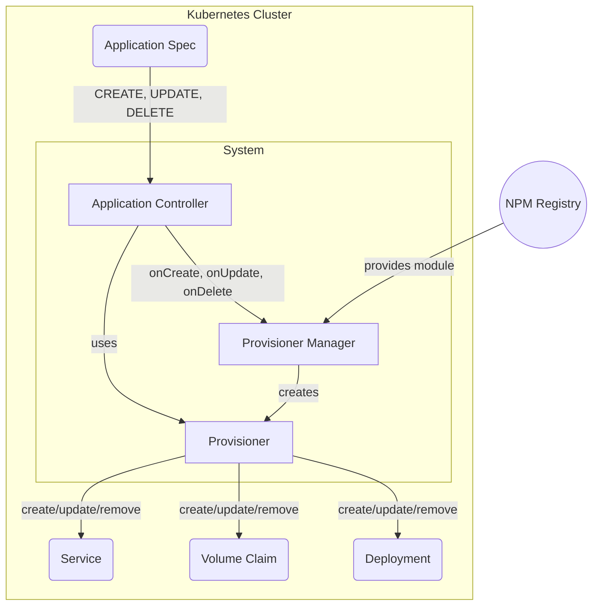

# How Provisioners Work

The c6o *application manifest* is a Kubernetes custom resource definition (CRD) that provides the necessary configuration and metadata needed for c6o to manage cloud applications.

The manifest contains sections used by a *provisioner* for installing, removing, and updating applications, sections for configuring internal and external access to the application, service interfaces, and status. More information on the manifest can be found [here](/reference/appspec.md).

A Provisioner is an npm package used by the c6o platform to install, remove, and reconfigure applications. The Provisioner module is accessed both by the  CLI and the c6o system via the Marina desktop, Store and NavStation applications.

## Architecture

The provisioning system is illustrated below. The c6o Application controller watches application specs. When an application changes the App Controller uses the Provisioner Manager to download an NPM module, and instantiate the provisioner implementation. It then call the appropriate action methods needed to handle the event.

For example, the application controller may detect a CREATE event when a new application spec is added. The event handler uses the Provisioner Manager to download and instantiate the provisioner for that application. In a separate process, it calls the provisioner to perform the action. The Provisioner generates the needed k8s resources such as Deployment, Service, and PVC as shown to install the application.

> Note that it is possible for the c6o CLI to call the Provisioner Manager directly to perform application install, update and removal without involving the System Application Controller. This is useful for testing and debugging.

## Provisioner Services

A Provisioner exposes methods to implement the *create*, *update* and *remove* actions. The *create* action corresponds to application install, *update* to changing configuration, and *remove* to uninstalling.

Each action typically has three phases: *inquire*, *validate* and *apply*. The inquire stage retrieves info from the user of the CLI; validate is used to validate the application manifest, and apply to install resources on the cluster. When using a provisioner from the web UI, the application manifest is created on the front end and added to the cluster.

### Create Application Action

When a new application spec is added to the cluster, the provisioner adds Kubernetes resources to the cluster ensures it is up and running and accessible by authorized users.

### Remove Application Action

Provisioners are also responsible for removing applications from a cluster, ensuring resources added during install are removed. In some cases a provisioner can provide options to keep data volumes and other resources on removal; Provisioners provide support for removal options using the CLI or web application.

### Update/Configure Action

After an application is installed, it may need to be re-configured, for example to link it to other applications, scale it up or down, or enable application-specific features and networking options.

### Web User interface

Provisioners supply web components for users to configure applications using the Marina, Store and NavStation web applications.

#### Install - Store

Application manifests are stored in Hub, and downloaded to the store for installation. When installing an application, the Store uses information the manifest to find the corresponding provisioners to install applications.

In the store, users are prompted with an install wizard to generate a complete application spec. The application spec is then written to the cluster. The system-controller retrieves an event and provisions the application by calling one (or more) application provisioners.

#### Remove - Marina

On remove, the app manifest is deleted. The system-controller detects the delete, and then calls the deprovision method on a provisioner. Once deprovision succeeds, the application resource is released for k8s to delete it.

When the user chooses *advanced options* during uninstall, the uninstall web components for each provisioner used by the app is displayed in a wizard similar to the install.

#### Settings - NavStation

To change the settings of an application, the web components load an application's settings UI web component. This UI then makes API calls to the app's default provisioner to change the application state.

### CLI support

Provisioners have can support interaction from the command line allowing users to fill in configuration options for install remove, and update from there.

## Advanced

### Provisioner APIs

Provisioners can expose APIs to other provisioners, e.g. to support linking functionality, and access via REST endpoints from web or access from other provisioners that need to configure them for application linking. These can be custom APIs or APIs that conform to a common service such as logging.

### Application Linking

To support coordination between applications, for example configuring Prometheus and a Grafana dashboard to display application metrics, applications can be *linked*. To do this, a provisioner can find other applications installed in the cluster, and call the associated provisioners APIs for those applications for example, to add configuration and restart the applications.
