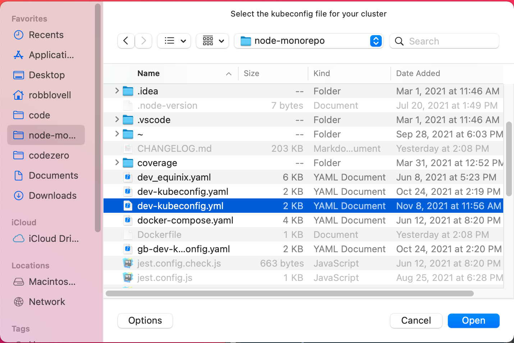

## Adding a Cluster

Clusters are managed via the tray menu under "Clusters". Select "+ Add Cluster" to add a kubeconfig yaml file to the
default kuberentes configuration on your system (in ~/.kube/config)

Select the file in the dialog:

After selecting "Open", you can switch between configurations using the Cluster menu:

