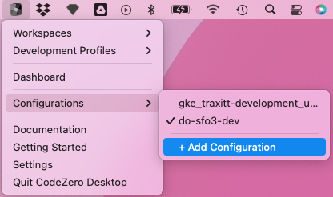
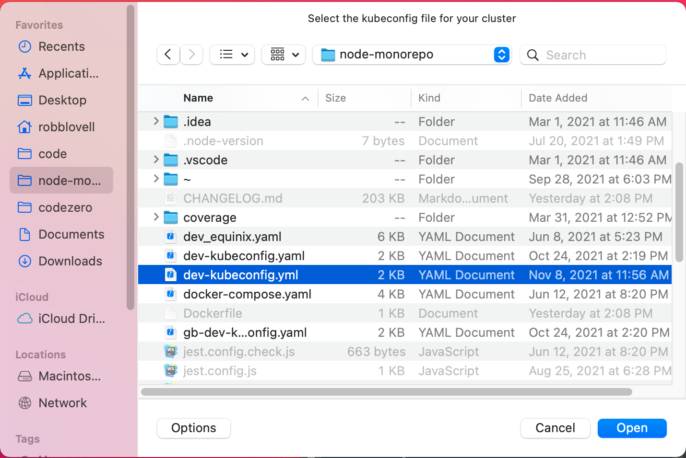
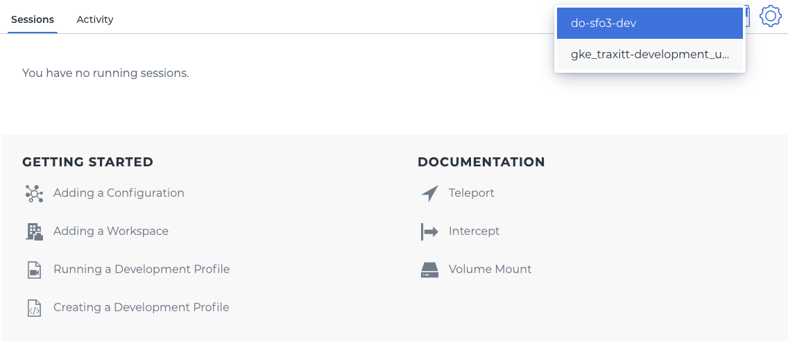

## Adding a Configuration

Configurations can be added via the tray menu under "Configurations". Select "+ Add Configuration" to select a kubeconfig yaml file and add its configuration to the
default kuberentes configuration on your system (in ~/.kube/config).

Select the file in the dialog:

After selecting "Open", you can switch between configurations using the tray menu or from the dropdown on the dashboard:

