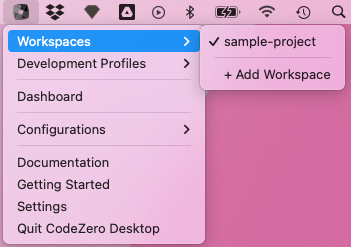
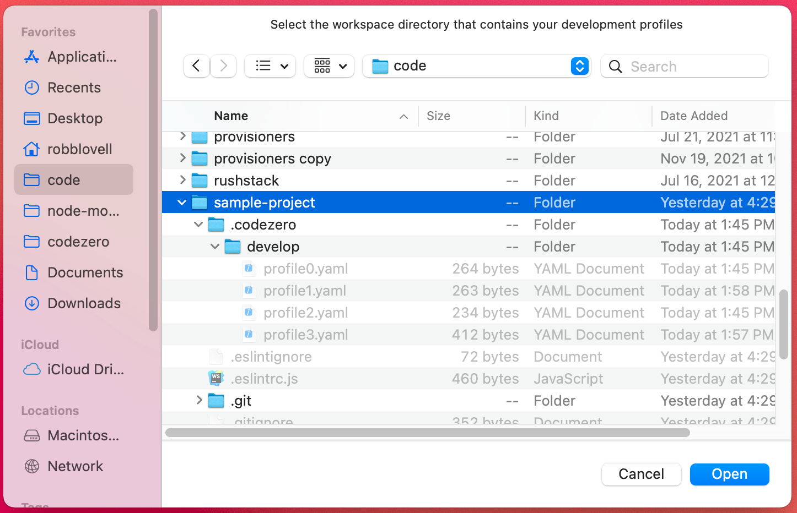
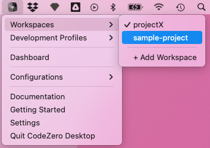

## Adding a Workspace

Workspaces are managed via the tray menu under "Workspaces". Select "+ Add Workspace" to add a workspace to the
the Desktop app. When adding a workspace the app will automatically load any Codezero Development Profiles within
the workspace's `.codezero/develop` directory.

Select the workspace directory in the dialog: (i.e. Select the root folder with the .codezero directory within it.)

After selecting "Open", you can switch between workspaces using the Workspaces menu:

