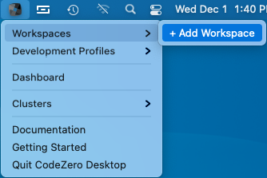
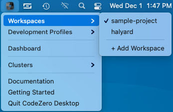

## Adding a Workspace

Workspaces are managed via the tray menu under "Workspaces". Select "+ Add Workspace" to add a CodeZero workspace to the
the dashboard menu. This will find the Codezero Development Profiles within the .codezero/develop directory of the 
workspace selected.

Select the workspace directory in the dialog: (Select the folder with the .codezero directory within it.)

After selecting "Open", you can switch between configurations using the Cluster menu:

