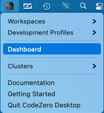
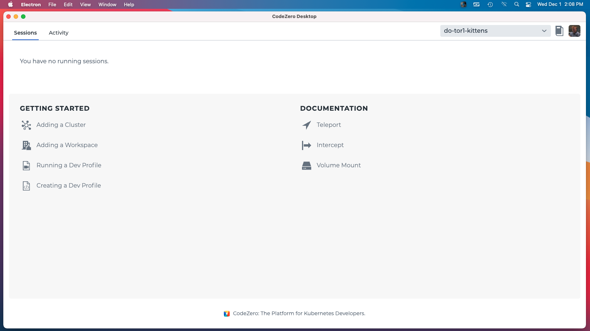
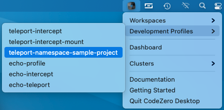
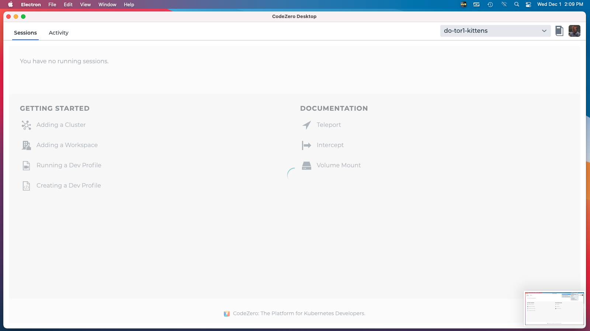
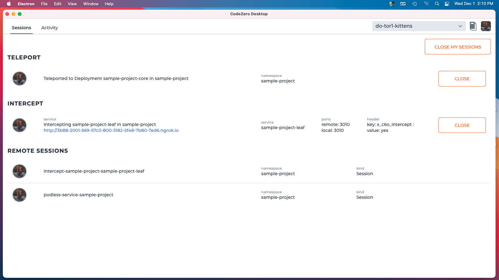
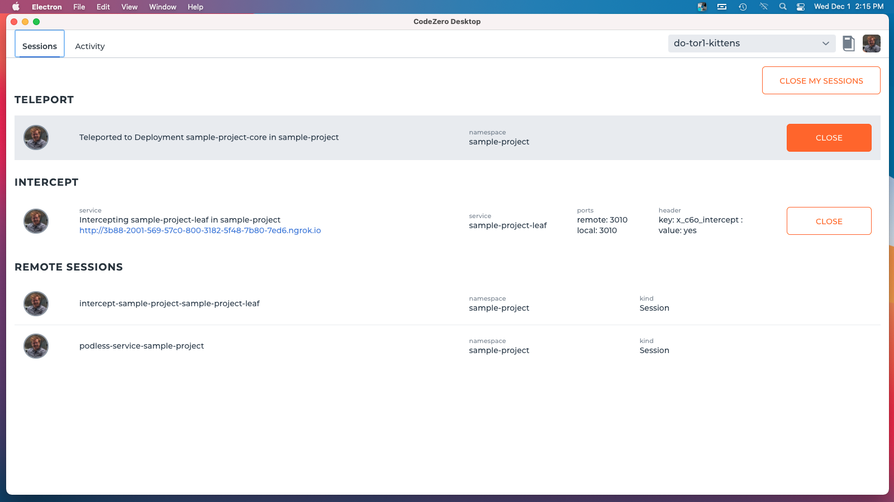
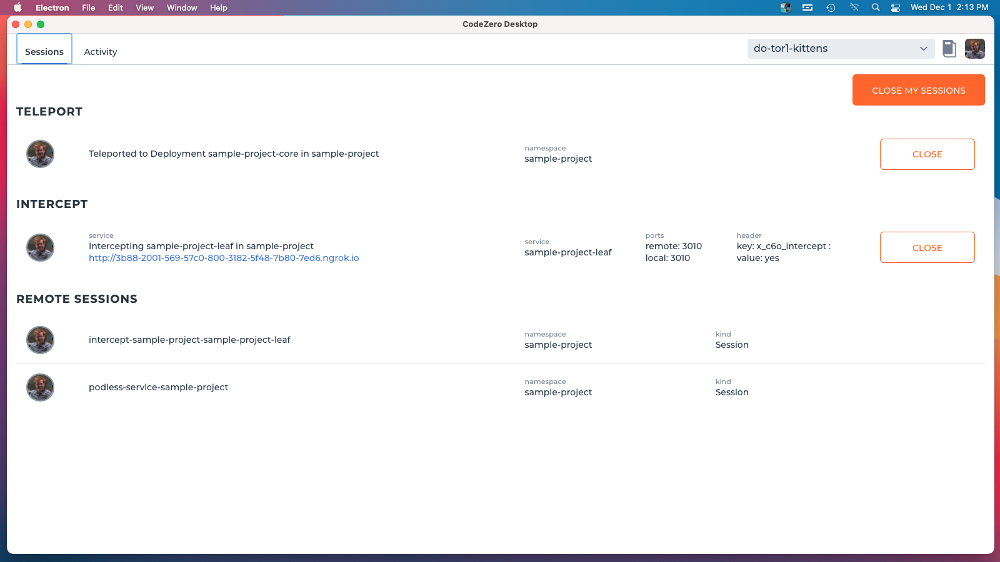

## Running a Development Profile

Dev Profiles are read from the .codezero/develop directory and contain instructions to startup various CodeZero commands.
See [Creating Dev Profiles](./running-a-dev-profile.md) for more information on creating dev profiles.

Open the dashboard window to see the development profile sessions:

A dashboard opens, and if you have no sessions running, you will see a getting started page with links to this documentation.

To run a dev profile, select one from the "Development Profiles" menu items.

The command will start running and the dashboard will show a "busy" indicator while the session starts up:

As commands run, you will see various sessions appear in the dashboard. When the command is finished you will see the 
sessions that are running:

Other dev profiles can be run and these will show up too:

A session is closed by selecting the close button next to the session:

You can close all sessions by selecting the Close My Sessions button:

