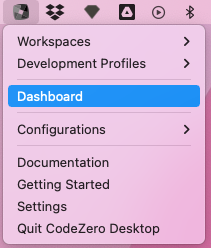
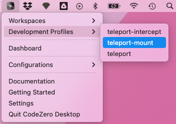

## Running a Development Profile

Development Profiles are read from the `.codezero/develop` directory and contain instructions to start up various CodeZero commands.

Open the dashboard window to see the sessions run from Development Profiles:

A dashboard opens, and if you have no sessions running, you will see a getting started page with documentation links.

To run a Development Profile, select one from the "Development Profiles" menu items.

The command will start running and the dashboard will show a "busy" indicator while the session starts up:

As commands run, you will see various sessions appear in the dashboard. When the command is finished you will see the
sessions that are running:

Other Development Profiles can be run and these will show up too:

A session is closed by selecting the close button next to the session:

You can close all sessions by selecting the Close My Sessions button:

