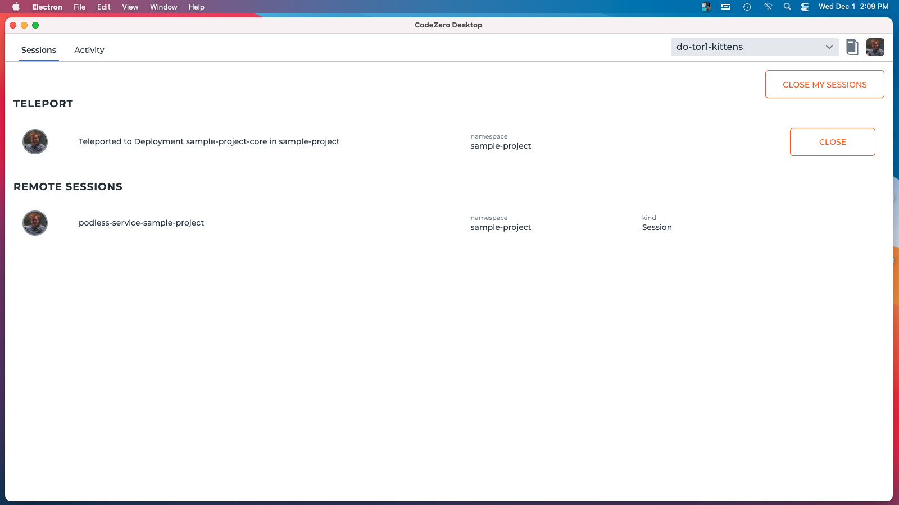

# Using the CodeZero Desktop App

The Desktop App gives you a graphical interface for some of the functions available in the CLI.

## What you can do with the Desktop App

With the app you can:

1. Merge `kubeconfig` contexts into your system's `kubeconfig` at `~/.kube/config`
2. Switch the active context
3. Securely request and share encrypted contexts with other users
4. Add _Workspaces_ containing _Development Profiles_ for easily running commands
5. Run _Development Profiles_ from your computer's system tray
6. See active _Sessions_ belonging to you or other users working in the cluster
7. Close running _Sessions_
8. See logs from _Sessions_ and previously run commands
9. Manage your user profile

---

## Adding a Context

You can use the Desktop app to merge (or remove) kubeconfig contexts in your user kubeconfig located at `~/.kube/config`.

To add a new context:

1. Click on the CodeZero system tray icon.
2. Open the **Contexts** menu and select **+ Add Context**.
3. A dialog will appear where you can either:
   - Paste in the YAML for the new context, or
   - Select a file containing the context
4. Click on the "Add Context" button.

When adding a context, it can be either plaintext or _encrypted_.

Encrypted contexts can be generated using the Desktop app for securely sharing a context with other users. Learn more about [requesting an encrypted context](/guides/collaboration?id=requesting-a-context), or [generating an encypted context](/guides/collaboration?id=generating-and-sharing-an-encrypted-context).

> [!PROTIP]
> Encrypted contexts can also be requested and generated using the CodeZero CLI.

You can switch your active context using the tray menu or from the Dashboard's settings screen.

> [!NOTE]
> You can also add a new context from the Manage Contexts screen under Settings.

---

## Adding a Workspace

_Workspaces_ are Git repos that may contain _Development Profiles_ at the root of the repository in the `.codezero/develop/` folder.

Workspaces are managed in the system tray menu under **Workspaces**. The following describes how to add a new workspace, and how to select the current workspace.

To add a new workspace:

1. Click on the CodeZero system tray icon.
2. Open the **Workspaces** menu and select **+ Add Workspace**.
3. A system dialog will open.
4. Choose the root folder that contains the `.codezero` folder and click **Open**.

### Switch the Active Workspace

You can switch between workspaces using the **Workspaces** menu.

1. Click on the CodeZero system tray icon.
2. Open the **Workspaces** menu and select the workspace you wish to switch to.
3. This will load the Development Profiles for this workspace, which can be accessed from the **Development Profiles** tray menu.

---

## Running a Development Profile

_Development Profiles_ are read from the `.codezero/develop/` directory within Workspaces. The following describes how to run a Development Profile.

1. Click on the CodeZero system tray icon.
2. Open the **Workspaces** menu and make sure you have the correct workspace selected.
3. Open the **Development Profiles** menu and select the profile you wish to run.

The Commands that are part of the Development Profile will start in sequence, and you will see various Sessions appear in the Dashboard as they start up.

You can run additional Development Profiles. They will start as long as there are no conflicting Sessions.

Close a running Session by selecting the **Close** button next to the Session. This will not affect Sessions belonging to other users working in the cluster.

Click **Close My Sessions** to close all your active Sessions.

