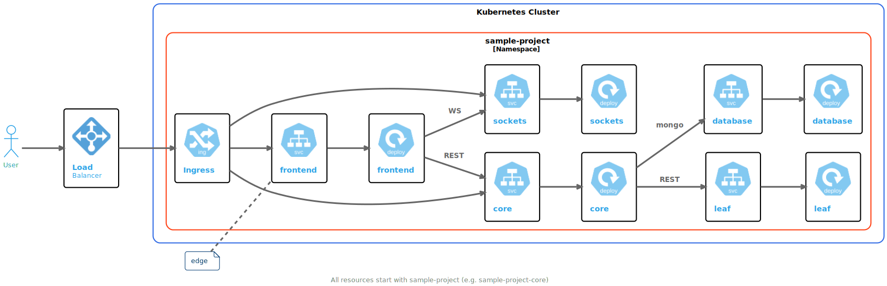

# Sample Kubernetes Project

All of the tutorials use the [Sample Kubernetes Project](https://github.com/c6o/sample-project) on GitHub. For the remainder of these tutorials, you will need:

[prerequisites](_fragments/prerequisites.md ':include')

> [!Note]
> Tutorials are a work in progress and do not represent everything you can do with CodeZero. If you are new to CodeZero, it is best that you go through the tutorials in the order they are presented.

## Objectives

In this tutorial, you will learn:

* How to perform local development against an application running in a Kubernetes cluster

By the end of the tutorial you should have successfully run the application locally, and also in your cluster.

## Architecture

The following diagram depicts all the components of the sample project:



## Tutorial

If you haven't already, clone the [Sample Kubernetes Project](https://github.com/c6o/sample-project) repo on GitHub, and set up a Kubernetes cluster. For development we recommend using either [Civo](https://civo.com) or [DigitalOcean](https://digitalocean.com), but any k8s or k3s Kubernetes cluster will do.

Getting to know Kubernetes and setting up a cluster is beyond the scope of this README, however you can check out the beginner articles on our [Blog](https://blog.codezero.io/tag/learning/).

### Local Setup

This project requires NodeJS 16+ and yarn, has been tested on MacOS (BigSur), Linux, and Windows Subsystem for Linux (WSL).

```bash
npm install -g yarn
```

All microservices can run locally with minimal requirements. After you clone the project, you can build and run all the services locally. From the repo's root, run the following (yarn is required):

```bash
yarn install
yarn start
```

Open [http://localhost:3030](http://localhost:3030) in a browser to view the running services.

> [!Note]
> If you aren't running MongoDB locally you won't see the database service running, but we'll get this working in a cluster in the next section.

Hit Ctrl-C now to stop the services and exit.

### Kubernetes Setup

This project uses Persistent Volumes and either LoadBalancer services (DigitalOcean) or Traefik V2 (Civo) for [ingress](https://kubernetes.io/docs/concepts/services-networking/ingress/).

Once your cluster is set up, install the sample project in-cluster. From the root of the repo, run:

```bash
kubectl create ns sample-project
kubectl -n sample-project apply -f ./k8s
```

This will install all the services and deployment, but will not set up ingress.

If you're using TraefikV2, run the following:

```bash
kubectl -n sample-project apply -f ./k8s/traefik
```

Or if you use an Ingress Controller, run the following:

```bash
kubectl -n sample-project apply -f ./k8s/ingress
```

To use a generic LoadBalance service, run the following:

```bash
kubectl -n sample-project apply -f ./k8s/loadbalance
```

The above assumes port 80 is avaiable. If you'd like an alternative port, edit the port in `k8s/loadbalance/frontend.yaml`

You will then need to obtain the appropriate ingress service IP address or the LoadBalancer IP address and go to `http://IP-ADDRESS` in a browser. You should see all the microservices running.

Congratulations, you are now ready to move on to the [Developing Edge Services](/tutorials/edge.md) tutorial.
