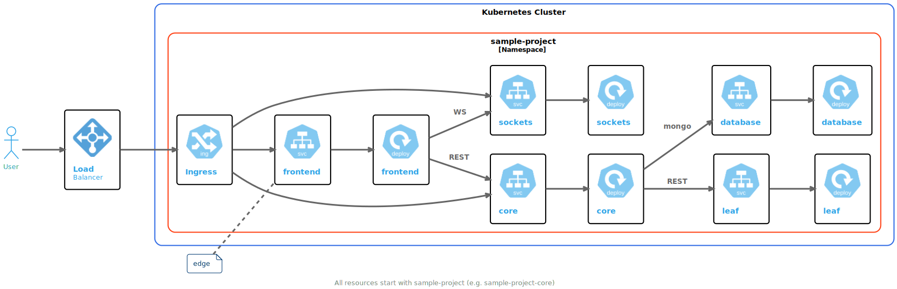

# Sample Kubernetes Project

The [Sample Kubernetes Project](https://github.com/c6o/sample-project) is on GitHub. For the remainder of these tutorials, you will need:

1. A Kubernetes Cluster
1. A clone of the above project
1. CodeZero installed

> [!Note]
> Tutorials are a work in progress and do not represent everything you can do with CodeZero

If you are new to CodeZero, it is best that you go through the tutorials in the order they are presented.

## Architecture

The following diagram depicts all the components of the sample project

