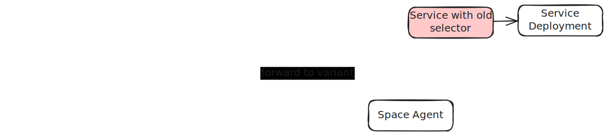

# Serve

<iframe width="560" height="315" src="https://www.youtube.com/embed/4X47YxlcGkQ?si=QbbzWDas16vdB8DB" title="YouTube video player" frameborder="0" allow="accelerometer; autoplay; clipboard-write; encrypted-media; gyroscope; picture-in-picture; web-share" referrerpolicy="strict-origin-when-cross-origin" allowfullscreen></iframe>

Codezero’s Serve function allows developers to run a service locally while making it appear as if it’s deployed in the Kubernetes cluster. When you serve a local variant, you can:

- Route specific traffic to your local service instance while keeping cluster traffic undisturbed
- Test changes without deploying to the cluster
- Share your local variant with team members through the service catalog

## Variants

A Variant in Codezero represents an alternative instance of a service that can run alongside the default in-cluster version.
Unlike traditional versioning, variants allow developers to test changes without deployment while allowing the original service to function undisturbed.

### Traffic Management

- Multiple variants can coexist simultaneously
- Traffic can be selectively routed based on:
  - User ID
  - Custom headers
  - [W3C Baggage](https://www.w3.org/TR/baggage/), for example [OpenTelemetry Baggage](https://opentelemetry.io/docs/concepts/signals/baggage/) or [Datadog](https://docs.datadoghq.com/tracing/trace_collection/trace_context_propagation/#baggage)

### Collaboration Features

- Team members can see available variants in the service catalog
- Developers can choose between original services or colleague’s variants
- Multiple developers can work on different variants of the same service simultaneously

## Benefits

Serving variants enables developers to test changes in a production-like environment without deployment overhead, facilitating faster development cycles and reducing the complexity of microservice development.

## Details

When you serve a local variant, the Codezero Space Agent creates a Serve Custom Resource.

Based on the values in the Serve Custom Resource, the Codezero Operator performs the following tasks:
1. It creates a new Codezero Router Deployment and changes the selector of the Service in the cluster to the new Router deployment.
1. It creates a new Service with the old selector values which is used to forward requests to the in-cluster service.
1. It restarts the Service Deployment to interrupt any long-running connections that may be open.

The Router either forwards requests to the in-cluster service or local variants via the Space Agent.

When no local variant is served for a particular service, the Space Agent deletes the Serve Custom Resource.
The Operator deletes the Codezero Router Deployment and restores the selector of the Service to the original value.

You can read more about configuration options for the Router in [Advanced Configuration Options for Space Agent](../guides/spaceagent-config.md).