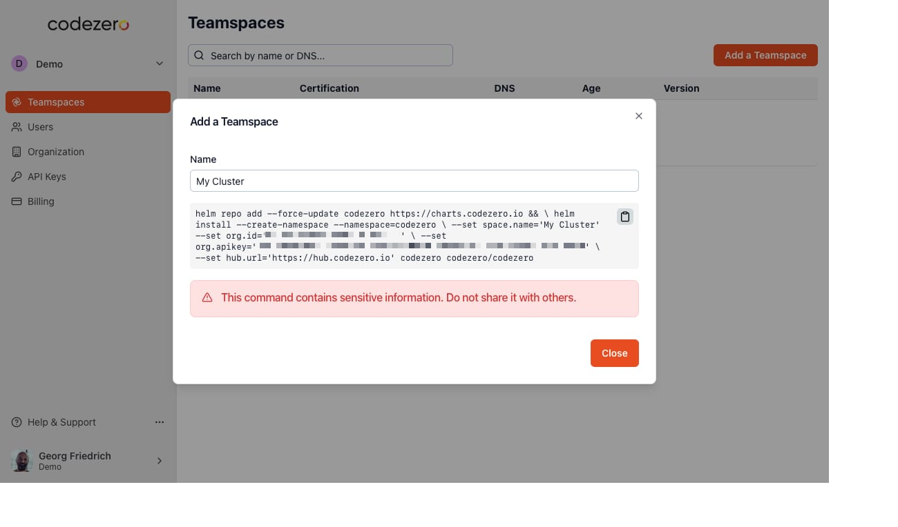

# Installing Space Agent for Kubernetes

Teamspaces are vanilla Kubernetes clusters with Codezero installed. The following guide will step you through registering a Teamspace and certifying it for development use. This should take about 10 minutes to complete.

## Install the Space Agent in your Cluster

To install Codezero from your terminal, you will need:

* Access to the cluster (i.e. kubeconfig)
* [helm](https://helm.sh/docs/intro/install/) and [kubectl](https://kubernetes.io/docs/reference/kubectl/)  installed, and
* Your current context set to the correct cluster

On the Profile menu, click _Settings_ and then select the _Teamspaces_ tab. Click _Add Teamspace_ to create the installation command.



To use this command copy to your clipboard using the _copy_ button on the right side of the screen.  After doing that press the _Done_ button.

This install command contains your organization's API key. Please keep it confidential.
It uses [Helm](https://helm.sh) to install the Codezero Space Agent. You can find the Helm charts on Codezero's [GitHub](https://github.com/c6o/helm-charts).

Now paste the command into your terminal and wait for Codezero to be installed and started.

:::note
_Additional annotations may be necessary;_ refer to our [Codezero Helm Chart documentation](https://github.com/c6o/helm-charts) and the section on Load balancer requirements below.
:::

### LoadBalancer requirements

The Codezero helm chart deploys a Kubernetes service of type `LoadBalancer`. For Codezero to function properly the provisioned load balancer requires a public ip address and must work on OSI layer 4.

import Tabs from '@theme/Tabs';
import TabItem from '@theme/TabItem';

<Tabs>
<TabItem value="aws-eks" label="AWS EKS" default>
By default AWS EKS uses classic load balancers for a Kubernetes service of type `LoadBalancer`. In this case no additional setup is required.

However when using [AWS Load Balancer Controller](https://docs.aws.amazon.com/eks/latest/userguide/aws-load-balancer-controller.html) additional annotations need to be set on Codezero's load balancer service. This can be done via the helm chart by adding the following values:

```text
lb:
    service:
        annotations:
            service.beta.kubernetes.io/aws-load-balancer-type: "external"
            service.beta.kubernetes.io/aws-load-balancer-nlb-target-type: "ip"
            service.beta.kubernetes.io/aws-load-balancer-scheme: "internet-facing"
```

</TabItem>
<TabItem value="gke" label="GKE" default>
    Google Kubernetes Engine creates external Network Load Balancers by default.
</TabItem>
<TabItem value="generic-cluster" label="Generic cluster">
    Codezero will rely on the default behaviour provided by the cluster.
</TabItem>
</Tabs>

## Teamspace Certification

The Codezero Space Agent installs into the `codezero` namespace and should take less than a minute to start depending on how long it takes to provision a LoadBalancer pod and service.  The `codezero` loadbalancer service will be ready but the cloud loadbalancer may need minutes to be fully available.

:::info
For example, with AWS, the kubernetes loadbalancer service will show the AWS NLB (Network Load Balancer) hostname and codezero hub will show the space as ready and certified.
However, the AWS NLB can still be in a provisioning state and network access will only work once it is fully provisioned, which can take up to 5+ minutes.
:::

You can view the codezero pods and services using the following:

```text
kubectl get pods,svc -n codezero

NAME                                READY   STATUS    RESTARTS   AGE
pod/loadbalancer-556d54fb4-qx6w4    1/1     Running   0          9d
pod/operator-86b9d856cb-ktqcj       1/1     Running   0          9d
pod/spaceagent-5cb47f595b-m8ppw     1/1     Running   0          9d

NAME                   TYPE           CLUSTER-IP     EXTERNAL-IP     PORT(S)                         AGE
service/codezero       LoadBalancer   10.43.95.152   xxx.x.xxx.xxx   8800:31420/TCP                  13d
service/spaceagent     ClusterIP      10.43.9.204    <none>          8800/TCP                        13d
```

Once the Codezero Loadbalancer pod is ready, you should see the Certification column at [hub.codezero.io/settings/spaces](https://hub.codezero.io/settings/spaces) change to _Certified_ and shortly thereafter, you should see an IP address (or Host Name) show up under DNS. Your Teamspace is ready for use.

Certification ensures secure communications between the Codezero SpaceAgent in your cluster and the [Hub](../concepts/architecture#hub) (the Codezero Admin Console).


## Upgrading Codezero Space Agent

Run the following commands to upgrade the Space Agent to the latest version without changing any configuration values:

```bash
helm repo add --force-update codezero https://charts.codezero.io
helm upgrade --namespace=codezero codezero codezero/codezero
```

## Uninstalling Codezero Space Agent

Codezero's Space Agent may be removed from the Kubernetes cluster at any time. It is recommended that you close all Consume and Serve sessions before you begin the uninstallation.

To uninstall, run:

```bash
helm -n codezero uninstall codezero
```
