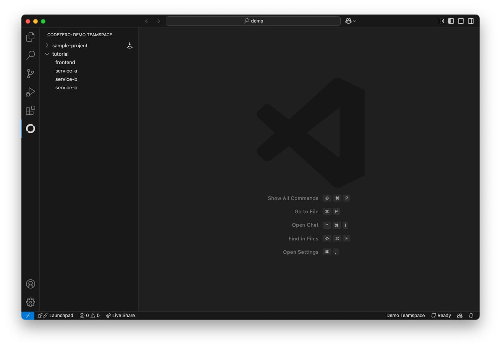

# Installing VSCode Extension

You can find the Codezero VS Code extension in the [Visual Studio Marketplace](https://marketplace.visualstudio.com/items?itemName=CodeZero.codezero).
Click Install to add the extension to your editor.

# Features

- Select Teamspace
- View Namespaces and Services
- Consume Services

