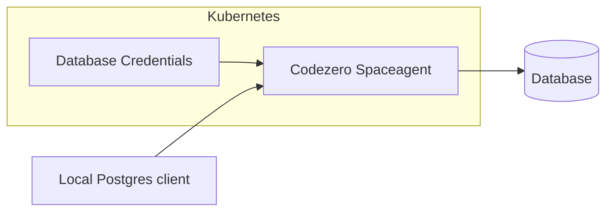

# Credential Infusion

Codezero's crendential infusion allows consuming services without the need to set up secrets within local development environments.
For example, a database can be accessed from local development without knowing the username and password. The Codezero Space Agent will infuse credentials on the fly.



## Setup Credential Infusion for MySQL

1. Create a Kubernetes secret holding the database credentials in the codezero namespace. The secret name must match the hostname of the database.

```yaml
apiVersion: v1
kind: Secret
metadata:
  name: test.cluster-cluyia0mwn9q.us-east-2.rds.amazonaws.com
  namespace: codezero
  annotations:
    codezero.io/credentials-infusion-type: mysql
    codezero.io/credentials-infusion-port: "3306" # optional, defaults to 3306
type: Opaque
stringData:
  username: my-user
  password: my-password
```

2. Consume `test.cluster-cluyia0mwn9q.us-east-2.rds.amazonaws.com` service via the Codezero desktop app or `czctl`

```bash
echo "test.cluster-cluyia0mwn9q.us-east-2.rds.amazonaws.com" | czctl consume apply
```

3. Use any mysql client in local development to connect to the database. E.g. with mysql client:

```bash
mysql -h test.cluster-cluyia0mwn9q.us-east-2.rds.amazonaws.com -u something -p --ssl-mode=DISABLED
```

:::note
When using credential infusion for Mysql the connection must always have ssl mode disabled. The tunnel connection to the space agent will still be secured with TLS.
:::


## Setup Credential Infusion for PostgreSQL

1. Create a Kubernetes secret holding the database credentials in the codezero namespace. The secret name must match the hostname of the database.

```yaml
apiVersion: v1
kind: Secret
metadata:
  name: my-postgres.cluyia0mwn9q.us-east-2.rds.amazonaws.com
  namespace: codezero
  annotations:
    codezero.io/credentials-infusion-type: postgres
    codezero.io/credentials-infusion-port: "5432" # optional, defaults to 5432
type: Opaque
stringData:
  username: my-user
  password: my-password
```

2. Consume `my-postgres.cluyia0mwn9q.us-east-2.rds.amazonaws.com` service via the Codezero desktop app or `czctl`

```bash
echo "my-postgres.cluyia0mwn9q.us-east-2.rds.amazonaws.com" | czctl consume apply
```

3. Use any postgres client in local development to connect to the database. E.g. with psql cli:

```bash
psql -h my-postgres.cluyia0mwn9q.us-east-2.rds.amazonaws.com
```

## Setup Credential Infusion for HTTP/HTTPS Headers

HTTP header infusion can be used to connect to external HTTPS services.

1. Create a Kubernetes secret holding the header and value to authenticate to the external HTTPS services. The secret name must match the hostname of the external service.

```yaml
apiVersion: v1
kind: Secret
metadata:
  name: api.stripe.com
  namespace: codezero
  annotations:
    codezero.io/credentials-infusion-type: https # can be https or http
    codezero.io/credentials-infusion-port: "443" # optional, defaults to 443 for https and 80 for http
type: Opaque
stringData:
  key: Authorization
  value: Basic Zm9vYmFyCg==
```

2. Consume `api.stripe.com` service via the Codezero desktop app or the CLI

```bash
echo "api.stripe.com" | czctl consume apply
```

3. Install the Codezero Credentials Infusion Root CA in your system trust store. This certificate is created by the Local Agent and is unique for your machine.

```bash
czctl cert install
```

4. Use any HTTP client to send requests to `https://api.stripe.com`

```bash
curl https://api.stripe.com/v1/customers?limit=1
```

:::note
Some programming languages do not rely on the system trust store. In such cases, you may need to manually add the Codezero Root CA.

For NodeJS, set the [NODE_EXTRA_CA_CERTS environment variable](https://nodejs.org/api/cli.html#node_extra_ca_certsfile) to add the Codezero Root CA:

```bash
export NODE_EXTRA_CA_CERTS=$(czctl cert path)
```
:::
