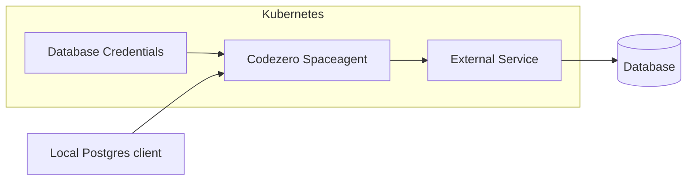

# Credential Infusion

Codezero's crendential infusion allows consuming services without the need to set up secrets within local development environments.
For example, a database can be accessed from local development without knowing the username and password. The Codezero Space Agent will infuse credentials on the fly.



## Setup Credential Infusion for PostgreSQL

1. Create a Kubernetes secret holding the database credentials in the codezero namespace. The secret name must match the external service name and namespace created in step 2.

```yaml
apiVersion: v1
kind: Secret
metadata:
  name: my-postgres.demo
  namespace: codezero
type: Opaque
stringData:
  username: my-user
  password: my-password
```

2. Create an external Kubernetes service pointing to the target database. The annotation `codezero.io/credential-infusion: postgres` instructs the Codezero Space Agent to infuse credentials for this database.

```yaml
apiVersion: v1
kind: Service
metadata:
  annotations:
    codezero.io/credential-infusion: postgres
  name: my-postgres
  namespace: demo
spec:
  externalName: my-postgres.cluyia0mwn9q.us-east-2.rds.amazonaws.com
  ports:
  - port: 5432
    protocol: TCP
    targetPort: 5432
  type: ExternalName
```

3. Consume `my-postgres.demo` service via the Codezero desktop app or `czctl`

```bash
echo "my-postgres/demo" | czctl consume apply
```

4. Use any postgres client in local development to connect to the database. E.g. with psql cli:

```bash
psql -h my-postgres.demo
```

## Setup Credential Infusion for HTTP Headers

HTTP header infusion can be used to connect to external HTTPS services.

1. Create a Kubernetes secret holding the header and value to authenticate to the external https services. The secret name must match the external service name and namespace created in step 2.

```yaml
apiVersion: v1
kind: Secret
metadata:
  name: my-http-service
  namespace: codezero
type: Opaque
stringData:
  key: Authorization
  value: Basic Zm9vYmFyCg==
```

2. Create an external Kubernetes service pointing to the target HTTP or HTTPS service.

```yaml
apiVersion: v1
kind: Service
metadata:
  annotations:
    codezero.io/credential-infusion: http
  name: my-http-service
  namespace: demo
spec:
  externalName: some.external-service.com
  ports:
  - port: 80
    protocol: TCP
    targetPort: 443
  type: ExternalName
```

3. Consume `my-http-service.demo` service via the Codezero desktop app or the CLI

```bash
echo "my-http-service/demo" | czctl consume apply
```

4. Use any HTTP client to send HTTP requests to `http://my-http-service.demo`

```bash
curl http://my-http-service.demo/my-api
```

:::note
Changing a credential secret requires a restart of the `spaceagent` deployment.

```bash
kubectl rollout restart deployment -n codezero spaceagent
```
:::
