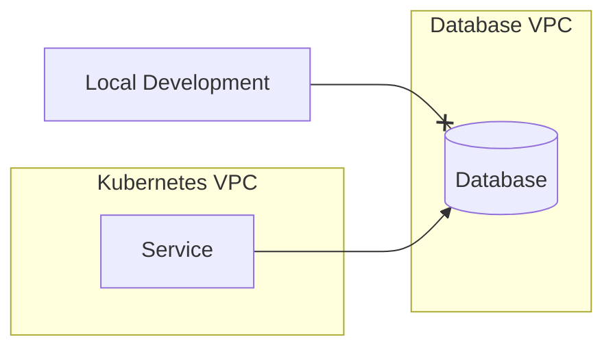

# Consuming external databases

When running applications in Kubernetes their databases usually run outside the Kubernetes cluster. In these scenarios the database commonly resides in different subnets or VPCs. Kubernetes worker nodes can route to the subnet or VPC but developers usually do not have direct access or require a VPN connection:



Consume can support external databases (or any external service) by applying a Kubernetes [service](https://kubernetes.io/docs/concepts/services-networking/service/#externalname) manifest. Apply the following manifests to create an external service using Postgres as an example:

import Tabs from '@theme/Tabs';
import TabItem from '@theme/TabItem';

<Tabs>
<TabItem value="dns" label="External DNS" default>
  Use the database DNS in `externalName`. For example in AWS Aurora use the cluster endpoint or reader endpoint.

  ```
  apiVersion: v1
  kind: Service
  metadata:
    annotations:
    name: postgres
    namespace: example
  spec:
    externalName: <aurora cluster endpoint>
    ports:
    - port: 5432
      protocol: TCP
      targetPort: 5432
    type: ExternalName
  ```
</TabItem>
<TabItem value="ip" label="External IP" default>
  A DNS is not always available. E.g. private Google SQL clusters have a private IP address.

  ```
  kind: Service
  apiVersion: v1
  metadata:
    name: postgres
    namespace: example
  spec:
    clusterIP: None
    ports:
    - port: 5432
  ---
  kind: Endpoints
  apiVersion: v1
  metadata:
    name: postgres
    namespace: example
  subsets:
    - addresses:
          - ip: <private database ip>
      ports:
        - port: 5432
          name: postgres
  ```
</TabItem>
</Tabs>

:::note
For Codezero to consume external services a service manifest must include ports.
:::

You can now consume the above defined service `example/postgres` and access the Postgres database locally.
