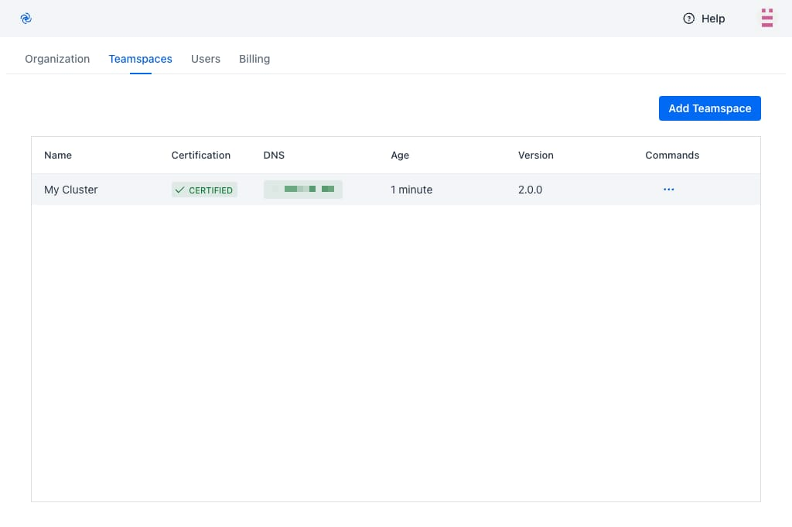

# Getting Started

Sign up or log in to the [Codezero Hub](https://hub.codezero.io).
The onboarding wizard will guide you through creating an organization and your first Teamspace.

## Install Codezero in your Cluster

After creating your Teamspace you need to install the Codezero Space Agent. Click on Helm Install to copy the Helm install string. This install command is unique to your cluster. It includes a one-time token that is used to certify the Teamspace.


## Wait for Certification

Finally, you should see the Certification column change to Certified and shortly thereafter, you should see an IP address or Host Name show up under DNS. At this time, your Teamspace is ready for use.



## Install the CLI

To install Codezero via the command line, run the following command in your terminal:

```bash
curl -L https://releases.codezero.io/install-headless.sh | /bin/bash
```

## Log in and Start the Local Agent

Log in to your Codezero account by running:

```bash
czctl auth login
```

Start the Codezero daemon (background service) by running:

```bash
czctl start
```

## Navigate to your Service Catalog

You can now select the Teamspace from the Teamspace List in the top left corner of your browser window.
This will take you to the Service Catalog:


