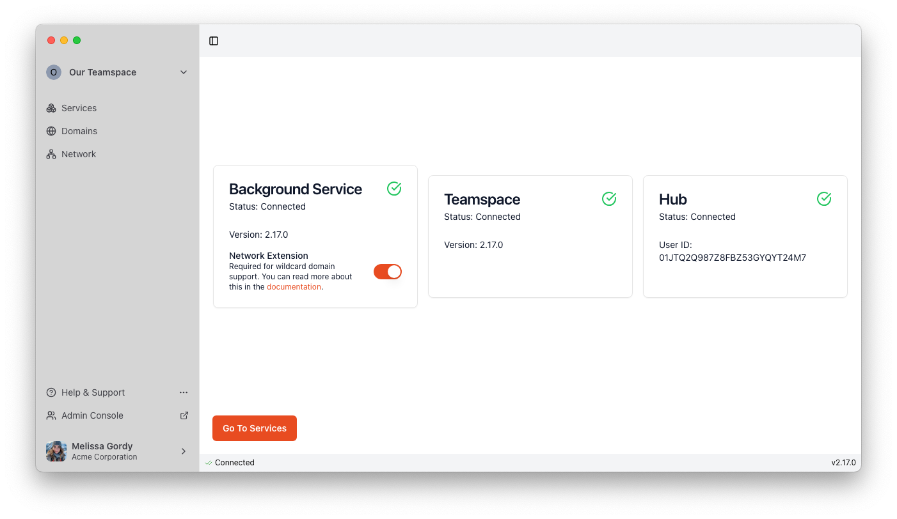
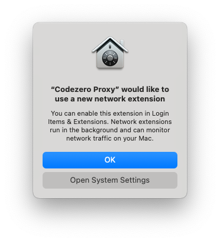
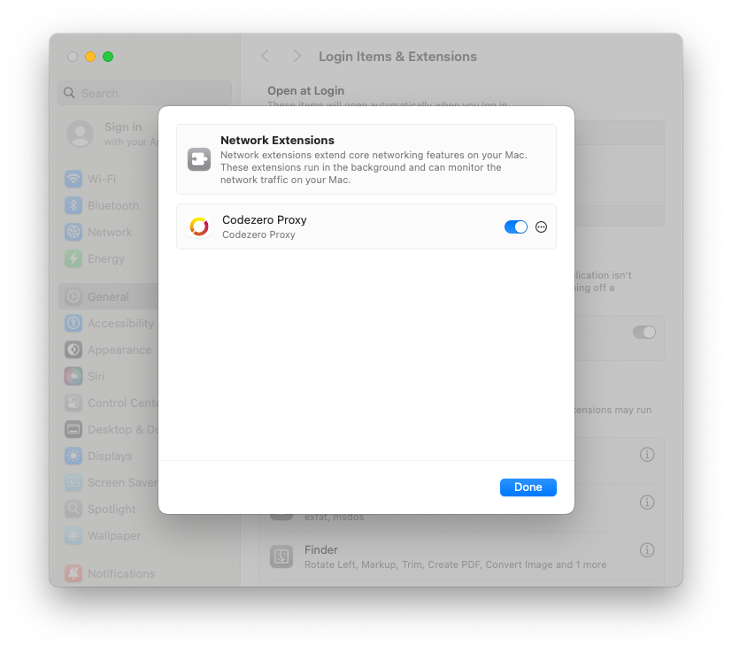
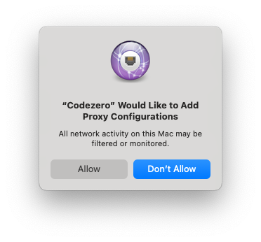

# Enabling the Network Extension

:::info[Prerequisites]
You need macOS 15 or later and the desktop app installed.
:::

Enabling the Network Extension allows you to consume wildcard domains, i.e. domains and they subdomains.

The Network Extension will relay network traffic to your consumed services directly to your Teamspace without modifying your `/etc/hosts` file.

Follow the steps below to enable the Network Extension:

1. Click on Connected in the status bar and then click the switch to enable the Network Extension inside the Background Service panel:

    

2. In the popup click the button "Open System Settings":

   

3. Click the switch next to "Codezero Proxy" to enable the Codezero Network Extension:

   

4. In the popup, click "Allow" in order to start the Codezero Network Extension:

   
