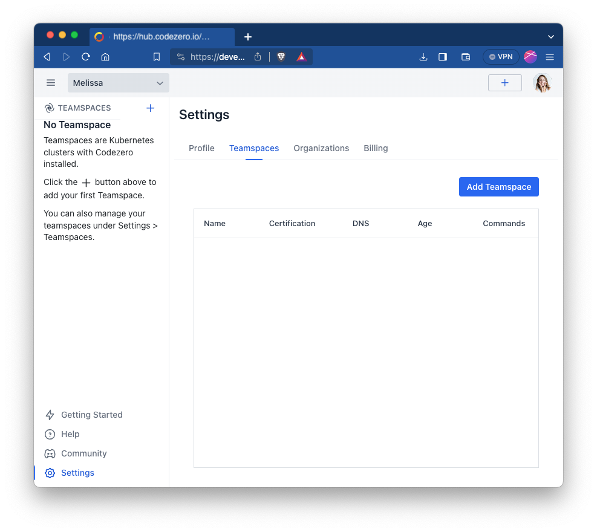
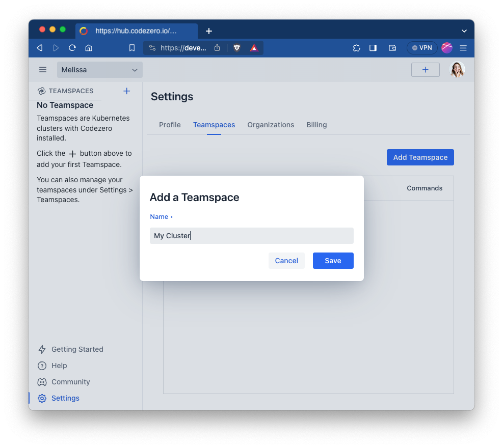
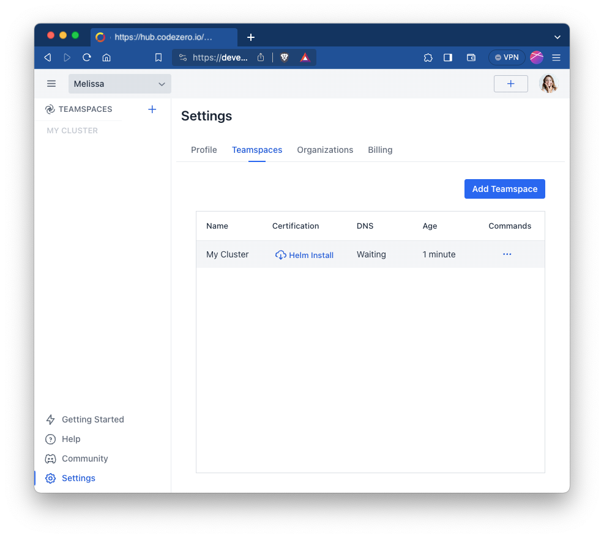
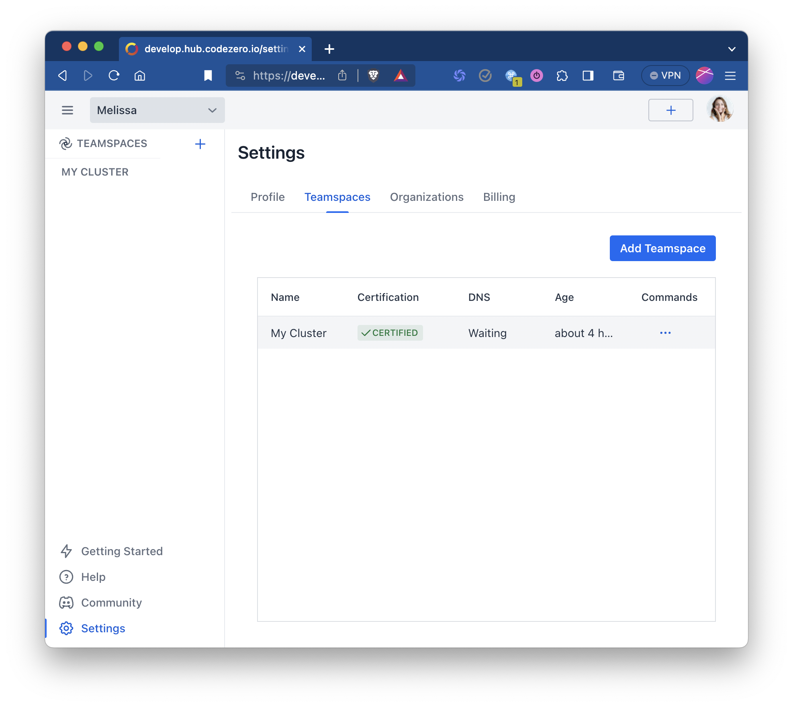
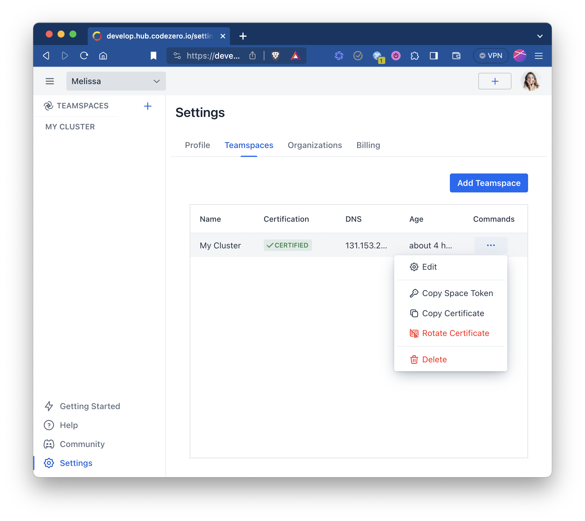

# Teamspace Setup

Teamspaces are vanilla Kubernetes clusters with Codezero installed. We strive to make it really easy for you to get up and running with Codezero. Once you have a Kubernetes cluster setup, it will only take you a few more minutes to add Teamspace capabilities.

## Login to Hub

Log in to the [Codezero Hub](https://hub.codezero.io) and navigate to Settings > Teamspaces:



## Add Teamspace

Click _Add Teamspace_ to name and create your Teamspace.



## Install Codezero

Now that you have registered a Teamspace, click on _Helm Install_ to copy the helm install string. This install command is unique to your cluster. It includes a one-time token that is used to certify the Teamspace.

Once installed, the cluster will use this one-time token to securely send a Certificate Signing Request which will then Certify the cluster.

```bash
helm repo add --force-update codezero https://charts.codezero.io
helm install --create-namespace --namespace=codezero --set space.token=<ONE-TIME TOKEN> \
    codezero codezero/codezero
```



## Wait for Certification

Finally, you should see the Certification column change to _Certified_ and shortly thereafter, you should see an IP address or Host Name show up under _DNS_. At this time, your Teamspace is ready for use.

You can now select the Teamspace from the _Teamspace List_ in the navigation panel. This will take you to the _Service Catalog_:



## Troubleshooting

### Rotate Certificate

Should you encounter any issues with the _Helm Install_, you cannot re-use the previously generated install string as the one-time token will have expired. To re-try, please:

1. Run `helm uninstall -n codezero codezero`
1. Select _Rotate Certificate_ from the commands menu
1. Click on _Helm Install_ link when it appears and try again

If you continue to encounter problems, please do not hesitate to reach out to us.



### Stuck _Waiting_ for DNS

The Codezero _System_ service will fail to start if it is unable to obtain the DNS address of the cluster. Sometimes, the Kubernetes retry logic will time out before the ingress is ready. In this case, you may have to restart the _System_ service. To do so, simply delete the _System_ pod:

```bash
kubectl -n codezero delete pod system-<RANDOM>
```