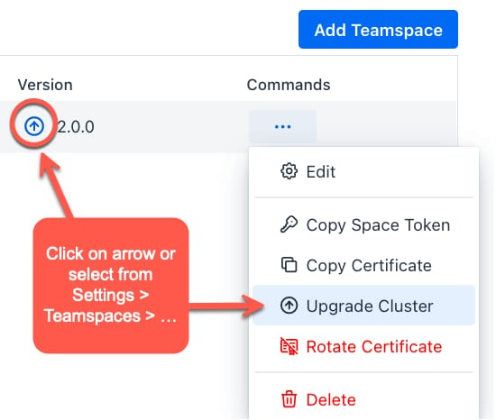

# Teamspace Setup

Teamspaces are vanilla Kubernetes clusters with Codezero installed. The following guide will step you through registering a Teamspace and certifying it for development use. This should take about 10 minutes to complete.

## Create a Codezero Hub Account

Sign up or log in to the [Codezero Hub](https://hub.codezero.io). The onboarding wizard will guide you through creating an organization and your first Teamspace.

The Hub allows you to register and certify Teamspaces. This is also where you can invite and administer members of the Teamspace. While the Hub provides a graphical user interface equivalent to the `czctl` command line tool, all services either run on your local machine or in the Kubernetes cluster.

## Register a Teamspace on Hub

On the Profile menu, click on _Settings_ and then select _Teamspaces_. Click _Add Teamspace_ to name and register your Teamspace name.


## Install Codezero in your Cluster

After registering your Teamspace you need to install the _Codezero System_ onto a Kubernetes cluster. Click on _Helm Install_ to copy the Helm install command. This install command is unique to your cluster. It includes a one-time token that is exchanged with the Hub to certify the Teamspace.


### Load balancer requirements

The Codezero helm chart deploys a Kubernetes service of type `LoadBalancer`. For Codezero to function properly the provisioned load balancer requires a public ip address and must work on OSI layer 4.

import Tabs from '@theme/Tabs';
import TabItem from '@theme/TabItem';

<Tabs>
<TabItem value="aws-eks" label="AWS EKS" default>
    By default AWS EKS uses classic load balancers for a Kubernetes service of type `LoadBalancer`. In this case no additional setup is required.

    However when using [AWS Load Balancer Controller](https://docs.aws.amazon.com/eks/latest/userguide/aws-load-balancer-controller.html) additional annotations need to be set on Codezero's load balancer service. This can be done via the helm chart by adding the following values:

    ```
    lb:
        service:
            annotations:
                service.beta.kubernetes.io/aws-load-balancer-type: "external"
                service.beta.kubernetes.io/aws-load-balancer-nlb-target-type: "ip"
                service.beta.kubernetes.io/aws-load-balancer-scheme: "internet-facing"
    ```


</TabItem>
<TabItem value="gke" label="GKE" default>
    Google Kubernetes Engine creates external Network Load Balancers by default.
</TabItem>
<TabItem value="generic-cluster" label="Generic cluster">
    Codezero will rely on the default behaviour provided by the cluster.
</TabItem>
</Tabs>


## Certification

The Codezero System installs into the `codezero` namespace and should take less than a minute to start depending on how long it takes to provision a LoadBalancer. Once ready, you should see the Certification column change to _Certified_ and shortly thereafter, you should see an IP address or Host Name show up under DNS. Your Teamspace is ready for use.

Certification ensures secure communications between the Codezero System in cluster and the Hub.

You can now select the Teamspace from the _Teamspace List_ in the navigation panel. This will take you to the _Service Catalog_:


## Uninstalling Codezero

Codezero may be removed from the Kubernetes cluster at any time. It is recommended that you close all Consume and Serve sessions prior to uninstalling.

To uninstall, run:

```bash
helm -n codezero uninstall codezero
```

You can then go into the Hub and delete the Teamspace.

## Troubleshooting

### Rotate Certificate

Should you encounter any issues with the _Helm Install_, you cannot re-use the previously generated install string as the one-time token will have expired. To re-try, please:

1. Run `helm uninstall -n codezero codezero`
1. Select _Rotate Certificate_ from the commands menu
1. Click on _Helm Install_ link when it appears and try again

If you continue to encounter problems, please do not hesitate to reach out to us.


### Upgrade Cluster / Codezero Space Agent

Occasionally a new Codezero release requires you to Update your Codezero Space Agent (also referred to as Upgrade your Cluster)

To update your Codezero Space Agent, follow these steps:

1. Log in to [Codezero Hub](https://hub.codezero.io).
2. Select your Teamspace in the top-left corner
3. Navigate to Settings > Teamspaces
4. Click the
   <svg xmlns="http://www.w3.org/2000/svg" class="icon icon-tabler icon-tabler-circle-arrow-up" width="24" height="24" viewBox="0 -2 24 24" stroke-width="2" stroke="currentColor" fill="none" stroke-linecap="round" stroke-linejoin="round">
       <path stroke="none" d="M0 0h24v24H0z" fill="none"></path>
       <path d="M3 12a9 9 0 1 0 18 0a9 9 0 0 0 -18 0"></path><path d="M12 8l-4 4"></path>
       <path d="M12 8v8"></path>
       <path d="M16 12l-4 -4"></path>
   </svg>
   icon next to the version number of your Teamspace to copy the Helm upgrade command.
5. Run the command and then sign out and sign in again.



### Stuck _Waiting_ for DNS

The Codezero _System_ service will fail to start if it is unable to obtain the DNS address of the cluster. Sometimes, the Kubernetes retry logic will time out before the ingress is ready. In this case, you may have to restart the _System_ service. To do so, simply delete the _System_ pod:

```bash
kubectl -n codezero delete pod system-<RANDOM>
```

### Locating Codezero Residue

Codezero does not use any Custom Resource Definitions or finalizers. In the event that you need to lookup resources added or modified by Codezero, you can use the following `kubectl` commands

```bash
kubectl get all --selector="app.kubernetes.io/managed-by"=codezero --all-namespaces
```

If you are looking for residue in a specific namespace, use:

```bash
kubectl -n <NAMESPACE> get all --selector="app.kubernetes.io/managed-by"=codezero
```

You should close all Consume and Serve sessions prior to cleaning up residue in which case the Codezero System controller will perform the cleanup for you. If for whatever reason, it does not, you can remove the resources found and re-deploy your application to get back to a clean state.

### Getting Further Help

If you have any further questions - please reach out to us via [support@codezero.io](mailto:support@codezero.io) or [Discord](https://discord.gg/wx3JkVjTPy) or your dedicated Slack Connect channel (if you're an Enterprise Customer).
