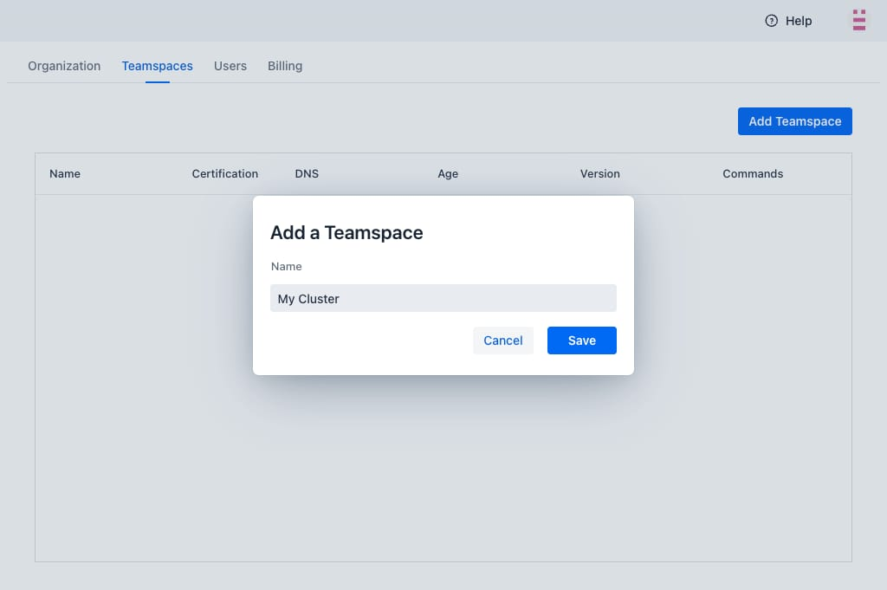
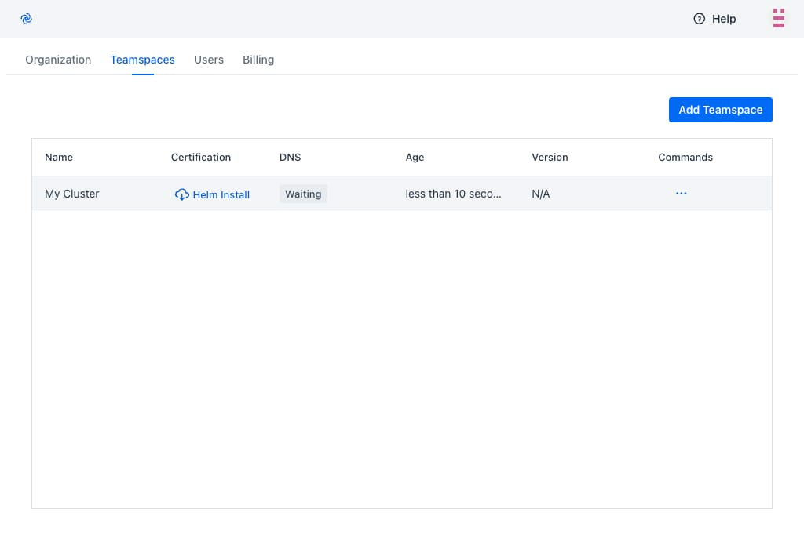
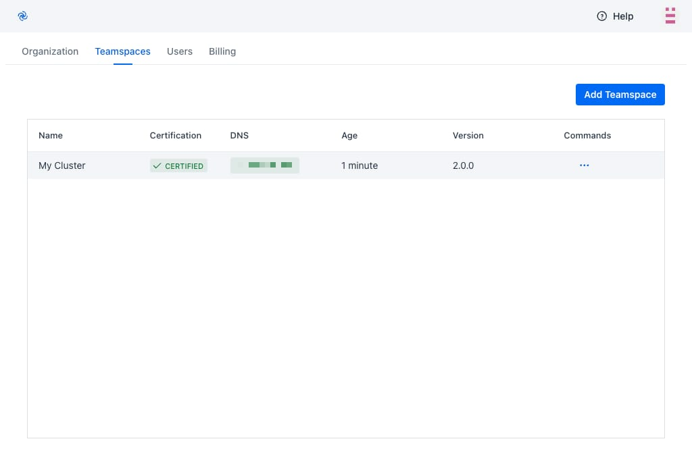
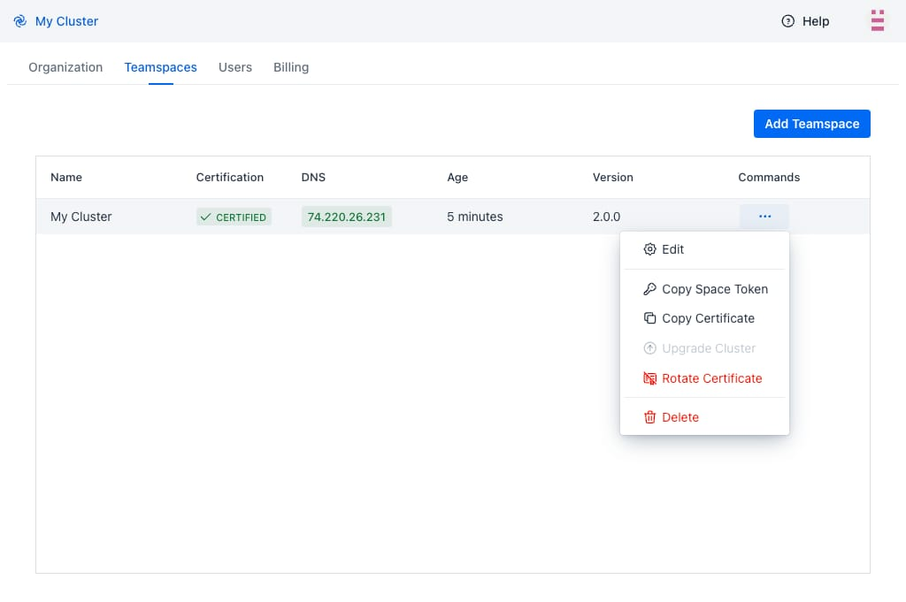

# Teamspace Setup

Teamspaces are vanilla Kubernetes clusters with Codezero installed. The following guide will step you through registering a Teamspace and cerifying it for development use.

## Create a Codezero Hub Account

Sign up or log in to the [Codezero Hub](https://hub.codezero.io). The onboarding wizard will guide you through creating an organization and your first Teamspace.

The Hub allows you to register and certify Teamspaces. This is also where you can invite and administer members of the Teamspace. While the Hub provides a graphical user interface equivalent to the `czctl` command line tool, all services either run on your local machine or in the Kubernetes cluster.

## Register a Teamspace on Hub

On the Profile menu, click on _Settings_ and then select _Teamspaces_. Click _Add Teamspace_ to name and register your Teamspace name.



## Install Codezero in your Cluster

After registering your Teamspace you need to install the _Codezero System_ onto a Kubernetes cluster. Click on _Helm Install_ to copy the Helm install command. This install command is unique to your cluster. It includes a one-time token that is exchanged with the Hub to certify the Teamspace.



## Certification

The Codezero System installs into the `codezero` namespace and should take less than a minute to start depending on how long it takes to provision a LoadBalancer. Once ready, you should see the Certification column change to _Certified_ and shortly thereafter, you should see an IP address or Host Name show up under DNS. Your Teamspace is ready for use.

Certification ensures secure communications between the Codezero System in cluster and the Hub.

You can now select the Teamspace from the _Teamspace List_ in the navigation panel. This will take you to the _Service Catalog_:



## Troubleshooting

### Rotate Certificate

Should you encounter any issues with the _Helm Install_, you cannot re-use the previously generated install string as the one-time token will have expired. To re-try, please:

1. Run `helm uninstall -n codezero codezero`
1. Select _Rotate Certificate_ from the commands menu
1. Click on _Helm Install_ link when it appears and try again

If you continue to encounter problems, please do not hesitate to reach out to us.



### Stuck _Waiting_ for DNS

The Codezero _System_ service will fail to start if it is unable to obtain the DNS address of the cluster. Sometimes, the Kubernetes retry logic will time out before the ingress is ready. In this case, you may have to restart the _System_ service. To do so, simply delete the _System_ pod:

```bash
kubectl -n codezero delete pod system-<RANDOM>
```