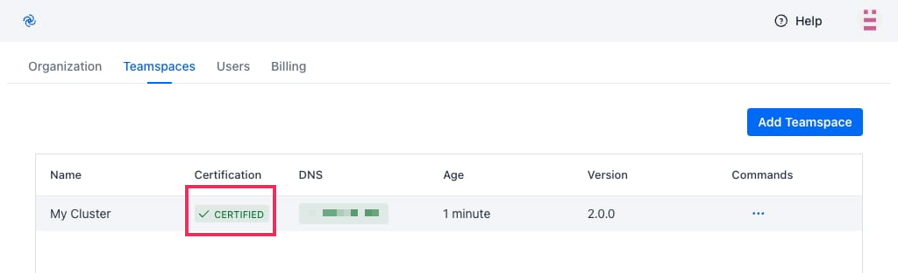

# Teamspace Setup

Teamspaces are vanilla Kubernetes clusters with Codezero installed. The following guide will step you through registering a Teamspace and certifying it for development use. This should take about 10 minutes to complete.

## Create a Codezero Hub Account

Sign up or log in to the [Codezero Hub](https://hub.codezero.io). The onboarding wizard will guide you through creating an organization and your first Teamspace.

The Hub allows you to manage your organization, invite and administer members, and register and certify Teamspaces. You can always return to your organization and list of Teamspaces by going to the Profile menu at the top right corner of the screen.

While the Hub provides a graphical user interface equivalent to the `czctl` command line tool, all services run on your local machine or in the Kubernetes cluster.

## Install Codezero in your Cluster

Ensure you have access to the cluster where you want to install Codezero from your terminal, have helm and kubectl installed, and that your current context is the correct cluster.

On the Profile menu, click _Settings_ and then select the _Teamspaces_ tab. Click _Add Teamspace_ to create the installation command.


To use this command copy to your clipboard using the _copy_ button on the right side of the screen.  After doing that press the _Done_ button.

This install command contains your organization's API key. Please keep it confidential.
It uses [Helm](https://helm.sh) to install the Codezero Space Agent. You can find the Helm charts on Codezero's [GitHub](https://github.com/c6o/helm-charts).

Now paste the command into your terminal and wait for Codezero to be installed and started.

:::note
_Additional annotations may be necessary;_ refer to our Codezero [Helm Chart documentation](https://github.com/c6o/helm-charts) and the section on Load balancer requirements below.
:::

### Load balancer requirements

The Codezero helm chart deploys a Kubernetes service of type `LoadBalancer`. For Codezero to function properly the provisioned load balancer requires a public ip address and must work on OSI layer 4.

import Tabs from '@theme/Tabs';
import TabItem from '@theme/TabItem';

<Tabs>
<TabItem value="aws-eks" label="AWS EKS" default>
    By default AWS EKS uses classic load balancers for a Kubernetes service of type `LoadBalancer`. In this case no additional setup is required.

    However when using [AWS Load Balancer Controller](https://docs.aws.amazon.com/eks/latest/userguide/aws-load-balancer-controller.html) additional annotations need to be set on Codezero's load balancer service. This can be done via the helm chart by adding the following values:

    ```
    lb:
        service:
            annotations:
                service.beta.kubernetes.io/aws-load-balancer-type: "external"
                service.beta.kubernetes.io/aws-load-balancer-nlb-target-type: "ip"
                service.beta.kubernetes.io/aws-load-balancer-scheme: "internet-facing"
    ```

</TabItem>
<TabItem value="gke" label="GKE" default>
    Google Kubernetes Engine creates external Network Load Balancers by default.
</TabItem>
<TabItem value="generic-cluster" label="Generic cluster">
    Codezero will rely on the default behaviour provided by the cluster.
</TabItem>
</Tabs>

## Certification

The Codezero SpaceAgent installs into the `codezero` namespace and should take less than a minute to start depending on how long it takes to provision a LoadBalancer.  The `codezero` loadbalancer service will be ready but the cloud loadbalancer may need minutes to be fully available.

:::info
For example, with AWS, the kubernetes loadbalancer service will show the AWS NLB (Network Load Balancer) hostname and codezero hub will show the space as ready and certified. 
However, the NLB can still be in a provisioning state and network access will only work once it is fully provisioned, which can take up to 5+ minutes.
:::

You can view the codezero pods and services using the following:

```
kubectl get pods,svc -n codezero

NAME                                READY   STATUS    RESTARTS   AGE
pod/loadbalancer-556d54fb4-qx6w4    1/1     Running   0          9d
pod/operator-86b9d856cb-ktqcj       1/1     Running   0          9d
pod/spaceagent-5cb47f595b-m8ppw     1/1     Running   0          9d

NAME                   TYPE           CLUSTER-IP     EXTERNAL-IP     PORT(S)                         AGE
service/codezero       LoadBalancer   10.43.95.152   xxx.x.xxx.xxx   8800:31420/TCP                  13d
service/spaceagent     ClusterIP      10.43.9.204    <none>          8800/TCP                        13d
```

Once ready, you should see the Certification column at [hub.codezero.io/settings/spaces](https://hub.codezero.io/settings/spaces) change to _Certified_ and shortly thereafter, you should see an IP address (or Host Name) show up under DNS. Your Teamspace is ready for use.

Certification ensures secure communications between the Codezero SpaceAgent in-cluster and the Hub.

You can now select the Teamspace from the _Teamspace List_ in the navigation panel. This will take you to the _Service Catalog_:




## Uninstalling Codezero

Codezero may be removed from the Kubernetes cluster at any time. It is recommended that you close all Consume and Serve sessions before you begin the uninstallation.

To uninstall, run:

    ```bash
    helm -n codezero uninstall codezero
    ```

You can then go into the Hub and delete the Teamspace.

## Troubleshooting

### Upgrade Cluster / Codezero Space Agent

Occasionally a new Codezero release requires you to Update your Codezero Space Agent (also referred to as Upgrade your Cluster)

To update your Codezero Space Agent, run the following command:

    ```bash
    helm repo add --force-update codezero https://charts.codezero.io && helm upgrade --namespace=codezero codezero codezero/codezero
    ```

### Stuck _Waiting_ for DNS

The Codezero _SpaceAgent_ service will fail to start if it is unable to obtain the DNS address of the cluster. Sometimes, the Kubernetes retry logic will time out before the ingress is ready. In this case, you may have to restart the _SpaceAgent_ service. To do so, simply restart the _SpaceAgent_ pod:

```bash
kubectl rollout restart deployment spaceagent -n codezero
```

### Locating Codezero Residue

Codezero does not use any Custom Resource Definitions or finalizers. If you need to lookup resources added or modified by Codezero, you can use the following `kubectl` commands to see if there are any active Serves in the cluster:

```bash
kubectl get all --selector="app.kubernetes.io/managed-by"=codezero --all-namespaces
```

If you are looking for residue in a specific namespace, use:

```bash
kubectl -n <NAMESPACE> get all --selector="app.kubernetes.io/managed-by"=codezero
```

**NOTE:** You should close all Consume and Serve sessions before cleaning up residue in which case the Codezero SpaceAgent controller will perform the cleanup for you. If for whatever reason, it does not, you can remove the resources found and re-deploy your application to get back to a clean state.

### Getting Further Help

If you have any further questions - please reach out to us via [support@codezero.io](mailto:support@codezero.io) or [Discord](https://discord.gg/wx3JkVjTPy) or your dedicated Slack Connect channel (if you're an Enterprise Customer).
