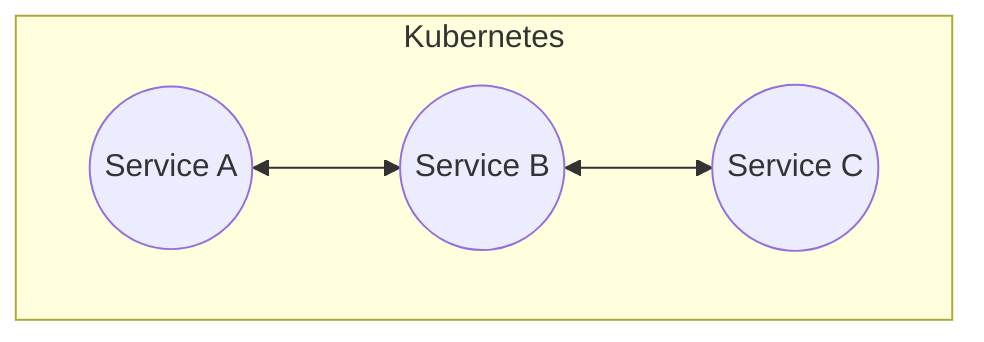
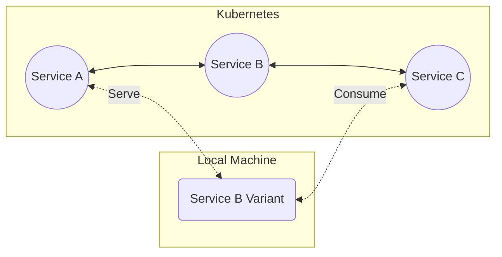

# Overview

Codezero is an overlay network that empowers development teams to turn Kubernetes clusters into _Teamspaces_. A Teamspace is a collaborative development environment where developers can locally _Consume_ services discoverable in a _Service Catalog_. Services featured in the catalog operate either within the Kubernetes cluster, or on a team member's local machine. Developers can _Serve_ local _Variants_ of services through this catalog to other team members.

<h3>Development Cluster</h3>

Consider the application above. Services A, B and C are deployed to a development cluster or namespace. You would either have to replicate the entire application locally or, replace Service B with the new version in the development environment in order to test.

:::tip
The version of the app one experiences is determined by the path a ray of traffic takes across the services.
:::

<h3>Teamspace</h3>

With a Teamspace, in order to work on Service B, you simply run the service locally. This _Local_ Service B Variant receives traffic based on [_Conditions_](../references/serve#condition-types) you specify. The Local Variant then delivers traffic back by [Consuming](../references/consume) Service C. Traffic that does not meet the specified condition flows through the _Default_ Service B Variant running in the cluster untouched.

Local Variants need not be containerized. They are simply services running on a local port but through the service catalog appear like they are deployed to the Kubernetes cluster. Developers can, therefore, use preferred local tooling like IDEs, debuggers, profilers and test tools (e.g. Postman) during the development process.

Teamspaces are language agnostic and operate at the network level. Any authorized member can define _Conditions_ that reshape traffic across the services available in the catalog to instantly create a _Logical Ephemeral Environment_. While the Teamspace is long running, this temporary traffic shaped environment comprising of a mix of remote and local services can be used to rapidly build and test software before code is pushed.

You do not have to be a Kubernetes admin or a networking guru to develop using a Teamspace. Once set up, most developers need not have any direct knowledge of, or access to the underlying Kubernetes Clusters.

## Getting Started

The Getting Started section covers installing Codezero's Local Agent and setting up and administering Teamspaces whether they are in Kubernetes or VMs.

## Tutorial

The [Tutorial](../tutorial) focuses on how to use Codezero to connect your local development environment to a set of services running in Codezero's Demo Teamspace and how to debug those remote services locally.

## Concepts

We strive to limit the jargon that developers have to learn to benefit from our tooling. While words like Services and Environments are commonplace, we felt it would help to clarify this terminology within the Codezero and Kubernetes context. We cover various terms in the "Concepts" section of this documentation.

## How-to Guides

How-to guides take you through the steps required to solve a real-world problem.

## References

The Reference guides contain technical details about Codezero's architecture and software.
