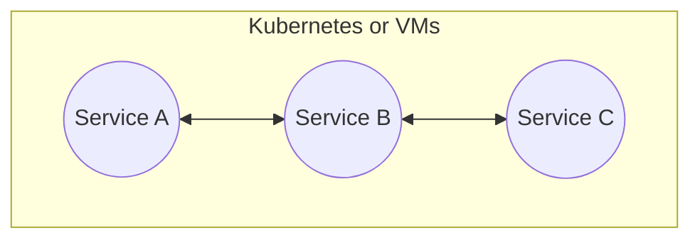
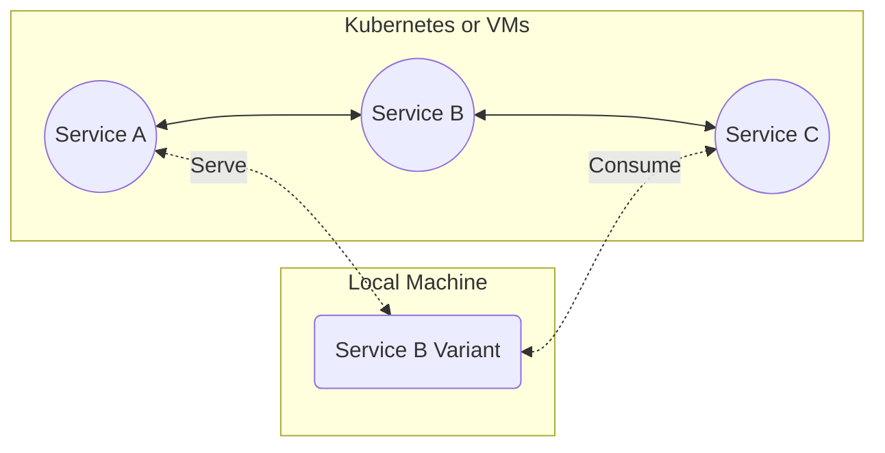

# Overview

Codezero introduces an innovative overlay network that transforms VMs / Kubernetes clusters into Teamspaces, enhancing collaborative development.

**Teamspaces:** These are specialized development environments where developers can work together seamlessly. Teamspaces facilitate real-time collaboration by allowing developers to:

- **Consume Services:** Developers can access and utilize services listed in a Service Catalog. This Catalog includes services running either within a Kubernetes cluster / VM or on a team member's local machine, ensuring that all team members have access to the necessary components for development and testing.
- **Serve Local Variants:** Team members can temporarily share their own local versions (or Variants) of Services. By serving these local variants through the Service Catalog, developers can test and iterate on their work in a shared environment, promoting rapid feedback and integration.

This simplifies the development process and bridges the gap between Local development and Remote deployment, allowing developers to focus **_more on coding_** and **_less on managing network configurations_**.

<h3>Development Cluster</h3>

Consider the application above. Services A, B and C are deployed to a development cluster, VM or Namespace. Without Codezero, you would either have to replicate the entire application locally or, replace Service B with the new version in the development environment in order to test.

:::tip
The version of the app one experiences is determined by the path a ray of traffic takes across the services.
:::

<h3>Teamspace</h3>

With a Teamspace, to work on Service B, just run a copy of the Service locally. This _Local_ Service B Variant receives traffic based on [_Conditions_](../references/serve#condition-types) you specify. The Local Variant then delivers traffic back by [Consuming](../references/consume) Service C. Traffic that does not meet the specified condition flows through the _Default_ Service B Variant running in the cluster untouched.

Local Variants need not be containerized. They are simply services running on a local port but through the service catalog appear like they are deployed to the Kubernetes cluster. Developers can, therefore, use preferred local tooling like IDEs, debuggers, profilers and test tools (e.g. Postman) during the development process.

Teamspaces are language agnostic and operate at the network level. Any authorized member can define _Conditions_ that reshape traffic across the services available in the catalog to instantly create a _Logical Ephemeral Environment_ or **"Zero Environment"**. While the Teamspace is long-running, this temporary traffic-shaped environment comprising of a mix of remote and local services can be used to rapidly build and test software before code is pushed.

You do not have to be a Kubernetes/VM Admin or a networking guru to develop using a Teamspace. Once set up, most developers usually don't need any direct knowledge of, or access to the underlying Kubernetes Clusters.

## Getting Started

The [Getting Started](../getting-started) section covers installing Codezero's Local Agent and setting up and administering Teamspaces whether in Kubernetes or VMs.

## Tutorial

The [Tutorial](../tutorial) focuses on using Codezero to connect your local development environment to a set of services running in Codezero's Demo Teamspace and how to debug those remote services locally.

## Concepts

We have tried hard to limit the jargon developers must learn to benefit from our tooling. While words like Services and Environments are commonplace, we felt it would help to clarify this terminology within the Codezero and Kubernetes/VMs context. We cover various terms in the [Concepts](../category/concepts) section.

## How-to Guides

[How-to guides](../category/how-to-guides) take you through the steps required to solve a real-world problem.

## References

The [Reference](../category/references) guides contain technical details about Codezero's architecture and software.
