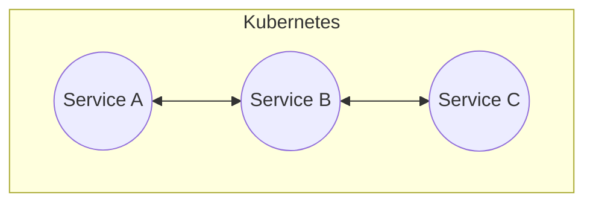
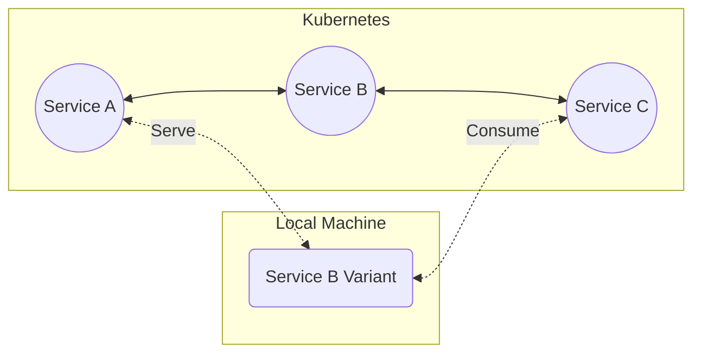

# Overview

Codezero is an overlay network that empowers development teams to turn Kubernetes clusters into _Teamspaces_. A Teamspace is a collaborative development environment where developers can locally _Consume_ services discoverable in a _Service Catalog_. Services featured in the catalog operate either within the Kubernetes cluster, or on a team member's local machine. Developers can _Serve_ local _Variants_ of services through this catalog to other team members.

<h3>Development Cluster</h3>

Consider the application above. Services A, B and C are deployed to a development cluster or namespace. You would either have to replicate the entire application locally or, replace Service B with the new version in the development environment in order to test.

:::tip
The version of the app one experiences is determined by the path a ray of traffic takes across the services.
:::

<h3>Teamspace</h3>

With a Teamspace, in order to work on Service B, you simply run the service locally. This _Local_ Service B Variant receives traffic based on _Conditions_ you specify. The Local Variant then delivers traffic back by Consuming Service C. Traffic that does not meet the specified condition flows through the _Default_ Service B Variant running in the cluster untouched.

Local Variants need not be containerized. They are simply services running on a local port but through the service catalog appear like they are deployed to the Kubernetes cluster. Developers can, therefore, use preferred local tooling like IDEs, debuggers, profilers and test tools (e.g. Postman) during the development process.

Teamspaces are language agnostic and operate at the network level. Any authorized member can define _Conditions_ that reshape traffic across the services available in the catalog to instantly create a _Logical Ephemeral Environment_. While the Teamspace is long running, this temporary traffic shaped environment comprising of a mix of remote and local services can be used to rapidly build and test software before code is pushed.

You do not have to be a Kubernetes admin or a networking guru to develop using a Teamspace. Once set up, most developers need not have any direct knowledge of, or access to the underlying Kubernetes Clusters.

## Getting Started

This documentation is geared to both Kubernetes Admins who want to create Teamspaces as well as Developers who simply want to work with Teamspaces.

We recommend you go through this documentation in the order it is presented as we build on previously defined concepts. Happy Learning!

### Guides

The Guides cover setting up and administering a Teamspace. You will require a Kubernetes Cluster to create a Teamspace. Due to inherent limitations, you cannot use a local cluster like Minikube or Kind with Codezero.

<!-- ### Concepts

WE SHOULD ADD BACK A CONCEPTS SECTION

We strive to limit the jargon that developers have to learn to benefit from our tooling. While words like Services and Environments are commonplace, we felt it would help to clarify this terminology within the Codezero and Kubernetes context. We cover various terms in the "Concepts" section of this documentation. -->

### Tutorials

The [Tutorials](https://docs.codezero.io/tutorials/sample-project) focus on using a Teamspace once setup. We have a [Sample Kubernetes Project](/tutorials/sample-project.mdx) that comprises some of the most common Microservices Patterns you would encounter in a Kubernetes cluster. This [project](/tutorials/sample-project.mdx) is used across all the Tutorials and Videos in this documentation.

The Tutorials walk you through scenarios you will encounter in just about any modern microservices application development.
