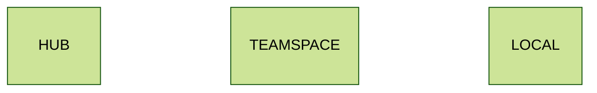
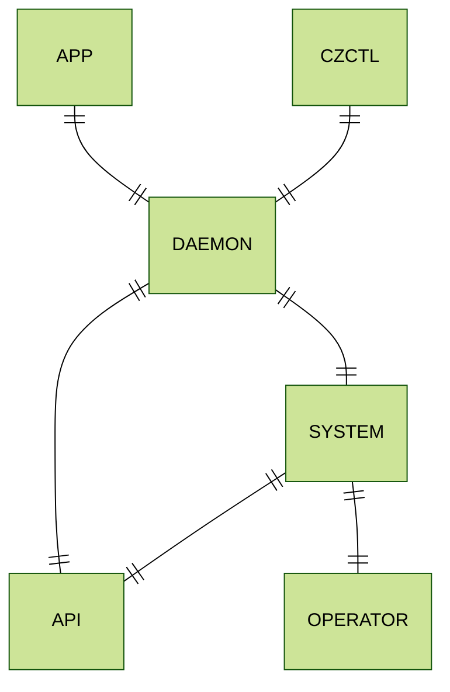

# Architecture

## Overview

Codezero is made up of components that run locally on your developer workstation, in the Kubernetes cluster and a central cloud hosted Hub. The following color code identifies where the sub-components identified below run.

This diagram defines all the components that make up Codezero:

## Hub

The Hub is managed by Codezero and is available at [https://hub.codezero.io](https://hub.codezero.io). The Hub is the central authority that manages Organizations, Users, Roles, Policies and Teamspaces.

If you would like to run a self-hosted Hub, please reach out to [sales@codezero.io](mailto:sales@codezero.io)

## Teamspace

A Teamspace is a vanilla Kubernetes cluster with Codezero installed. A Teamspace consists of a System and an Operator.

### System

The System is a Kubernetes controller that manages in-cluster resources that are added or altered depending on developer actions.
It gives visibility into all activities happening in the cluster and coordinates between local and in-cluster tunnels.

The System has a single tunnel that is used for traffic between local and in-cluster services.

### Operator

The operator manages Serve resources in a Kubernetes.

## Local

The local agent is made up of two components:

1. A CLI and Daemon
1. A Desktop App

### Daemon

The Daemon runs with root privileges and is:

1. A tunnel to the current selected Teamspace
1. A secure proxy for client applications (czctl, desktop app) to communicate with the current Teamspace

The Daemon executable is generally located at `/usr/local/bin/czctl`.

The Daemon is started when you run `czctl start`.

### Desktop app

The Desktop app contains the CLI and Daemon. It requires root/admin privileges to start the Daemon.
