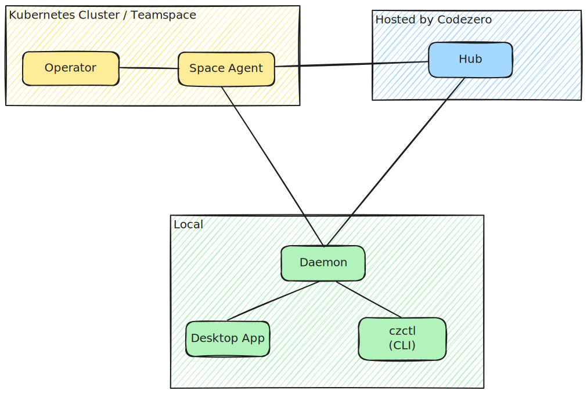

# Architecture

## Overview

Codezero is made up of components that run locally on your developer workstation, in the Kubernetes cluster and a central cloud hosted Hub.

* Hub (blue) is hosted by Codezero.
* Teamspace is the System and Operator (yellow) components installed in your cluster.
* The CLI, Desktop App and Daemon are installed and run on your Local development machine (green).

## HUB

The Hub is Codezero's Admin Console, and our central authority that manages Organizations, Users, Roles, Policies and Teamspaces. The Hub is managed by Codezero and is available at [https://hub.codezero.io](https://hub.codezero.io). If you would like to run a self-hosted Hub, for a specific application, please connect: [sales@codezero.io](mailto:sales@codezero.io)

## TEAMSPACE

A Teamspace is a vanilla Kubernetes cluster with Codezero installed. A Teamspace consists of a System and an Operator.

### Space Agent

The Space Agent is a Kubernetes controller that manages in-cluster resources that are added or altered depending on developer actions.
It gives visibility into all activities happening in the cluster and co-ordinates between Local and In-cluster tunnels.

The System has a single, secure tunnel that is used for Consume and Serve traffic between Local and In-cluster services.

### Operator

The Operator manages Serve resources in the Kubernetes cluster.

## LOCAL

The local agent is composed of:

1. A CLI and Daemon (aka `czctl`)
2. A Desktop App (Codezero.app)

### Daemon / CLI

The Daemon runs with root privileges and is:

* A tunnel to the current selected Teamspace
* A secure proxy for client applications (`czctl`, Desktop App) to communicate with the current Teamspace

The Daemon executable is generally located at `/usr/local/bin/czctl` or `/opt/homebrew/czctl` (depending on install method).

The Daemon is started when you run `czctl start` or when you start the Codezero Desktop app.

### Desktop App

The Desktop app provides a GUI for the Service Catalog, Serve and Control sessions, and easy access to Logs. It is a single app that also contains the CLI and Daemon. It requires root/admin privileges to start the Daemon.
