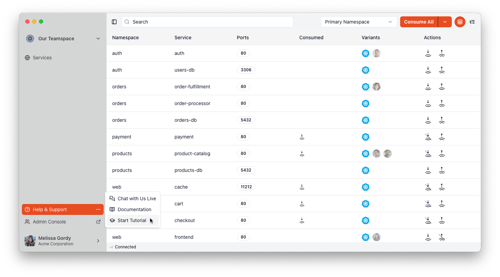

# Tutorial

In this tutorial you will learn how to use Codezero to connect your local development environment to a set of services running in the cloud and how to debug those services.

## Prerequisites

You will need the Codezero Local Agent version 2.8.0 or above installed.

## Start the Tutorial

Either select Help & Support > Start Tutorial in the Codezero app or run the following command:

```bash
czctl tutorial
```



This will connect you to the Demo Teamspace and launch a new browser window with the Tutorial.