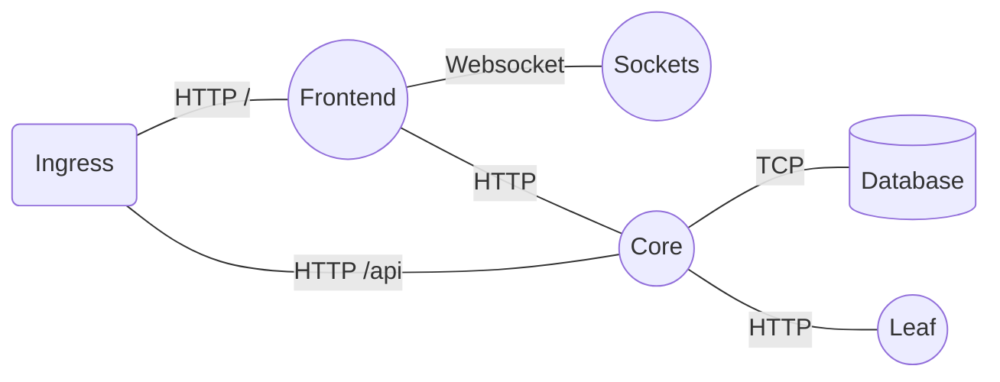

```mermaid
flowchart LR
    User(Ingress) --- |HTTP /| Frontend((Frontend))
    Frontend ---|Websocket| Sockets((Sockets))
    Frontend --- |HTTP|Core((Core))
    Core ---|TCP| Database[(Database)]
    Core ---|HTTP| Leaf((Leaf))
    User --- |HTTP /api| Core
```
