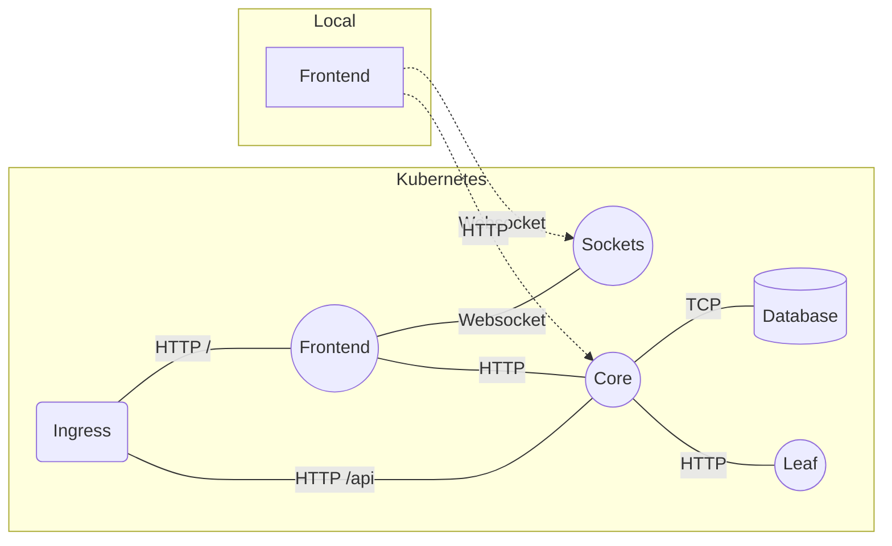
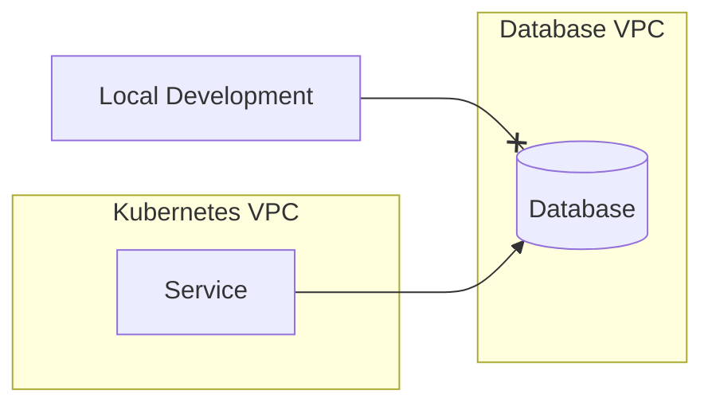

<div style={{ textAlign: 'center' }}>
<iframe width="560" height="315" src="https://www.youtube.com/embed/0VrrEhNUSP4?si=wFryPs7sUx1beNSy" title="YouTube video player" frameborder="0" allow="accelerometer; autoplay; clipboard-write; encrypted-media; gyroscope; picture-in-picture; web-share" referrerpolicy="strict-origin-when-cross-origin" allowfullscreen></iframe>
</div>

import Architecture from './_fragments/architecture.md'


In this tutorial, we learn how to Consume services running in a Teamspace. If you recall, the following diagram represents our Application Service Graph running in Kubernetes:

<Architecture />

## Desired Environment

Let us assume you wish to make changes to the Frontend service. We can see from the diagram above that the Frontend Service requires the Sockets and the Core services. In order to develop locally, you would not only have to run the Sockets and Core service locally but the entire blast radius of upstream services. In this case, this includes Database and Leaf even though Frontend does not directly require this.

Instead, given that we have a Teamspace with these services running, we would like to do the following:



We say that we would like to _Consume_ the Core and Sockets services. Concretely, we would like to be able to run the following `curl` or `websocat` commands and retrieve data from these services as though they were running locally:

```bash
curl -L http://sample-project-core.sample-project:3000/api
```

```bash
websocat -v ws://sample-project-sockets.sample-project:8999/
```

Note how the service names match the service names in-cluster: `<service-name>.<namespace-name>`

## Local Development with Consume

In order to consume, run the following command:

```bash
czctl consume edit
```

When the text editor pops up, enter the following consume rule, then save and close the editor:

```
sample-project/sample-project-core
sample-project/sample-project-sockets
```

You can now see which services are available locally using

```bash
czctl consume list
```

and your output will looks something like the following:

```
sample-project-core.sample-project (3000) 
sample-project-sockets.sample-project (8999) 
```

You can now test to see if these services are available locally using either of the `curl` or `websocat` commands above.

Now you could have accomplished the above using `kubectl port-forward ...` however, here are some reasons to use `czctl consume` instead of `kubectl port-forward`


### Advantages over port-forwarding
Advantages over using port-forward include:
1. You do not need to have access to Kubernetes credentials (Kubeconfig)
1. Port-forwarding binds to Pods whereas Codezero routes to Services which means:
    1. You get the real round-robin experience that the Frontend service gets in cluster
    1. Pods can crash or restart and you will not have to re-establish your port-forward
1. You get to use the proper in-cluster DNS name of the Socket and Core services instead of `localhost`
1. Consume uses far fewer resources and is much more performant when trying to consume many services within a cluster

### Cleaning up

In order to close your consume sessions, run:

```bash
czctl consume clear
```

Your consume sessions will close.


### Using Wildcards in Rules

As your application grows, your list of services can become unmanageable. In this case, you can use the `*` wildcard in the consume rules list.

This time, when you run `czctl consume edit`, try the following rule:

```
sample-project/*
```

This time, all the services in the `sample-project` namespace are available locally so the following command will allow you to connect to the Database service:

```bash
mongosh "mongodb://sample-project-database.sample-project:27017"
```

### Using Negation in Rules

When running services locally, developers often start servers on `localhost` or `0.0.0.0` which binds to all interfaces. This can result in port conflicts. Often times, when developing a services, you do not want to consume the in-cluster variant of the service. You can add a negation rules to the consume rule set to exclude specific services:

```
sample-project/*
!sample-project/sample-project-frontend
```

The above rule set will consume all services in the `sample-project` namespace except for the `sample-project-core` service.

### Selecting a Primary Namespace

Kubernetes services can access services across namespaces. The following defines all valid names for a Kubernetes service.

```
service-name
service-name.namespace
service-name.namespace.svc.cluster.local
```

Consume supports all of the above permutations however, to use the simple form `service-name`, we need to designate a *Primary Namespace*. This is because service names are not unique across namespaces. The Primary Namespace makes the `namespace` optional so you can address the service by its `service-name` as if your local machine is running inside the cluster and within the same namespace.

To select the Primary Namespace, run:

```bash
czctl primary-namespace select sample-project
```

Now, note that you no longer have to specify the namespace when using `curl` or other tools:


```bash
curl -L http://sample-project-core:3000/api
```

```bash
websocat -v ws://sample-project-sockets:8999/
```
## Advanced Topics

Working with traffic shaping is new concept. Here are some advanced capabilities and considerations when using logical traffic shaped environments.

### Consuming external databases

When running applications in Kubernetes their databases usually run outside the Kubernetes cluster. In these scenarios the database commonly resides in different subnets or VPCs. Kubernetes worker nodes can route to the subnet or VPC but developers usually do not have direct access or require a VPN connection:



Consume can support external databases (or any external service) by applying a Kubernetes [service](https://kubernetes.io/docs/concepts/services-networking/service/#externalname) manifest. Apply the following manifests to create an external service using Postgres as an example:

import Tabs from '@theme/Tabs';
import TabItem from '@theme/TabItem';

<Tabs>
<TabItem value="dns" label="External DNS" default>
  Use the database DNS in `externalName`. For example in AWS Aurora use the cluster endpoint or reader endpoint.

  ```
  apiVersion: v1
  kind: Service
  metadata:
    annotations:
    name: postgres
    namespace: example
  spec:
    externalName: <aurora cluster endpoint>
    ports:
    - port: 5432
      protocol: TCP
      targetPort: 5432
    type: ExternalName
  ```
</TabItem>
<TabItem value="ip" label="External IP" default>
  A DNS is not always available. E.g. private Google SQL clusters have a private IP address.

  ```
  kind: Service
  apiVersion: v1
  metadata:
    name: postgres
    namespace: example
  spec:
    clusterIP: None
    ports:
    - port: 5432
  ---
  kind: Endpoints
  apiVersion: v1
  metadata:
    name: postgres
    namespace: example
  subsets:
    - addresses:
          - ip: <private database ip>
      ports:
        - port: 5432
          name: postgres
  ```
</TabItem>
</Tabs>

:::note
For Codezero to consume external services a service manifest must include ports.
:::

You can now consume the above defined service `example/postgres` and access the Postgres database locally.

### Mounting an In-Cluster Volume for use with Codezero

When using Codezero to consume a remote service, traffic is intercepted and sent to the local process. But let's say you have a kubernetes operator which depends on a resource in a mounted directory in the cloud - like a storage class files needed to execute. To allow the consumed process access to the files on the remote volume follow these steps.

Here's the procedure using an NFS Mount:

1. Copy the following sample yaml from our [c6o/sample-project](https://raw.githubusercontent.com/c6o/sample-project/main/k8s/nfs/core.yaml) repo
2. Modify lines 40 and 50 to match your persistentVolumeClaim [PVC] and also match all the namespaces
3. Apply the file and make sure the NFS Pod starts properly
4. Run `czctl consume edit` and enter `<namespace>/nfs-mount`
5. For convenience, make the namespace the primary namespace `czctl primary-namespace select <namespace>`
6. You should be able to now mount the volume locally using NFS `mount -t nfs nfs-mount:/usr/src/app/data ~/mnt`


The above assumes you want the path `/usr/src/app/data` (defined in the yaml) and that you have a local mountpoint `~/mnt`

For more resiliency, you can use a Deployment instead of a Pod. Codezero tunnels to the Service (not the Pod) so the above will work even a single NFS Pod fails.  

If you have any further questions - please reach out to us via [support@codezero.io](mailto:support@codezero.io) or [Discord](https://discord.gg/wx3JkVjTPy) or your dedicated Slack Connect channel (if you're an Enterprise Customer).

