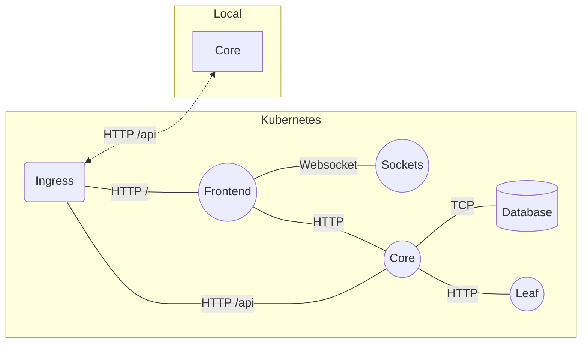
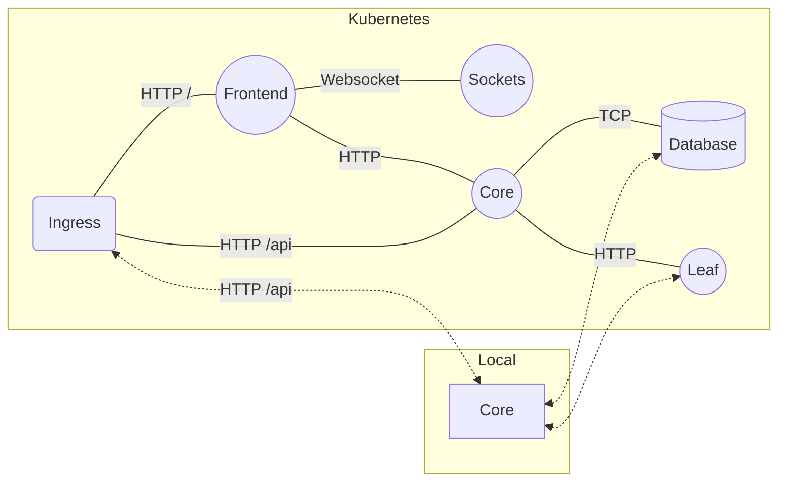

import CoreImg from './_media/core.png'
import ModHeader from './_media/modheader.png'
import ServeBrowser from './_media/serve_browser.png'
import Architecture from './_fragments/architecture.md'

In this tutorial, we learn how to Serve a Variant to a Service running in a Teamspace. The following diagram represents our Application Service Graph running in Kubernetes:

<Architecture />

## Desired Environment

Let us assume you wish to make changes to the Core service and would like to see these changes reflected in the application without having to deploy. The following diagram represents the environment we are interested in:



We say that we would like to _Serve a Variant_ of the the Core services. We introduce the term _Variant_ instead of _Version_ here because we may have a different version of this service in the cluster in some other namespace or we may even have multiple versions within the namespace with fractional traffic going to each. In summary, we would like to experience the local variant api instead of the one currently in the cluster when we access the application in the browser.

## Local Development with Serve

In order to Serve, we run the following command:

```bash
czctl serve sample-project/sample-project-core 3000
```


You can now list the active serve sessions using:

```bash
czctl serve list
```

Which will present the following:

```bash
- id: 01H8X4DCNFYCW2PZV0V77NCMXR:sample-project:sample-project-core
  userID: 01H8D4XXXFYAAAPZYYY77NCMXR
  name: sample-project-core
  namespace: sample-project
  ports:
    - local: 3000
      remote: 3000
  condition:
    type: user
```

Note the `condition.type: user` and the `userID`. This `userID` is your Codezero `userID`. The above indicates that traffic coming from this user will be routed to the variant instead of the in-cluster service. We will cover conditions in detail below.

For now, let us first verify that the Serve operation is working. Note that we do not yet have anything running locally. We will first require the `ExternalIP` of the Frontend service. Assuming you have chosen a `LoadBalancer` option when you setup the Sample Project, you can retrieve the `ExternalIP` using:

```bash
kubectl -n sample-project get service sample-project-frontend
```

Make a note of the `ExternalIP` and open the IP address in a web browser. You should see something resembling the following in the section marked 
Core:

<div class="text--center">
  
</div>

You can also directly access the Core service as it is exposed by the Ingress on the path `/api` like so:

```bash
curl -sL http://212.2.240.71/api | jq
```

which would show:

```json
{
  "who": "core",
  "where": "sample-project-core-5cb5fdb8bb-lzvh7",
  "mongo": {
    "url": "mongodb://sample-project-database:27017/sample-project-database",
    "success": true
  },
  "leaf": {
    "url": "http://sample-project-leaf:3010/api",
    "who": "leaf",
    "where": "sample-project-leaf-5b4bd4855b-dg98l",
    "propagated-headers": "{}"
  },
  "file": {
    "path": "./data/message.txt",
    "error": "ENOENT: no such file or directory, open './data/message.txt' - Your mission: Fix this error and save the world!"
  }
}
```

Note that the Core API calls the Leaf Service and the Database service and consolidates the results. Right now, the `where` field for `who:core` shows the `Host` of the Core service in the cluster. Your host name will be different than the one above but currently, traffic is routed to the in-cluster Core service because we have not met the `type: user` condition. In order to route traffic to the local variant, we would need to add your `userID` to the request to the Frontend service.

### Adding the UserID header

Before we continue, let us run the Core service locally. The sample project has a NodeJS Core service and you can either run this or write a simple HTTP server in the language of your choosing and return the static payload above. Just be sure to change the `where` filed for the `who:core` part of the payload. You can run the sample Core provided locally by running:

:::note
Make sure you have run `czctl start` now if you have not already
:::

```bash
yarn start-core
```

You can now verify that this service is running locally.

:::caution
The reason for the long pause is you do not have the upstream dependencies of the Core service (`Database` and `Leaf`) and these requests can take up to 60 seconds to timeout. We will fix this in a later part of the tutorial.
:::

Run:

```bash
curl http://localhost:3000/api | jq
```

and the result will be similar to:

```json
{
  "who": "core",
  "where": "<YOUR LOCAL HOSTNAME>",
  "mongo": {
    "url": "mongodb://sample-project-database:27017",
    "error": "MongoServerSelectionError"
  },
  "leaf": {
    "error": "getaddrinfo ENOTFOUND sample-project-leaf"
  },
  "file": {
    "path": "./data/message.txt",
    "data": "99 bugs in the code<br />\n99 bugs in the code<br />\nclone the repo, patched it around<br />\n129 bugs in the code<br />"
  }
}
```

Now that we have a _Local Variant_ running, we can access the local variant _through_ the cluster using the following curl command:

```bash
curl -sH "x-c6o-userid:<UserID>" http://<ExternalIP>:3000/api | jq
```

The `ExternalIP` is from the LoadBalancer above and the `UserID` is the value from `czctl serve list` or `czctl status`. You should now (after the timeout pause) see the result from your local variant even though you are accessing the service using the `ExternalIP`

You can confirm this by removing the `x-c6o-userid` header

```bash
curl -s http://<ExternalIP>:3000/api | jq
```

You are therefore, able to conditionally experience the local variant or in-cluster environment depending on whether this condition is met by the presence of this header.

### UserID header in browser

In order to access variants via a browser, there are a number of third party tools that will add custom headers to browser requests:

- [Header-Inject](https://github.com/jg23497/Header-Inject)
- [ModHeader](https://modheader.com)
- [Requestly](https://requestly.com/)

A number of the above providers are browser extensions. For example, configuring _ModHeader_ as follows with your `UserID`:


<div class="text--center">
  
</div>

results in the following rendering in the browser:

<div class="text--center">
  
</div>

## Combining Serve with Consume

Thus far, we are capturing traffic to the Core service but are not addressing the upstream dependencies, namely, Database and Leaf. In a number of cases, this may be fine if we are simply trying to debug the Core API and do not want or need data to flow the request to upstream services. If however, we do wish to test the entire request cycle, we can combine Serve with Consume.




In order to accomplish the above we can now simply apply what we learnt in the [Consuming Remote Service](./consume.mdx) Tutorial:

```bash
czctl consume edit
```

with the following rule sets

```
sample-project/sample-project-database
sample-project/sample-project-leaf
```

or

```
sample-project/*
!sample-project/sample-project-core
```

:::caution
You will want to exclude the Core service in the consume rules to reduce confusion and local port conflicts. Currently, Codezero maps ports to the `127.100.0.0/16` range but local apps that bind to `0.0.0.0` or `localhost` will encounter port conflicts as they attempt to bind to all local interfaces.

Also, please note that the Codezero IP range above is subject to change.
:::

## Condition Types

Conditions are a powerful and simple way to create unique development environments based on a base in-cluster environment. We have learnt that conditions define how traffic routes across in-cluster and local variants and essentially, allow you to develop without having to deploy.

We currently support 3 condition types but are actively working on adding more. Should you have unique needs in order to make your development experience easier, please reach out to us.

### User

When unspecified, Serve creates a conditional route based on the current Codezero User. This is convenient because your `UserID` is unique ensures that there would be no conflicts across other sessions. Other team members may use the same Teamspace infrastructure to work on the same part of the application concurrently.

### Header

If you prefer to use your own header, you can use the `Header` condition. This allows you to specify any arbitrary header key and value. You would specify this condition as follows:

```bash
czctl serve sample-project/sample-project-core 3000 --condition-type header --condition "my-key:my-value"
```

In the case above, in order to route to this new variant, your `curl` command would be:

```bash
curl -sH "my-key:my-value" http://<ExternalIP>:3000/api | jq
```

### Default

We call the in-cluster variant the _Default Variant_. This is because it is the variant that is served when no conditions are met or when there are no conditions for routing traffic.

In some cases, you may want all traffic destined for the in-cluster service to route to you. For instance, you may be interested in a web hook callback and are not able to manipulate the headers sent by a third party service.

In this case, you want to make your local variant the new Default Variant.

```bash
czctl serve sample-project/sample-project-core 3000 --condition-type default
```

With the above, you no longer have to add anything to the `curl` request:

```bash
curl -s http://<ExternalIP>:3000/api | jq
```

:::note
If another team member has an active User or Header condition Serve session, traffic will be routed to them if those conditions are met. This is so that you do not interfere with a more specific request Serve session.
:::

## Advanced Topics

Working with traffic shaping is new concept. Here are some advanced capabilities and considerations when designing these logical traffic shaped environments.

### Header Propagation

The above example shows a simple case where the service is at the edge of the network. In this case, headers used to redirect traffic are easily delivered to the in-cluster service. But what about the case where you want to work with the `Leaf` service?

In order to achieve this, we have to ensure headers are propagated to upstream services. This is not uncommon. For example, if you are using OpenTelemetry to you have to propagate OpenTelemetry in order to profile spans that traverse services across the application.

Header propagation is language specific. In some cases, there are libraries that fully automate header propagation (e.g. Hpropagate for NodeJS). In the case of the Sample Project, the Core service has the following code to propagate headers.

```javascript
// In order for intercept to work, headers need to
// be propagated to upstream requests
// In this case, we only propagate headers that start
// with x-c6o but you should use your own convention
const propagateHeaders = (headers) =>
    Object.keys(headers)
        .filter(key => key.startsWith('x-c6o-'))
        .reduce((obj, key) => {
            obj[key] = headers[key]
            return obj
        }, {})
```

and this code is used here:

```javascript
  export const leafResult = async (inHeaders) => {
      try {
        const headers = propagateHeaders(inHeaders)
        const url = `${leafURL}/api`
        const result = await axios({
            url,
            headers
        })
        ...
      }
  }
```

In the example above, we propagate all headers starting with `x-c6o`. In order to make your entire service graph easy to develop against, it is advised your team come up with some sort of convention where headers starting with `x-my-company-` are propagated if present.

#### Working with Queues (e.g. Kafka)

Similar to the issue raised above, Queues discard HTTP metadata like headers. One simple solution to this is to propagate headers in the metadata or payload enqueued so that the consumer at the other end of the queue can re-hydrate headers to upstream services.

These few lines of code that propagate Headers and metadata through queues are a small price to pay for the added ability to develop services locally.

### Traffic Tainting Non-Idempotent Operations

When working with non-idempotent operations or operations where you do *not* want to commit changes during testing (e.g. to a database), you may want to consider using _Traffic Tainting_.

Let us say that you are consuming a billing API but you do not want actions done during local development to actually perform a billing operation, you could taint the traffic going up to the consumed service using metadata (e.g. HTTP Header `x-is-tainted:true`). You could then have the upstream Billing API service reply with a 200 but not actually perform the billing operation when the request is tainted.

### State and Data Conflicts

One of the benefits of working in a Teamspace is that you are working in an environment that is as close to a real production environment as possible while getting to use local tooling. Unfortunately, there are certain conditions where this is not feasible. For instance, if you need make a schema change to the Database, there is simply no way to do this without impacting other team members.

You may be able to run a local database with the new schema and serve that as a variant. However, sometimes, there is no real alternative but to create a different _Physical Environment_. You may consider implementing an easy to access Infrastructure as Code script using tools like Terraform or Pulumi to deploy the base services to another namespace where you can work with this new schema without impacting teammates.
