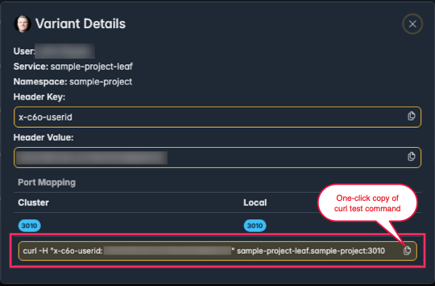

# Using the Desktop App

import ServiceCatalogImg from './_media/service-catalog.png'

The Desktop Application adds a menu bar icon (macOS) or a tray icon (Windows). The icon indicates the current state of Connectivity with the Teamspace.

**(MacOS)**    

**(Windows)** 

-  Colored icon indicates active Consumes
-  Gray icon indicates no active Consumes
-  Gray icon with a triangle exclamation mark indicates an error

**The Desktop Application provides:**
- Quick access to the Service Catalog
- Easy Consume All / Clear button (blue)
- Fast filtering for Namespace & Services at top of Desktop App window
- Quick Switch between Teamspaces
- Organization switching (if you belong to more than one Codezero Org)
- Dark/Light Mode to match system default

  

- Easy Test connect to Variants 
  - Clicking on a user’s Variant icon in the Service Catalog will provide Variant Details
  

:::note
The curl command provided by the Desktop App might need customizing depending on the nature of the Variant service 
:::