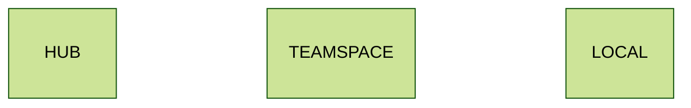
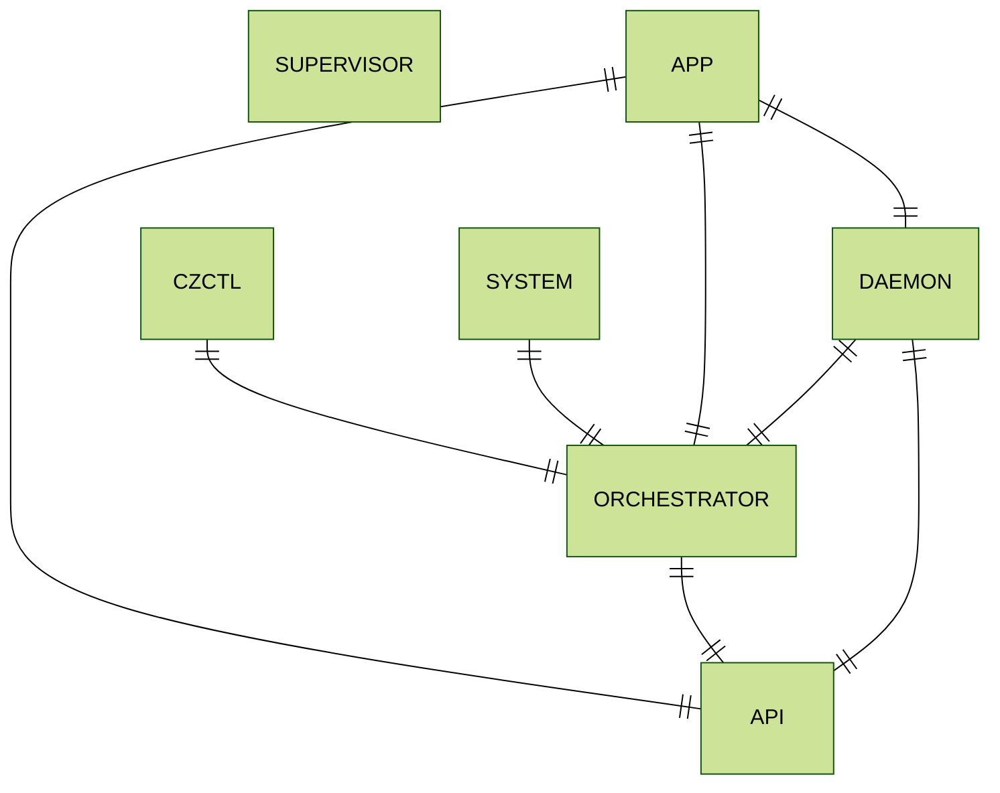

# Architecture

## Overview

Codezero is made up of components that run locally on your developer workstation, in the Kubernetes cluster and a central cloud hosted Hub. The following color code identifies where the sub-components identified below run.

This diagram defines all the components that make up Codezero:

## Hub

The Hub is managed by Codezero and is available at [https://hub.codezero.io](https://hub.codezero.io). The Hub is the central authority that manages Organizations, Users, Roles, Policies and Teamspaces.

The Hub also provides a graphical user interface where developers can perform all the functions available in the `czctl` command line tool.

If you would like to run a self-hosted Hub, please reach out to [sales@codezero.io](mailto:sales@codezero.io)

## Teamspace

A Teamspace is a vanilla Kubernetes cluster with Codezero installed. A Teamspace consists of a System and an Orchestrator

### System

The System is a Kubernetes controller that manages in-cluster resources that are added or altered depending on developer actions. It is also responsible of monitoring cluster state and reports any changes to the Orchestrator.

The System has a single tunnel that is used for traffic between local and in-cluster services.

### Orchestrator

The Orchestrator provides real-time information to all clients connected to the Teamspace. The Orchestrator gives visibility into all activities happening in the cluster and coordinates between local and in-cluster tunnels.

## Local

The local agent is made up of two executables, the Daemon and the Supervisor.

### Supervisor

The Supervisor is responsible for making sure the Daemon is in a healthy state and running when `czctl start` is executed. The Supervisor executable is generally located at `/usr/local/bin/codezero/czsupervisor`.

### Daemon

The Daemon runs with root privileges and is:

1. A tunnel to the current selected Teamspace
1. A Split Domain Name Service (DNS) server that resolves in cluster services to the tunnel
1. A secure proxy for client applications (czctl, desktop, hub) to communicate with the current Teamspace

The Daemon executable is generally located at `/usr/local/bin/codezero/czdaemon`.

The Supervisor and Daemon are started when you run `czctl start`. You can directly execute the Daemon and this can be especially useful when troubleshooting.
